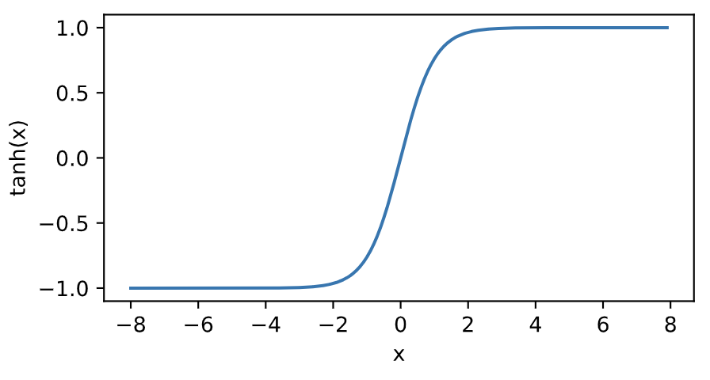
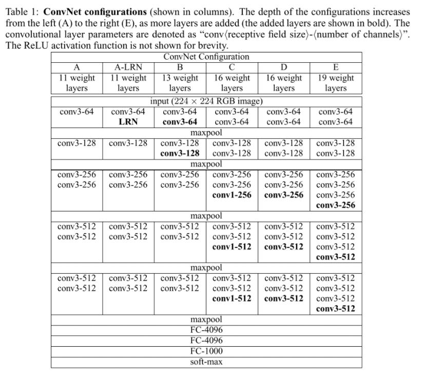

项目来源：[动手学深度学习 Pytorch](https://github.com/ShusenTang/Dive-into-DL-PyTorch)

内容：学习笔记。

时间：2019.12.12


# 阅读指南

内容大体可以分为3个部分：

* 第一部分（第1章至第3章）涵盖预备工作和基础知识。第1章介绍深度学习的背景。第2章提供动手学深度学习所需要的预备知识。第3章包括深度学习最基础的概念和技术，如多层感知机和模型正则化。如果读者时间有限，并且只想了解深度学习最基础的概念和技术，那么只需阅读第一部分。
* 第二部分（第4章至第6章）关注现代深度学习技术。第4章描述深度学习计算的各个重要组成部分，并为实现后续更复杂的模型打下基础。第5章解释近年来令深度学习在计算机视觉领域大获成功的卷积神经网络。第6章阐述近年来常用于处理序列数据的循环神经网络。阅读第二部分有助于掌握现代深度学习技术。
* 第三部分（第7章至第10章）讨论计算性能和应用。第7章评价各种用来训练深度学习模型的优化算法。第8章检验影响深度学习计算性能的几个重要因素。第9章和第10章分别列举深度学习在计算机视觉和自然语言处理中的重要应用。这部分内容读者可根据兴趣选择阅读。

下图描绘了《动手学深度学习》的结构。

<div align=center>

</div>


# 深度学习简介

​		


# 3、深度学习基础

​		线性回归输出是一个连续值，因此适用于回归问题。回归问题在实际中很常见，如预测房屋价格、气温、销售额等连续值的问题。与回归问题不同，分类问题中模型的最终输出是一个离散值。我们所说的图像分类、垃圾邮件识别、疾病检测等输出为离散值的问题都属于分类问题的范畴。softmax回归则适用于分类问题。由于线性回归和softmax回归都是单层神经网络，它们涉及的概念和技术同样适用于大多数的深度学习模型。我们首先以线性回归为例，介绍大多数深度学习模型的基本要素和表示方法。

## 3.1.1 线性回归的基本要素

​		我们以一个简单的房屋价格预测作为例子来解释线性回归的基本要素。这个应用的目标是预测一栋房子的售出价格（元）。我们知道这个价格取决于很多因素，如房屋状况、地段、市场行情等。为了简单起见，这里我们假设价格只取决于房屋状况的两个因素，即面积（平方米）和房龄（年）。接下来我们希望探索价格与这两个因素的具体关系。

### 3.1.1.1 模型定义

​		设房屋的面积为 $x_1$，房龄为 $x_2$，售出价格为 $y$。我们需要建立基于输入 $x_1$ 和 $x_2$ 来计算输出 $y$ 的表达式，也就是模型（model）。顾名思义，线性回归假设输出与各个输入之间是线性关系：
$$
\hat{y} = x_1 w_1 + x_2 w_2 + b
$$
其中 $w_1$ 和 $w_2$ 是权重（weight），$b$ 是偏差（bias），且均为标量。它们是线性回归模型的参数（parameter）。模型输出 $\hat{y}$ 是线性回归对真实价格 $y$ 的预测或估计。我们通常允许它们之间有一定误差。


### 3.1.1.2 模型训练

​		接下来我们需要通过数据来寻找特定的模型参数值，使模型在数据上的误差尽可能小。这个过程叫作**模型训练（model training）**。下面我们介绍模型训练所涉及的<u>3个要素</u>。

#### (1) 训练数据

​		我们通常收集一系列的真实数据，例如多栋房屋的真实售出价格和它们对应的面积和房龄。我们希望在这个数据上面寻找模型参数来使模型的预测价格与真实价格的误差最小。在机器学习术语里，该数据集被称为**训练数据集（training data set）或训练集（training set）**，一栋房屋被称为一个**样本（sample）**，其真实售出价格叫作**标签（label）**，用来预测标签的两个因素叫作**特征（feature）**。<u>特征用来表征样本的特点</u>。

​		假设我们采集的样本数为 $n$，索引为 $i$ 的样本的特征为 $x_1^{(i)}$ 和 $x_2^{(i)}$，标签为 $y^{(i)}$。对于索引为 $i$ 的房屋，线性回归模型的房屋价格预测表达式为
$$
\hat{y}^{(i)} = x_1^{(i)} w_1 + x_2^{(i)} w_2 + b
$$


#### (2) 损失函数

​		在模型训练中，我们需要衡量价格预测值与真实值之间的误差。通常我们会选取一个非负数作为误差，且数值越小表示误差越小。一个常用的选择是平方函数。它在评估索引为 $i$ 的样本误差的表达式为


$$
\ell^{(i)}(w_1, w_2, b) = \frac{1}{2} \left(\hat{y}^{(i)} - y^{(i)}\right)^2
$$

其中常数 $\frac 1 2$ 使对平方项求导后的常数系数为1，这样在形式上稍微简单一些。显然，误差越小表示预测价格与真实价格越相近，且当二者相等时误差为0。给定训练数据集，这个误差只与模型参数相关，因此我们将它记为以模型参数为参数的函数。在机器学习里，将衡量误差的函数称为**损失函数（loss function）**。这里使用的平方误差函数也称为**平方损失（square loss）**。

​		通常，我们用训练数据集中<u>所有样本误差的平均来衡量模型预测的质量</u>，即

$$
\ell(w_1, w_2, b) =\frac{1}{n} \sum_{i=1}^n \ell^{(i)}(w_1, w_2, b) =\frac{1}{n} \sum_{i=1}^n \frac{1}{2}\left(x_1^{(i)} w_1 + x_2^{(i)} w_2 + b - y^{(i)}\right)^2
$$

​		在模型训练中，我们希望找出一组模型参数，记为 $w_1^*, w_2^*, b^*$，来使训练样本平均损失最小：

$$
w_1^*, w_2^*, b^* = \underset{w_1, w_2, b}{\arg\min} \ell(w_1, w_2, b)
$$


#### (3) 优化算法

​		当模型和损失函数形式较为简单时，上面的误差最小化问题的解可以直接用公式表达出来。这类解叫作**解析解（analytical solution）**。本节使用的线性回归和平方误差刚好属于这个范畴。然而，大多数深度学习模型并<u>没有解析解，只能通过优化算法有限次迭代模型参数来尽可能降低损失函数的值</u>。这类解叫作**数值解（numerical solution）**。

​		在求数值解的优化算法中，**小批量随机梯度下降（mini-batch stochastic gradient descent）**在深度学习中被广泛使用。它的算法很简单：先选取一组模型参数的初始值，如随机选取；接下来对参数进行多次迭代，使每次迭代都可能降低损失函数的值。在每次迭代中，先随机均匀采样一个由固定数目训练数据样本所组成的小批量（mini-batch）$\mathcal{B}$，然后求小批量中数据样本的平均损失有关模型参数的导数（梯度），最后用此结果与预先设定的一个正数的乘积作为模型参数在本次迭代的减小量。

​		在训练本节讨论的线性回归模型的过程中，模型的每个参数将作如下迭代：

$$
\begin{aligned}
w_1 &\leftarrow w_1 -   \frac{\eta}{|\mathcal{B}|} \sum_{i \in \mathcal{B}} \frac{ \partial \ell^{(i)}(w_1, w_2, b)  }{\partial w_1} = w_1 -   \frac{\eta}{|\mathcal{B}|} \sum_{i \in \mathcal{B}}x_1^{(i)} \left(x_1^{(i)} w_1 + x_2^{(i)} w_2 + b - y^{(i)}\right),\\
w_2 &\leftarrow w_2 -   \frac{\eta}{|\mathcal{B}|} \sum_{i \in \mathcal{B}} \frac{ \partial \ell^{(i)}(w_1, w_2, b)  }{\partial w_2} = w_2 -   \frac{\eta}{|\mathcal{B}|} \sum_{i \in \mathcal{B}}x_2^{(i)} \left(x_1^{(i)} w_1 + x_2^{(i)} w_2 + b - y^{(i)}\right),\\
b &\leftarrow b -   \frac{\eta}{|\mathcal{B}|} \sum_{i \in \mathcal{B}} \frac{ \partial \ell^{(i)}(w_1, w_2, b)  }{\partial b} = b -   \frac{\eta}{|\mathcal{B}|} \sum_{i \in \mathcal{B}}\left(x_1^{(i)} w_1 + x_2^{(i)} w_2 + b - y^{(i)}\right).
\end{aligned}
$$

​		在上式中，$|\mathcal{B}|$ 代表每个小批量中的样本个数（批量大小，batch size），$\eta$ 称作学习率（learning rate）并取正数。需要强调的是，这里的批量大小和学习率的值是人为设定的，并<u>不是通过模型训练学出的</u>，因此叫作**超参数（hyperparameter）**。我们通常所说的“调参”指的正是调节超参数，例如通过反复试错来找到超参数合适的值。在少数情况下，超参数也可以通过模型训练学出。本书对此类情况不做讨论。


### 3.1.1.3 模型预测

​		模型训练完成后，我们将模型参数 $w_1, w_2, b$ 在优化算法停止时的值分别记作 $\hat{w}_1, \hat{w}_2, \hat{b}$。注意，这里我们得到的并不一定是最小化损失函数的最优解 $w_1^*, w_2^*, b^*$，而是对最优解的一个近似。然后，我们就可以使用学出的线性回归模型 $x_1 \hat{w}_1 + x_2 \hat{w}_2 + \hat{b}$ 来估算训练数据集以外任意一栋面积（平方米）为$x_1$、房龄（年）为$x_2$的房屋的价格了。这里的估算也叫作模型预测、模型推断或模型测试。


### 3.1.2 线性回归的表示方法

​		我们已经阐述了线性回归的模型表达式、训练和预测。下面我们解释线性回归与神经网络的联系，以及线性回归的矢量计算表达式。

### 3.1.2.1 神经网络图

​		在深度学习中，我们可以使用神经网络图直观地表现模型结构。为了更清晰地展示线性回归作为神经网络的结构，图3.1使用神经网络图表示本节中介绍的线性回归模型。神经网络图隐去了模型参数权重和偏差。

<div align=center>

</div>
<div align=center>图3.1 线性回归是一个单层神经网络</div>
​		在图3.1所示的神经网络中，输入分别为 $x_1$ 和 $x_2$，因此输入层的输入个数为2。**输入个数也叫特征数或特征向量维度**。图3.1中网络的输出为 $o$，输出层的输出个数为1。需要注意的是，我们直接将图3.1中神经网络的输出 $o$ 作为线性回归的输出，即 $\hat{y} = o$。由于输入层并不涉及计算，按照惯例，图3.1所示的神经网络的层数为1。所以，<u>线性回归是一个单层神经网络</u>。<u>输出层中负责计算 $o$ 的单元又叫神经元。</u>在线性回归中，$o$ 的计算依赖于 $x_1$ 和 $x_2$。也就是说，<u>输出层中的神经元和输入层中各个输入完全连接</u>。因此，这里的**输出层又叫全连接层（fully-connected layer）或稠密层（dense layer）**。


### 3.1.2.2 矢量计算表达式

​		广义上讲，当数据样本数为 $n$，特征数为 $d$ 时，线性回归的矢量计算表达式为
$$
\boldsymbol{\hat{y}} = \boldsymbol{X} \boldsymbol{w} + b
$$
其中模型输出 $\boldsymbol{\hat{y}} \in \mathbb{R}^{n \times 1}$ 批量数据样本特征 $\boldsymbol{X} \in \mathbb{R}^{n \times d}$，权重 $\boldsymbol{w} \in \mathbb{R}^{d \times 1}$， 偏差 $b \in \mathbb{R}$。相应地，批量数据样本标签 $\boldsymbol{y} \in \mathbb{R}^{n \times 1}$。设模型参数 $\boldsymbol{\theta} = [w_1, w_2, b]^\top$，我们可以重写损失函数为
$$
\ell(\boldsymbol{\theta})=\frac{1}{2n}(\boldsymbol{\hat{y}}-\boldsymbol{y})^\top(\boldsymbol{\hat{y}}-\boldsymbol{y})
$$

​		小批量随机梯度下降的迭代步骤将相应地改写为
$$
\boldsymbol{\theta} \leftarrow \boldsymbol{\theta} -   \frac{\eta}{|\mathcal{B}|} \sum_{i \in \mathcal{B}}   \nabla_{\boldsymbol{\theta}} \ell^{(i)}(\boldsymbol{\theta}),
$$

​		其中梯度是损失有关3个为标量的模型参数的偏导数组成的向量：
$$
\nabla_{\boldsymbol{\theta}} \ell^{(i)}(\boldsymbol{\theta})=
\begin{bmatrix}
    \frac{ \partial \ell^{(i)}(w_1, w_2, b)  }{\partial w_1} \\
    \frac{ \partial \ell^{(i)}(w_1, w_2, b)  }{\partial w_2} \\
    \frac{ \partial \ell^{(i)}(w_1, w_2, b)  }{\partial b}
\end{bmatrix} =
\begin{bmatrix}
    x_1^{(i)} (x_1^{(i)} w_1 + x_2^{(i)} w_2 + b - y^{(i)}) \\
    x_2^{(i)} (x_1^{(i)} w_1 + x_2^{(i)} w_2 + b - y^{(i)}) \\
    x_1^{(i)} w_1 + x_2^{(i)} w_2 + b - y^{(i)}
\end{bmatrix}=
\begin{bmatrix}
    x_1^{(i)} \\
    x_2^{(i)} \\
    1
\end{bmatrix}
(\hat{y}^{(i)} - y^{(i)})
$$


## 3.2 线性回归的开始

```python
# coding: utf-8
import torch
from matplotlib import pyplot as plt
import numpy as np
import random


# 产生训练集
num_inputs = 2
num_examples = 1000
true_w = [2, -3.4]
true_b = 4.2
features = torch.randn(num_examples, num_inputs,dtype=torch.float32)
labels = true_w[0] * features[:, 0] + true_w[1] * features[:, 1] + true_b
labels += torch.tensor(np.random.normal(0, 0.01, size=labels.size()),dtype=torch.float32)
plt.scatter(features[:, 1].numpy(), labels.numpy(), 1);
# plt.show()
# plt.savefig('image')

# 读取数据,它每次返回`batch_size`（批量大小）个随机样本的特征和标签。
def data_iter(batch_size, features, labels):
    num_examples = len(features)
    indices = list(range(num_examples))
    random.shuffle(indices)  # 样本的读取顺序是随机的
    for i in range(0, num_examples, batch_size):
        j = torch.LongTensor(indices[i: min(i + batch_size, num_examples)]) # 最后一次可能不足一个batch
        yield  features.index_select(0, j), labels.index_select(0, j)

batch_size = 10
# for X, y in data_iter(batch_size, features, labels):
#     print(X, y)


# 初始化模型参数
w = torch.tensor(np.random.normal(0, 0.01, (num_inputs, 1)), dtype=torch.float32)
b = torch.zeros(1, dtype=torch.float32)
# 需要对这些参数求梯度来迭代参数的值，因此我们要让它们的`requires_grad=True`。
w.requires_grad_(requires_grad=True)
b.requires_grad_(requires_grad=True)


# 下面是线性回归的矢量计算表达式的实现。我们使用`mm`函数做矩阵乘法。
def linreg(X, w, b):  # 本函数已保存在d2lzh_pytorch包中方便以后使用
    return torch.mm(X, w) + b

# 定义线性回归的损失函数。在实现中，我们需要把真实值`y`变形成预测值`y_hat`的形状。以下函数返回的结果也将和`y_hat`的形状相同。
def squared_loss(y_hat, y):  # 本函数已保存在d2lzh_pytorch包中方便以后使用
    # 注意这里返回的是向量, 另外, pytorch里的MSELoss并没有除以 2
    return (y_hat - y.view(y_hat.size())) ** 2 / 2

#定义优化算法# 以下的`sgd`函数实现了上一节中介绍的小批量随机梯度下降算法。它通过不断迭代模型参数来优化损失函数。这里自动求梯度模块计算得来的梯度是一个批量样本的梯度和。我们将它除以批量大小来得到平均值。
def sgd(params, lr, batch_size):  # 本函数已保存在d2lzh_pytorch包中方便以后使用
    for param in params:
        param.data -= lr * param.grad / batch_size # 注意这里更改param时用的param.data

# 训练模型
lr = 0.03
num_epochs = 10
net = linreg
loss = squared_loss

for epoch in range(num_epochs):  # 训练模型一共需要num_epochs个迭代周期
    # 在每一个迭代周期中，会使用训练数据集中所有样本一次（假设样本数能够被批量大小整除）。X
    # 和y分别是小批量样本的特征和标签
    for X, y in data_iter(batch_size, features, labels):
        l = loss(net(X, w, b), y).sum()  # l是有关小批量X和y的损失
        l.backward()  # 小批量的损失对模型参数求梯度
        sgd([w, b], lr, batch_size)  # 使用小批量随机梯度下降迭代模型参数

        # 不要忘了梯度清零
        w.grad.data.zero_()
        b.grad.data.zero_()
    train_l = loss(net(features, w, b), labels)
    print('epoch %d, loss %f' % (epoch + 1, train_l.mean().item()))

```

​		

​		使用PyTorch可以更简洁地实现模型。`torch.utils.data`模块提供了有关数据处理的工具，`torch.nn`模块定义了大量神经网络的层，`torch.nn.init`模块定义了各种初始化方法，`torch.optim`模块提供了很多常用的优化算法。

```python
# coding: utf-8
import torch
from matplotlib import pyplot as plt
import numpy as np
import random
import torch.utils.data as Data
import torch.nn as nn
import torch.optim as optim


# 生成数据集
num_inputs = 2
num_examples = 1000
true_w = [2, -3.4]
true_b = 4.2
features = torch.tensor(np.random.normal(0, 1, (num_examples, num_inputs)), dtype=torch.float)
labels = true_w[0] * features[:, 0] + true_w[1] * features[:, 1] + true_b
labels += torch.tensor(np.random.normal(0, 0.01, size=labels.size()), dtype=torch.float)


# ## 读取数据
#
# PyTorch提供了`data`包来读取数据。由于`data`常用作变量名，我们将导入的`data`模块用`Data`代替。在每一次迭代中，我们将随机读取包含10个数据样本的小批量。
batch_size = 10
# 将训练数据的特征和标签组合
dataset = Data.TensorDataset(features, labels)
# 随机读取小批量
data_iter = Data.DataLoader(dataset, batch_size, shuffle=True)

# for X, y in data_iter:
#     print(X, y)
#     break

# ## 定义模型
#
# 在上一节从零开始的实现中，我们需要定义模型参数，并使用它们一步步描述模型是怎样计算的。当模型结构变得更复杂时，这些步骤将变得更繁琐。其实，PyTorch提供了大量预定义的层，这使我们只需关注使用哪些层来构造模型。下面将介绍如何使用PyTorch更简洁地定义线性回归。
class LinearNet(nn.Module):
    def __init__(self, n_feature):
        super(LinearNet, self).__init__()
        self.linear = nn.Linear(n_feature, 1)

    # forward 定义前向传播
    def forward(self, x):
        y = self.linear(x)
        return y


net = LinearNet(num_inputs)
print(net)  # 使用print可以打印出网络的结构


# 还可以用`nn.Sequential`来更加方便地搭建网络，`Sequential`是一个有序的容器，网络层将按照在传入`Sequential`的顺序依次被添加到计算图中。
# 写法一
net = nn.Sequential(
    nn.Linear(num_inputs, 1)
    # 此处还可以传入其他层
    )

# 写法二
net = nn.Sequential()
net.add_module('linear', nn.Linear(num_inputs, 1))
# net.add_module ......

# 写法三
from collections import OrderedDict
net = nn.Sequential(OrderedDict([
          ('linear', nn.Linear(num_inputs, 1))
          # ......
        ]))

print(net)
print(net[0])

# 通过`net.parameters()`来查看模型所有的可学习参数，此函数将返回一个生成器。
for param in net.parameters():
    print(param)

# 初始化模型参数
# 在使用`net`前，我们需要初始化模型参数，如线性回归模型中的权重和偏差。PyTorch在`init`模块中提供了多种参数初始化方法。这里的`init`是`initializer`的缩写形式。我们通过`init.normal_`将权重参数每个元素初始化为随机采样于均值为0、标准差为0.01的正态分布。偏差会初始化为零。
nn.init.normal_(net[0].weight, mean=0, std=0.01)
nn.init.constant_(net[0].bias, val=0)  # 也可以直接修改bias的data: net[0].bias.data.fill_(0)

# ##  定义损失函数
#
# PyTorch在`nn`模块中提供了各种损失函数，这些损失函数可看作是一种特殊的层，PyTorch也将这些损失函数实现为`nn.Module`的子类。我们现在使用它提供的均方误差损失作为模型的损失函数。
loss = nn.MSELoss()

# 定义优化算法
# 同样，我们也无须自己实现小批量随机梯度下降算法。`torch.optim`模块提供了很多常用的优化算法比如SGD、Adam和RMSProp等。下面我们创建一个用于优化`net`所有参数的优化器实例，并指定学习率为0.03的小批量随机梯度下降（SGD）为优化算法。
optimizer = optim.SGD(net.parameters(), lr=0.03)
print(optimizer)

# 有时候我们不想让学习率固定成一个常数，那如何调整学习率呢？主要有两种做法。一种是修改`optimizer.param_groups`中对应的学习率，另一种是更简单也是较为推荐的做法——新建优化器，由于optimizer十分轻量级，构建开销很小，故而可以构建新的optimizer。但是后者对于使用动量的优化器（如Adam），会丢失动量等状态信息，可能会造成损失函数的收敛出现震荡等情况。

# 训练模型
num_epochs = 3
for epoch in range(1, num_epochs + 1):
    for X, y in data_iter:
        output = net(X)
        l = loss(output, y.view(-1, 1))
        optimizer.zero_grad() # 梯度清零，等价于net.zero_grad()
        l.backward()
        optimizer.step()
    print('epoch %d, loss: %f' % (epoch, l.item()))
dense = net[0]
print(true_w, dense.weight)
print(true_b, dense.bias)
```


# 3.4 softmax回归

​		前几节介绍的线性回归模型适用于输出为连续值的情景。在另一类情景中，模型输出可以是一个像图像类别这样的离散值。对于这样的离散值预测问题，我们可以使用诸如softmax回归在内的分类模型。和线性回归不同，softmax回归的输出单元从一个变成了多个，且引入了softmax运算使输出更适合离散值的预测和训练。本节以softmax回归模型为例，介绍神经网络中的分类模型。


## 3.4.1 分类问题

​		让我们考虑一个简单的图像分类问题，其输入图像的高和宽均为2像素，且色彩为灰度。这样每个像素值都可以用一个标量表示。我们将图像中的4像素分别记为$x_1, x_2, x_3, x_4$。假设训练数据集中图像的真实标签为狗、猫或鸡（假设可以用4像素表示出这3种动物），这些标签分别对应离散值$y_1, y_2, y_3$。

​		我们通常使用离散的数值来表示类别，例如$y_1=1, y_2=2, y_3=3$。如此，一张图像的标签为1、2和3这3个数值中的一个。虽然我们仍然可以使用回归模型来进行建模，并将预测值就近定点化到1、2和3这3个离散值之一，但这种连续值到离散值的转化通常会影响到分类质量。因此我们一般使用更加适合离散值输出的模型来解决分类问题。


## 3.4.2 softmax回归模型

​		softmax回归跟线性回归一样将输入特征与权重做线性叠加。与线性回归的一个主要不同在于，softmax回归的输出值个数等于标签里的类别数。因为一共有4种特征和3种输出动物类别，所以权重包含12个标量（带下标的$w$）、偏差包含3个标量（带下标的$b$），且对每个输入计算$o_1, o_2, o_3$这3个输出：

$$
\begin{aligned}
o_1 &= x_1 w_{11} + x_2 w_{21} + x_3 w_{31} + x_4 w_{41} + b_1,\\
o_2 &= x_1 w_{12} + x_2 w_{22} + x_3 w_{32} + x_4 w_{42} + b_2,\\
o_3 &= x_1 w_{13} + x_2 w_{23} + x_3 w_{33} + x_4 w_{43} + b_3.
\end{aligned}
$$


​		图3.2用神经网络图描绘了上面的计算。softmax回归同线性回归一样，也是一个单层神经网络。由于每个输出$o_1, o_2, o_3$的计算都要依赖于所有的输入$x_1, x_2, x_3, x_4$，softmax回归的输出层也是一个全连接层。

<div align=center>

</div>
<div align=center> 图3.2 softmax回归是一个单层神经网络</div>
​		既然分类问题需要得到离散的预测输出，一个简单的办法是将输出值$o_i$当作预测类别是$i$的置信度，并将值最大的输出所对应的类作为预测输出，即输出 $\underset{i}{\arg\max} o_i$。例如，如果$o_1,o_2,o_3$分别为$0.1,10,0.1$，由于$o_2$最大，那么预测类别为2，其代表猫。

​		然而，直接使用输出层的输出有两个问题。一方面，由于输出层的输出值的范围不确定，我们难以直观上判断这些值的意义。例如，刚才举的例子中的输出值10表示“很置信”图像类别为猫，因为该输出值是其他两类的输出值的100倍。但如果$o_1=o_3=10^3$，那么输出值10却又表示图像类别为猫的概率很低。另一方面，由于真实标签是离散值，这些离散值与不确定范围的输出值之间的误差难以衡量。

​		softmax运算符（softmax operator）解决了以上两个问题。它通过下式将输出值变换成值为正且和为1的概率分布：

$$
\hat{y}_1, \hat{y}_2, \hat{y}_3 = \text{softmax}(o_1, o_2, o_3)
$$

其中

$$
\hat{y}_1 = \frac{ \exp(o_1)}{\sum_{i=1}^3 \exp(o_i)},\quad
\hat{y}_2 = \frac{ \exp(o_2)}{\sum_{i=1}^3 \exp(o_i)},\quad
\hat{y}_3 = \frac{ \exp(o_3)}{\sum_{i=1}^3 \exp(o_i)}.
$$

容易看出$\hat{y}_1 + \hat{y}_2 + \hat{y}_3 = 1$且$0 \leq \hat{y}_1, \hat{y}_2, \hat{y}_3 \leq 1$，因此$\hat{y}_1, \hat{y}_2, \hat{y}_3$是一个合法的概率分布。这时候，如果$\hat{y}_2=0.8$，不管$\hat{y}_1$和$\hat{y}_3$的值是多少，我们都知道图像类别为猫的概率是80%。此外，我们注意到

$$
\underset{i}{\arg\max} o_i = \underset{i}{\arg\max} \hat{y}_i
$$

​		因此softmax运算不改变预测类别输出。

## 3.4.3 单样本分类的矢量计算表达式

​		为了提高计算效率，我们可以将单样本分类通过矢量计算来表达。在上面的图像分类问题中，假设softmax回归的权重和偏差参数分别为

$$
\boldsymbol{W} = 
\begin{bmatrix}
    w_{11} & w_{12} & w_{13} \\
    w_{21} & w_{22} & w_{23} \\
    w_{31} & w_{32} & w_{33} \\
    w_{41} & w_{42} & w_{43}
\end{bmatrix},\quad
\boldsymbol{b} = 
\begin{bmatrix}
    b_1 & b_2 & b_3
\end{bmatrix},
$$

​		设高和宽分别为2个像素的图像样本$i$的特征为

$$
\boldsymbol{x}^{(i)} = \begin{bmatrix}x_1^{(i)} & x_2^{(i)} & x_3^{(i)} & x_4^{(i)}\end{bmatrix},
$$

​		输出层的输出为

$$
\boldsymbol{o}^{(i)} = \begin{bmatrix}o_1^{(i)} & o_2^{(i)} & o_3^{(i)}\end{bmatrix},
$$

​		预测为狗、猫或鸡的概率分布为

$$
\boldsymbol{\hat{y}}^{(i)} = \begin{bmatrix}\hat{y}_1^{(i)} & \hat{y}_2^{(i)} & \hat{y}_3^{(i)}\end{bmatrix}.
$$


​		softmax回归对样本$i$分类的矢量计算表达式为

$$
\begin{aligned}
\boldsymbol{o}^{(i)} &= \boldsymbol{x}^{(i)} \boldsymbol{W} + \boldsymbol{b},\\
\boldsymbol{\hat{y}}^{(i)} &= \text{softmax}(\boldsymbol{o}^{(i)}).
\end{aligned}
$$

## 3.4.4 小批量样本分类的矢量计算表达式

​		为了进一步提升计算效率，我们通常对小批量数据做矢量计算。广义上讲，给定一个小批量样本，其批量大小为$n$，输入个数（特征数）为$d$，输出个数（类别数）为$q$。设批量特征为$\boldsymbol{X} \in \mathbb{R}^{n \times d}$。假设softmax回归的权重和偏差参数分别为$\boldsymbol{W} \in \mathbb{R}^{d \times q}$和$\boldsymbol{b} \in \mathbb{R}^{1 \times q}$。softmax回归的矢量计算表达式为
$$
\begin{aligned}
\boldsymbol{O} &= \boldsymbol{X} \boldsymbol{W} + \boldsymbol{b},\\
\boldsymbol{\hat{Y}} &= \text{softmax}(\boldsymbol{O}),
\end{aligned}
$$

其中的加法运算使用了广播机制，$\boldsymbol{O}, \boldsymbol{\hat{Y}} \in \mathbb{R}^{n \times q}$且这两个矩阵的第$i$行分别为样本$i$的输出$\boldsymbol{o}^{(i)}$和概率分布$\boldsymbol{\hat{y}}^{(i)}$。


## 3.4.5 交叉熵损失函数

​		前面提到，使用softmax运算后可以更方便地与离散标签计算误差。我们已经知道，softmax运算将输出变换成一个合法的类别预测分布。实际上，真实标签也可以用类别分布表达：对于样本$i$，我们构造向量$\boldsymbol{y}^{(i)}\in \mathbb{R}^{q}$ ，使其第$y^{(i)}$（样本$i$类别的离散数值）个元素为1，其余为0。这样我们的训练目标可以设为使预测概率分布$\boldsymbol{\hat y}^{(i)}$尽可能接近真实的标签概率分布$\boldsymbol{y}^{(i)}$。

​		改善上述问题的一个方法是使用更适合衡量两个概率分布差异的测量函数。其中，交叉熵（cross entropy）是一个常用的衡量方法：

$$H\left(\boldsymbol y^{(i)}, \boldsymbol {\hat y}^{(i)}\right ) = -\sum_{j=1}^q y_j^{(i)} \log \hat y_j^{(i)},$$

​		其中带下标的$y_j^{(i)}$是向量$\boldsymbol y^{(i)}$中非0即1的元素，需要注意将它与样本$i$类别的离散数值，即不带下标的$y^{(i)}$区分。在上式中，我们知道向量$\boldsymbol y^{(i)}$中只有第$y^{(i)}$个元素$y^{(i)}_{y^{(i)}}$为1，其余全为0，于是$H(\boldsymbol y^{(i)}, \boldsymbol {\hat y}^{(i)}) = -\log \hat y_{y^{(i)}}^{(i)}$。也就是说，交叉熵只关心对正确类别的预测概率，因为只要其值足够大，就可以确保分类结果正确。当然，遇到一个样本有多个标签时，例如图像里含有不止一个物体时，我们并不能做这一步简化。但即便对于这种情况，交叉熵同样只关心对图像中出现的物体类别的预测概率。

​		假设训练数据集的样本数为$n$，交叉熵损失函数定义为
$$\ell(\boldsymbol{\Theta}) = \frac{1}{n} \sum_{i=1}^n H\left(\boldsymbol y^{(i)}, \boldsymbol {\hat y}^{(i)}\right ),$$

​		其中$\boldsymbol{\Theta}$代表模型参数。同样地，如果每个样本只有一个标签，那么交叉熵损失可以简写成$\ell(\boldsymbol{\Theta}) = -(1/n)  \sum_{i=1}^n \log \hat y_{y^{(i)}}^{(i)}$。从另一个角度来看，我们知道最小化$\ell(\boldsymbol{\Theta})$等价于最大化$\exp(-n\ell(\boldsymbol{\Theta}))=\prod_{i=1}^n \hat y_{y^{(i)}}^{(i)}$，即最小化交叉熵损失函数等价于最大化训练数据集所有标签类别的联合预测概率。

## 3.4.6 模型预测及评价

​		在训练好softmax回归模型后，给定任一样本特征，就可以预测每个输出类别的概率。通常，我们把预测概率最大的类别作为输出类别。如果它与真实类别（标签）一致，说明这次预测是正确的。在3.6节的实验中，我们将使用准确率（accuracy）来评价模型的表现。它等于正确预测数量与总预测数量之比。


# 3.5 图像分类数据集（MNIST）

​		在介绍softmax回归的实现前我们先引入一个多类图像分类数据集。它将在后面的章节中被多次使用，以方便我们观察比较算法之间在模型精度和计算效率上的区别。图像分类数据集中最常用的是手写数字识别数据集MNIST。但大部分模型在MNIST上的分类精度都超过了95%。

​		本节我们将使用torchvision包，它是服务于PyTorch深度学习框架的，主要用来构建计算机视觉模型。torchvision主要由以下几部分构成：

1. `torchvision.datasets`: 一些加载数据的函数及常用的数据集接口；

2. `torchvision.models`: 包含常用的模型结构（含预训练模型），例如AlexNet、VGG、ResNet等；

3. `torchvision.transforms`: 常用的图片变换，例如裁剪、旋转等；

4. `torchvision.utils`: 其他的一些有用的方法。

   MNIST数据的下载、读入和批量处理


```python
# coding: utf-8
import torch
import torchvision
import torchvision.transforms as transforms
import matplotlib.pyplot as plt
import time
import sys

# 通过torchvision的`torchvision.datasets`来下载这个数据集。第一次调用时会自动从网上获取数据。我们通过参数`train`来指定获取训练数据集或测试数据集（testing data set）。测试数据集也叫测试集（testing set），只用来评价模型的表现，并不用来训练模型。
# 另外我们还指定了参数`transform = transforms.ToTensor()`使所有数据转换为`Tensor`，如果不进行转换则返回的是PIL图片。`transforms.ToTensor()`将尺寸为 (H x W x C) 且数据位于[0, 255]的PIL图片或者数据类型为`np.uint8`的NumPy数组转换为尺寸为(C x H x W)且数据类型为`torch.float32`且位于[0.0, 1.0]的`Tensor`。
download_mnist = False
mnist_train = torchvision.datasets.MNIST(root='D:/temp/MNIST_data', train=True, download=download_mnist, transform=transforms.ToTensor())
mnist_test = torchvision.datasets.MNIST(root='D:/temp/MNIST_data', train=False, download=download_mnist, transform=transforms.ToTensor())

# 样本数量
mnist_train.__len__()
# 读取样本
feature, label = mnist_train[0]
# 读入样本图片data
feature=mnist_test.data[0]
# 读入样本对应标签
label = mnist_test.test_labels[0]
# 显示图片
plt.imshow(mnist_test.data[0])

## 读取小批量
# 我们将在训练数据集上训练模型，并将训练好的模型在测试数据集上评价模型的表现。前面说过，`mnist_train`是`torch.utils.data.Dataset`的子类，所以我们可以将其传入`torch.utils.data.DataLoader`来创建一个读取小批量数据样本的DataLoader实例。
# 在实践中，数据读取经常是训练的性能瓶颈，特别当模型较简单或者计算硬件性能较高时。PyTorch的`DataLoader`中一个很方便的功能是允许使用多进程来加速数据读取。这里我们通过参数`num_workers`来设置4个进程读取数据。

batch_size = 256
if sys.platform.startswith('win'):
    num_workers = 0  # 0表示不用额外的进程来加速读取数据
else:
    num_workers = 4
train_iter = torch.utils.data.DataLoader(mnist_train, batch_size=batch_size, shuffle=True, num_workers=num_workers)
test_iter = torch.utils.data.DataLoader(mnist_test, batch_size=batch_size, shuffle=False, num_workers=num_workers)

# 该函数将返回`train_iter`和`test_iter`两个变量。随着本书内容的不断深入，我们会进一步改进该函数。
# start = time.time()
# for X, y in train_iter:
#     continue
# print('%.2f sec' % (time.time() - start))


```

# 3.7 softmax回归的简洁实现

​		我们在3.3节（线性回归的简洁实现）中已经了解了使用Pytorch实现模型的便利。下面，让我们再次使用Pytorch来实现一个softmax回归模型。首先导入所需的包或模块

```python
# coding: utf-8
import torch
import torch.nn as nn
import torchvision
import torchvision.transforms as transforms
import numpy as np
import matplotlib.pyplot as plt
import sys

# 获取和读取数据
download_mnist = False
batch_size = 256
mnist_train = torchvision.datasets.MNIST(root='D:/temp/MNIST_data', train=True, download=download_mnist, transform=transforms.ToTensor())
mnist_test = torchvision.datasets.MNIST(root='D:/temp/MNIST_data', train=False, download=download_mnist, transform=transforms.ToTensor())
train_iter = torch.utils.data.DataLoader(mnist_train, batch_size=batch_size, shuffle=True)
test_iter = torch.utils.data.DataLoader(mnist_test, batch_size=batch_size, shuffle=False)

# 定义和初始化模型
num_inputs = 784
num_outputs = 10

class LinearNet(nn.Module):
    def __init__(self, num_inputs, num_outputs):
        super(LinearNet, self).__init__()
        self.liner = nn.Linear(num_inputs, num_outputs)
    def forward(self, x):
        y = self.liner(x.view(x.shape[0],-1))
        return y

net = LinearNet(num_inputs, num_outputs)
nn.init.normal_(net.liner.weight, mean=0, std=0.01)
nn.init.constant_(net.liner.bias, val=0)

# softmax 交叉熵 损失熵
loss = nn.CrossEntropyLoss()

# 优化算法
optimizer = torch.optim.SGD(net.parameters(), lr=0.1)

# 评估
def evaluate_accuracy(data_iter, net):
    acc_sum, n = 0.0, 0

# 训练模型
num_epochs = 5
for epoch in range(num_epochs):
    train_l_sum, train_acc_sum, train_num = 0.0, 0.0, 0
    for x, y in train_iter:
        y_hat = net(x)
        l = loss(y_hat, y).sum()

        # 梯度清零
        if optimizer is not None:
            optimizer.zero_grad()

        # 反向传播
        l.backward()
        optimizer.step()

        # 训练集计算准确度
        train_l_sum += l.item()
        train_acc_sum += (y_hat.argmax(dim=1) == y).sum().item()
        train_num += y.shape[0]

    # 测试集
    with torch.no_grad():
        test_acc_sum, test_num = 0.0, 0
        for x, y in test_iter:
            test_acc_sum += (net(x).argmax(dim=1) == y).float().sum().item()
            test_num += y.shape[0]

    print('epoch %d, loss %.4f, train acc %.3f, test acc %.3f'
          % (epoch + 1, train_l_sum / train_num, train_acc_sum / train_num, test_acc_sum / test_num))


```


# 3.8 多层感知机

​		我们已经介绍了包括线性回归和softmax回归在内的单层神经网络。然而深度学习主要关注多层模型。在本节中，我们将以**多层感知机（multilayer perceptron，MLP）**为例，介绍多层神经网络的概念。


## 3.8.1 隐藏层

多层感知机在单层神经网络的基础上引入了一到多个隐藏层（hidden layer）。隐藏层位于输入层和输出层之间。图3.3展示了一个多层感知机的神经网络图，它含有一个隐藏层，该层中有5个隐藏单元。

<div align=center>

</div>
<div align=center> 图3.3 带有隐藏层的多层感知机</div>
​		在图3.3所示的多层感知机中，输入和输出个数分别为4和3，中间的隐藏层中包含了5个隐藏单元（hidden unit）。由于输入层不涉及计算，图3.3中的多层感知机的层数为2。由图3.3可见，隐藏层中的神经元和输入层中各个输入完全连接，输出层中的神经元和隐藏层中的各个神经元也完全连接。因此，多层感知机中的隐藏层和输出层都是全连接层。


​		具体来说，给定一个小批量样本$\boldsymbol{X} \in \mathbb{R}^{n \times d}$，其批量大小为$n$，输入个数为$d$。假设多层感知机只有一个隐藏层，其中隐藏单元个数为$h$。记隐藏层的输出（也称为隐藏层变量或隐藏变量）为$\boldsymbol{H}$，有$\boldsymbol{H} \in \mathbb{R}^{n \times h}$。因为隐藏层和输出层均是全连接层，可以设隐藏层的权重参数和偏差参数分别为$\boldsymbol{W}_h \in \mathbb{R}^{d \times h}$和 $\boldsymbol{b}_h \in \mathbb{R}^{1 \times h}$，输出层的权重和偏差参数分别为$\boldsymbol{W}_o \in \mathbb{R}^{h \times q}$和$\boldsymbol{b}_o \in \mathbb{R}^{1 \times q}$。

​		我们先来看一种含单隐藏层的多层感知机的设计。其输出$\boldsymbol{O} \in \mathbb{R}^{n \times q}$的计算为

$$
\begin{aligned}
\boldsymbol{H} &= \boldsymbol{X} \boldsymbol{W}_h + \boldsymbol{b}_h,\\
\boldsymbol{O} &= \boldsymbol{H} \boldsymbol{W}_o + \boldsymbol{b}_o,
\end{aligned}      
$$

​		也就是将隐藏层的输出直接作为输出层的输入。如果将以上两个式子联立起来，可以得到

$$
\boldsymbol{O} = (\boldsymbol{X} \boldsymbol{W}_h + \boldsymbol{b}_h)\boldsymbol{W}_o + \boldsymbol{b}_o = \boldsymbol{X} \boldsymbol{W}_h\boldsymbol{W}_o + \boldsymbol{b}_h \boldsymbol{W}_o + \boldsymbol{b}_o.
$$

​		从联立后的式子可以看出，虽然神经网络引入了隐藏层，却依然等价于一个单层神经网络：其中输出层权重参数为$\boldsymbol{W}_h\boldsymbol{W}_o$，偏差参数为$\boldsymbol{b}_h \boldsymbol{W}_o + \boldsymbol{b}_o$。不难发现，即便再添加更多的隐藏层，以上设计依然只能与仅含输出层的单层神经网络等价。


## 3.8.2 激活函数

​		上述问题的根源在于全连接层只是对数据做**仿射变换（affine transformation）**，而<u>多个仿射变换的叠加仍然是一个仿射变换</u>。解决问题的一个方法是引入非线性变换，例如对隐藏变量使用按元素运算的非线性函数进行变换，然后再作为下一个全连接层的输入。这个非线性函数被称为**激活函数（activation function）**。下面我们介绍几个常用的激活函数。

### 3.8.2.1 ReLU函数

​		ReLU（rectified linear unit）函数提供了一个很简单的非线性变换。给定元素$x$，该函数定义为

$$
\text{ReLU}(x) = \max(x, 0).
$$

​		通过`Tensor`提供的`relu`函数来绘制ReLU函数。可以看到，该激活函数是一个两段线性函数。

``` python
import torch
import numpy as np
import matplotlib.pylab as plt
import sys
x = torch.arange(-8.0, 8.0, 0.1, requires_grad=True)
y = x.relu()
plt.plot(x.data.numpy(), y.data.numpy())
plt.xlabel('x')
plt.ylabel('relu(x)')
plt.figure()
y.sum().backward()
plt.plot(x.data.numpy(), x.grad.data.numpy())
plt.xlabel('x')
plt.ylabel('grad of relu(x)')
```

<div align=center>

</div>

​		显然，当输入为负数时，ReLU函数的导数为0；当输入为正数时，ReLU函数的导数为1。尽管输入为0时ReLU函数不可导，但是我们可以取此处的导数为0。下面绘制ReLU函数的导数。


<div align=center>

</div>

### 3.8.2.2 sigmoid函数

​		sigmoid函数可以将元素的值变换到0和1之间：

$$
\text{sigmoid}(x) = \frac{1}{1 + \exp(-x)}.
$$

​		sigmoid函数在早期的神经网络中较为普遍，但它目前逐渐被更简单的ReLU函数取代。在后面“循环神经网络”一章中我们会介绍如何利用它值域在0到1之间这一特性来控制信息在神经网络中的流动。下面绘制了sigmoid函数。当输入接近0时，sigmoid函数接近线性变换。

``` python
import torch
import numpy as np
import matplotlib.pylab as plt
import sys
x = torch.arange(-8.0, 8.0, 0.1, requires_grad=True)
y = x.sigmoid()
plt.plot(x.data.numpy(), y.data.numpy())
plt.xlabel('x')
plt.ylabel('sigmoid(x)')
plt.figure()
y.sum().backward()
plt.plot(x.data.numpy(), x.grad.data.numpy())
plt.xlabel('x')
plt.ylabel('grad of sigmoid(x)')

```

<div align=center>

</div>

​		依据链式法则，sigmoid函数的导数

$$
\text{sigmoid}'(x) = \text{sigmoid}(x)\left(1-\text{sigmoid}(x)\right).
$$


​		下面绘制了sigmoid函数的导数。当输入为0时，sigmoid函数的导数达到最大值0.25；当输入越偏离0时，sigmoid函数的导数越接近0。


<div align=center>

</div>

### 3.8.2.3 tanh函数

​		tanh（双曲正切）函数可以将元素的值变换到-1和1之间：

$$
\text{tanh}(x) = \frac{1 - \exp(-2x)}{1 + \exp(-2x)}.
$$

​		我们接着绘制tanh函数。当输入接近0时，tanh函数接近线性变换。虽然该函数的形状和sigmoid函数的形状很像，但tanh函数在坐标系的原点上对称。

``` python
import torch
import numpy as np
import matplotlib.pylab as plt
import sys
x = torch.arange(-8.0, 8.0, 0.1, requires_grad=True)
y = x.sigmoid()
plt.plot(x.data.numpy(), y.data.numpy())
plt.xlabel('x')
plt.ylabel('tanh(x)')
plt.figure()
y.sum().backward()
plt.plot(x.data.numpy(), x.grad.data.numpy())
plt.xlabel('x')
plt.ylabel('grad of tanh(x)')


```

<div align=center>

</div>

​		依据链式法则，tanh函数的导数

$$
\text{tanh}'(x) = 1 - \text{tanh}^2(x).
$$

​		下面绘制了tanh函数的导数。当输入为0时，tanh函数的导数达到最大值1；当输入越偏离0时，tanh函数的导数越接近0。


<div align=center>

</div>

## 3.8.3 多层感知机

​		多层感知机就是含有至少一个隐藏层的由全连接层组成的神经网络，且每个隐藏层的输出通过激活函数进行变换。多层感知机的层数和各隐藏层中隐藏单元个数都是超参数。以单隐藏层为例并沿用本节之前定义的符号，多层感知机按以下方式计算输出：

$$
\begin{aligned}
\boldsymbol{H} &= \phi(\boldsymbol{X} \boldsymbol{W}_h + \boldsymbol{b}_h),\\
\boldsymbol{O} &= \boldsymbol{H} \boldsymbol{W}_o + \boldsymbol{b}_o,
\end{aligned}
$$

其中$\phi$表示激活函数。在分类问题中，我们可以对输出$\boldsymbol{O}$做softmax运算，并使用softmax回归中的交叉熵损失函数。在回归问题中，我们将输出层的输出个数设为1，并将输出$\boldsymbol{O}$直接提供给线性回归中使用的平方损失函数。


# 3.10 多层感知机的简洁实现

下面我们使用PyTorch来实现上一节中的多层感知机。

```python
# coding: utf-8
import torch
import torch.nn as nn
import torchvision
import torchvision.transforms as transforms
import numpy as np
import matplotlib.pyplot as plt
import sys

# 获取和读取数据
download_mnist = False
batch_size = 256
mnist_train = torchvision.datasets.MNIST(root='D:/temp/MNIST_data', train=True, download=download_mnist, transform=transforms.ToTensor())
mnist_test = torchvision.datasets.MNIST(root='D:/temp/MNIST_data', train=False, download=download_mnist, transform=transforms.ToTensor())
train_iter = torch.utils.data.DataLoader(mnist_train, batch_size=batch_size, shuffle=True)
test_iter = torch.utils.data.DataLoader(mnist_test, batch_size=batch_size, shuffle=False)

# 定义和初始化模型
num_inputs = 784
num_outputs = 10
num_hiddens = 256

class LinearNet(nn.Module):
    def __init__(self, num_inputs, num_outputs, num_hiddens):
        super(LinearNet, self).__init__()
        self.liner1 = nn.Linear(num_inputs, num_hiddens)
        self.liner2 = nn.Linear(num_hiddens, num_outputs)
        # self.twolayernet = nn.Sequential(
        #     nn.Linear(num_inputs, num_hiddens),
        #     nn.ReLU(),
        #     nn.Linear(num_hiddens, num_outputs),
        # )
    def forward(self, x):
        y = torch.relu(self.liner1(x.view(x.shape[0],-1)))
        y = self.liner2(y)
        # y = self.twolayernet(x.view(x.shape[0],-1))

        return y

net = LinearNet(num_inputs, num_outputs, num_hiddens)
print(net)
for params in net.parameters():
    nn.init.normal_(params, mean=0, std=0.01)

# softmax 交叉熵 损失熵
loss = nn.CrossEntropyLoss()

# 优化算法
optimizer = torch.optim.SGD(net.parameters(), lr=0.5)

# 评估
def evaluate_accuracy(data_iter, net):
    acc_sum, n = 0.0, 0

# 训练模型
num_epochs = 5
for epoch in range(num_epochs):
    train_l_sum, train_acc_sum, train_num = 0.0, 0.0, 0
    for x, y in train_iter:
        y_hat = net(x)
        l = loss(y_hat, y).sum()

        # 梯度清零
        if optimizer is not None:
            optimizer.zero_grad()

        # 反向传播
        l.backward()
        optimizer.step()

        # 训练集计算准确度
        train_l_sum += l.item()
        train_acc_sum += (y_hat.argmax(dim=1) == y).sum().item()
        train_num += y.shape[0]

    # 测试集
    with torch.no_grad():
        test_acc_sum, test_num = 0.0, 0
        for x, y in test_iter:
            test_acc_sum += (net(x).argmax(dim=1) == y).float().sum().item()
            test_num += y.shape[0]

    print('epoch %d, loss %.4f, train acc %.3f, test acc %.3f'
          % (epoch + 1, train_l_sum / train_num, train_acc_sum / train_num, test_acc_sum / test_num))


```


# 3.11 模型选择、欠拟合和过拟合

## 3.11.1 训练误差和泛化误差

​		我们需要区分**训练误差（training error）**和**泛化误差（generalization error）**。通俗来讲，<u>前者指模型在训练数据集上表现出的误差，后者指模型在任意一个测试数据样本上表现出的误差的期望</u>，并常常通过测试数据集上的误差来近似。计算训练误差和泛化误差可以使用之前介绍过的损失函数，例如线性回归用到的平方损失函数和softmax回归用到的交叉熵损失函数。

​		让我们以高考为例来直观地解释训练误差和泛化误差这两个概念。训练误差可以认为是做往年高考试题（训练题）时的错误率，泛化误差则可以通过真正参加高考（测试题）时的答题错误率来近似。假设训练题和测试题都随机采样于一个未知的依照相同考纲的巨大试题库。如果让一名未学习中学知识的小学生去答题，那么测试题和训练题的答题错误率可能很相近。但如果换成一名反复练习训练题的高三备考生答题，即使在训练题上做到了错误率为0，也不代表真实的高考成绩会如此。

​		在机器学习里，我们通常假设训练数据集（训练题）和测试数据集（测试题）里的每一个样本都是从同一个概率分布中相互独立地生成的。基于该独立同分布假设，给定任意一个机器学习模型（含参数），它的训练误差的期望和泛化误差都是一样的。例如，如果我们将模型参数设成随机值（小学生），那么训练误差和泛化误差会非常相近。但我们从前面几节中已经了解到，模型的参数是通过在训练数据集上训练模型而学习出的，参数的选择依据了最小化训练误差（高三备考生）。所以，训练误差的期望小于或等于泛化误差。也就是说，一般情况下，由训练数据集学到的模型参数会使模型在训练数据集上的表现优于或等于在测试数据集上的表现。由于无法从训练误差估计泛化误差，一味地降低训练误差并不意味着泛化误差一定会降低。

## 3.11.2 模型选择

​		在机器学习中，通常需要评估若干候选模型的表现并从中选择模型。这一过程称为模型选择（model selection）。可供选择的候选模型可以是有着不同超参数的同类模型。以多层感知机为例，我们可以选择隐藏层的个数，以及每个隐藏层中隐藏单元个数和激活函数。为了得到有效的模型，我们通常要在模型选择上下一番功夫。下面，我们来描述模型选择中经常使用的验证数据集（validation data set）。


### 3.11.2.1 验证数据集

​		从严格意义上讲，测试集只能在所有超参数和模型参数选定后使用一次。不可以使用测试数据选择模型，如调参。由于无法从训练误差估计泛化误差，因此也不应只依赖训练数据选择模型。鉴于此，我们可以预留一部分在训练数据集和测试数据集以外的数据来进行模型选择。这部分数据被称为验证数据集，简称**验证集（validation set）**。例如，我们可以从给定的训练集中随机选取一小部分作为验证集，而将剩余部分作为真正的训练集。

然而在实际应用中，由于数据不容易获取，测试数据极少只使用一次就丢弃。因此，实践中验证数据集和测试数据集的界限可能比较模糊。从严格意义上讲，除非明确说明，否则本书中实验所使用的测试集应为验证集，实验报告的测试结果（如测试准确率）应为验证结果（如验证准确率）。


### 3.11.2.3 $K$折交叉验证

​		由于验证数据集不参与模型训练，当训练数据不够用时，预留大量的验证数据显得太奢侈。一种改善的方法是$K$折交叉验证（$K$-fold cross-validation）。在$K$折交叉验证中，我们把原始训练数据集分割成$K$个不重合的子数据集，然后我们做$K$次模型训练和验证。每一次，我们使用一个子数据集验证模型，并使用其他$K-1$个子数据集来训练模型。在这$K$次训练和验证中，每次用来验证模型的子数据集都不同。最后，我们对这$K$次训练误差和验证误差分别求平均。


## 3.11.3 欠拟合和过拟合

​		接下来，我们将探究模型训练中经常出现的两类典型问题：一类是<u>模型无法得到较低的训练误差</u>，我们将这一现象称作**欠拟合（underfitting）**；另一类是<u>模型的训练误差远小于它在测试数据集上的误差</u>，我们称该现象为**过拟合（overfitting）**。在实践中，我们要尽可能同时应对欠拟合和过拟合。虽然有很多因素可能导致这两种拟合问题，在这里我们重点讨论两个因素：<u>模型复杂度和训练数据集大小</u>。


### 3.11.3.1 模型复杂度

​		为了解释模型复杂度，我们以多项式函数拟合为例。给定一个由标量数据特征$x$和对应的标量标签$y$组成的训练数据集，多项式函数拟合的目标是找一个$K$阶多项式函数

$$
\hat{y} = b + \sum_{k=1}^K x^k w_k
$$

来近似 $y$。在上式中，$w_k$是模型的权重参数，$b$是偏差参数。与线性回归相同，多项式函数拟合也使用平方损失函数。特别地，一阶多项式函数拟合又叫线性函数拟合。

​		因为高阶多项式函数模型参数更多，模型函数的选择空间更大，所以高阶多项式函数比低阶多项式函数的复杂度更高。因此，高阶多项式函数比低阶多项式函数更容易在相同的训练数据集上得到更低的训练误差。给定训练数据集，模型复杂度和误差之间的关系通常如图3.4所示。给定训练数据集，如果模型的复杂度过低，很容易出现欠拟合；如果模型复杂度过高，很容易出现过拟合。应对欠拟合和过拟合的一个办法是针对数据集选择合适复杂度的模型。

<div align=center>

</div>
<div align=center>图3.4 模型复杂度对欠拟合和过拟合的影响</div>
### 3.11.3.2 训练数据集大小

​		影响欠拟合和过拟合的另一个重要因素是训练数据集的大小。一般来说，如果训练数据集中样本数过少，特别是比模型参数数量（按元素计）更少时，过拟合更容易发生。此外，泛化误差不会随训练数据集里样本数量增加而增大。因此，在计算资源允许的范围之内，我们通常希望训练数据集大一些，特别是在模型复杂度较高时，例如层数较多的深度学习模型。


# 3.12 权重衰减

上一节中我们观察了过拟合现象，即模型的训练误差远小于它在测试集上的误差。虽然增大训练数据集可能会减轻过拟合，但是获取额外的训练数据往往代价高昂。本节介绍应对过拟合问题的常用方法：权重衰减（weight decay）。


## 3.12.1 方法

​		权重衰减等价于 $L_2$ 范数**正则化（regularization）**。正则化通过为<u>模型损失函数添加惩罚项使学出的模型参数值较小</u>，是应对过拟合的常用手段。我们先描述**$L_2$范数正则化**，再解释它为何又称权重衰减。

​		$L_2$范数正则化在模型原损失函数基础上添加$L_2$范数惩罚项，从而得到训练所需要最小化的函数。$L_2$范数惩罚项指的是模型权重参数每个元素的平方和与一个正的常数的乘积。以3.1节（线性回归）中的线性回归损失函数

$$
\ell(w_1, w_2, b) = \frac{1}{n} \sum_{i=1}^n \frac{1}{2}\left(x_1^{(i)} w_1 + x_2^{(i)} w_2 + b - y^{(i)}\right)^2
$$

为例，其中$w_1, w_2$是权重参数，$b$是偏差参数，样本$i$的输入为$x_1^{(i)}, x_2^{(i)}$，标签为$y^{(i)}$，样本数为$n$。将权重参数用向量$\boldsymbol{w} = [w_1, w_2]$表示，带有$L_2$范数惩罚项的新损失函数为

$$
\ell(w_1, w_2, b) + \frac{\lambda}{2n} \|\boldsymbol{w}\|^2,
$$

其中超参数$\lambda > 0$。当权重参数均为0时，惩罚项最小。当$\lambda$较大时，惩罚项在损失函数中的比重较大，这通常会使学到的权重参数的元素较接近0。当$\lambda$设为0时，惩罚项完全不起作用。上式中$L_2$范数平方$\|\boldsymbol{w}\|^2$展开后得到$w_1^2 + w_2^2$。有了$L_2$范数惩罚项后，在小批量随机梯度下降中，我们将线性回归一节中权重$w_1$和$w_2$的迭代方式更改为

$$
\begin{aligned}
w_1 &\leftarrow \left(1- \frac{\eta\lambda}{|\mathcal{B}|} \right)w_1 -   \frac{\eta}{|\mathcal{B}|} \sum_{i \in \mathcal{B}}x_1^{(i)} \left(x_1^{(i)} w_1 + x_2^{(i)} w_2 + b - y^{(i)}\right),\\
w_2 &\leftarrow \left(1- \frac{\eta\lambda}{|\mathcal{B}|} \right)w_2 -   \frac{\eta}{|\mathcal{B}|} \sum_{i \in \mathcal{B}}x_2^{(i)} \left(x_1^{(i)} w_1 + x_2^{(i)} w_2 + b - y^{(i)}\right).
\end{aligned}
$$

可见，$L_2$范数正则化令权重$w_1$和$w_2$先自乘小于1的数，再减去不含惩罚项的梯度。因此，$L_2$范数正则化又叫权重衰减。权重衰减通过惩罚绝对值较大的模型参数为需要学习的模型增加了限制，这可能对过拟合有效。实际场景中，我们有时也在惩罚项中添加偏差元素的平方和。


# 3.13 丢弃法

​		除了前一节介绍的权重衰减以外，深度学习模型常常使用**丢弃法（dropout）**来应对过拟合问题。丢弃法有一些不同的变体。本节中提到的丢弃法特指倒置丢弃法（inverted dropout）。

## 3.13.1 方法

​		回忆一下，3.8节（多层感知机）的图3.3描述了一个单隐藏层的多层感知机。其中输入个数为4，隐藏单元个数为5，且隐藏单元$h_i$（$i=1, \ldots, 5$）的计算表达式为

$$
h_i = \phi\left(x_1 w_{1i} + x_2 w_{2i} + x_3 w_{3i} + x_4 w_{4i} + b_i\right)
$$

这里$\phi$是激活函数，$x_1, \ldots, x_4$是输入，隐藏单元$i$的权重参数为$w_{1i}, \ldots, w_{4i}$，偏差参数为$b_i$。当对该隐藏层使用丢弃法时，该层的隐藏单元将有一定概率被丢弃掉。设丢弃概率为$p$，那么有$p$的概率$h_i$会被清零，有$1-p$的概率$h_i$会除以$1-p$做拉伸。丢弃概率是丢弃法的超参数。具体来说，设随机变量$\xi_i$为0和1的概率分别为$p$和$1-p$。使用丢弃法时我们计算新的隐藏单元$h_i'$

$$
h_i' = \frac{\xi_i}{1-p} h_i
$$

由于$E(\xi_i) = 1-p$，因此

$$
E(h_i') = \frac{E(\xi_i)}{1-p}h_i = h_i
$$

即**丢弃法不改变其输入的期望值**。让我们对图3.3中的隐藏层使用丢弃法，一种可能的结果如图3.5所示，其中$h_2$和$h_5$被清零。这时输出值的计算不再依赖$h_2$和$h_5$，在反向传播时，与这两个隐藏单元相关的权重的梯度均为0。由于在训练中隐藏层神经元的丢弃是随机的，即$h_1, \ldots, h_5$都有可能被清零，输出层的计算无法过度依赖$h_1, \ldots, h_5$中的任一个，从而在训练模型时起到正则化的作用，并可以用来应对过拟合。在测试模型时，我们为了拿到更加确定性的结果，一般不使用丢弃法。

<div align=center>

</div>
<div align=center> 图3.5 隐藏层使用了丢弃法的多层感知机</div>
```python
def dropout(X, drop_prob):
    X = X.float()
    assert 0 <= drop_prob <= 1
    keep_prob = 1 - drop_prob
    # 这种情况下把全部元素都丢弃
    if keep_prob == 0:
        return torch.zeros_like(X)
    mask = (torch.rand(X.shape) < keep_prob).float()
    
    return mask * X / keep_prob
```

​		用pytorch实现加入dropout来实现。

```python
# coding: utf-8
import torch
import torch.nn as nn
import torchvision
import torchvision.transforms as transforms
import numpy as np
import matplotlib.pyplot as plt
import sys

# 获取和读取数据
download_mnist = False
batch_size = 256
mnist_train = torchvision.datasets.MNIST(root='D:/temp/MNIST_data', train=True, download=download_mnist, transform=transforms.ToTensor())
mnist_test = torchvision.datasets.MNIST(root='D:/temp/MNIST_data', train=False, download=download_mnist, transform=transforms.ToTensor())
train_iter = torch.utils.data.DataLoader(mnist_train, batch_size=batch_size, shuffle=True)
test_iter = torch.utils.data.DataLoader(mnist_test, batch_size=batch_size, shuffle=False)

# 定义和初始化模型
num_inputs, num_outputs, num_hiddens1, num_hiddens2 = 784, 10, 256, 256
drop_prob1, drop_prob2 = 0.2, 0.5
class LinearNet(nn.Module):
    def __init__(self, num_inputs, num_outputs, num_hiddens1, num_hiddens2):
        super(LinearNet, self).__init__()
        self.twolayernet = nn.Sequential(
            nn.Linear(num_inputs, num_hiddens1),
            nn.ReLU(),
            nn.Dropout(drop_prob1),
            nn.Linear(num_hiddens1, num_hiddens2),
            nn.ReLU(),
            nn.Dropout(drop_prob2),
            nn.Linear(num_hiddens2, 10)
        )
    def forward(self, x):
        y = self.twolayernet(x.view(x.shape[0],-1))

        return y

net = LinearNet(num_inputs, num_outputs, num_hiddens1, num_hiddens2)
print(net)
for params in net.parameters():
    nn.init.normal_(params, mean=0, std=0.01)

# softmax 交叉熵 损失熵
loss = nn.CrossEntropyLoss()

# 优化算法
optimizer = torch.optim.SGD(net.parameters(), lr=0.5)

# 评估
def evaluate_accuracy(data_iter, net):
    acc_sum, n = 0.0, 0

# 训练模型
num_epochs = 5
for epoch in range(num_epochs):
    train_l_sum, train_acc_sum, train_num = 0.0, 0.0, 0
    # change back to train mode
    net.train()
    for x, y in train_iter:
        y_hat = net(x)
        l = loss(y_hat, y).sum()

        # 梯度清零
        if optimizer is not None:
            optimizer.zero_grad()

        # 反向传播
        l.backward()
        optimizer.step()

        # 训练集计算准确度
        train_l_sum += l.item()
        train_acc_sum += (y_hat.argmax(dim=1) == y).sum().item()
        train_num += y.shape[0]

    # 测试集
    # change back to test mode
    net.eval()
    with torch.no_grad():
        test_acc_sum, test_num = 0.0, 0
        for x, y in test_iter:
            test_acc_sum += (net(x).argmax(dim=1) == y).float().sum().item()
            test_num += y.shape[0]

    print('epoch %d, loss %.4f, train acc %.3f, test acc %.3f'
          % (epoch + 1, train_l_sum / train_num, train_acc_sum / train_num, test_acc_sum / test_num))


```

Dropout 在网络训练和测试时采用不同方式的,在训练模型时会在前面加上 `model.train()`在测试模型时在前面使用`model.eval()`。


# 3.14 正向传播、反向传播和计算图

前面几节里我们使用了小批量随机梯度下降的优化算法来训练模型。在实现中，我们只提供了模型的正向传播（forward propagation）的计算，即对输入计算模型输出，然后通过`autograd`模块来调用系统自动生成的`backward`函数计算梯度。基于反向传播（back-propagation）算法的自动求梯度极大简化了深度学习模型训练算法的实现。本节我们将使用数学和计算图（computational graph）两个方式来描述正向传播和反向传播。具体来说，我们将以带$L_2$范数正则化的含单隐藏层的多层感知机为样例模型解释正向传播和反向传播。

## 3.14.1 正向传播

正向传播是指对神经网络沿着从输入层到输出层的顺序，依次计算并存储模型的中间变量（包括输出）。为简单起见，假设输入是一个特征为$\boldsymbol{x} \in \mathbb{R}^d$的样本，且不考虑偏差项，那么中间变量

$$\boldsymbol{z} = \boldsymbol{W}^{(1)} \boldsymbol{x},$$

其中$\boldsymbol{W}^{(1)} \in \mathbb{R}^{h \times d}$是隐藏层的权重参数。把中间变量$\boldsymbol{z} \in \mathbb{R}^h$输入按元素运算的激活函数$\phi$后，将得到向量长度为$h$的隐藏层变量

$$\boldsymbol{h} = \phi (\boldsymbol{z}).$$

隐藏层变量$\boldsymbol{h}$也是一个中间变量。假设输出层参数只有权重$\boldsymbol{W}^{(2)} \in \mathbb{R}^{q \times h}$，可以得到向量长度为$q$的输出层变量

$$\boldsymbol{o} = \boldsymbol{W}^{(2)} \boldsymbol{h}.$$

假设损失函数为$\ell$，且样本标签为$y$，可以计算出单个数据样本的损失项

$$L = \ell(\boldsymbol{o}, y).$$

根据$L_2$范数正则化的定义，给定超参数$\lambda$，正则化项即

$$s = \frac{\lambda}{2} \left(\|\boldsymbol{W}^{(1)}\|_F^2 + \|\boldsymbol{W}^{(2)}\|_F^2\right),$$

其中矩阵的Frobenius范数等价于将矩阵变平为向量后计算$L_2$范数。最终，模型在给定的数据样本上带正则化的损失为

$$J = L + s.$$

我们将$J$称为有关给定数据样本的目标函数，并在以下的讨论中简称目标函数。


## 3.14.2 正向传播的计算图

我们通常绘制计算图来可视化运算符和变量在计算中的依赖关系。图3.6绘制了本节中样例模型正向传播的计算图，其中左下角是输入，右上角是输出。可以看到，图中箭头方向大多是向右和向上，其中方框代表变量，圆圈代表运算符，箭头表示从输入到输出之间的依赖关系。

<div align=center>

</div>
<div align=center> 图3.6 正向传播的计算图</div>
## 3.14.3 反向传播

反向传播指的是计算神经网络参数梯度的方法。总的来说，反向传播依据微积分中的链式法则，沿着从输出层到输入层的顺序，依次计算并存储目标函数有关神经网络各层的中间变量以及参数的梯度。对输入或输出$\mathsf{X}, \mathsf{Y}, \mathsf{Z}$为任意形状张量的函数$\mathsf{Y}=f(\mathsf{X})$和$\mathsf{Z}=g(\mathsf{Y})$，通过链式法则，我们有

$$\frac{\partial \mathsf{Z}}{\partial \mathsf{X}} = \text{prod}\left(\frac{\partial \mathsf{Z}}{\partial \mathsf{Y}}, \frac{\partial \mathsf{Y}}{\partial \mathsf{X}}\right),$$

其中$\text{prod}$运算符将根据两个输入的形状，在必要的操作（如转置和互换输入位置）后对两个输入做乘法。

回顾一下本节中样例模型，它的参数是$\boldsymbol{W}^{(1)}$和$\boldsymbol{W}^{(2)}$，因此反向传播的目标是计算$\partial J/\partial \boldsymbol{W}^{(1)}$和$\partial J/\partial \boldsymbol{W}^{(2)}$。我们将应用链式法则依次计算各中间变量和参数的梯度，其计算次序与前向传播中相应中间变量的计算次序恰恰相反。首先，分别计算目标函数$J=L+s$有关损失项$L$和正则项$s$的梯度

$$\frac{\partial J}{\partial L} = 1, \quad \frac{\partial J}{\partial s} = 1.$$

其次，依据链式法则计算目标函数有关输出层变量的梯度$\partial J/\partial \boldsymbol{o} \in \mathbb{R}^q$：

$$
\frac{\partial J}{\partial \boldsymbol{o}}
= \text{prod}\left(\frac{\partial J}{\partial L}, \frac{\partial L}{\partial \boldsymbol{o}}\right)
= \frac{\partial L}{\partial \boldsymbol{o}}.
$$


接下来，计算正则项有关两个参数的梯度：

$$\frac{\partial s}{\partial \boldsymbol{W}^{(1)}} = \lambda \boldsymbol{W}^{(1)},\quad\frac{\partial s}{\partial \boldsymbol{W}^{(2)}} = \lambda \boldsymbol{W}^{(2)}.$$


现在，我们可以计算最靠近输出层的模型参数的梯度$\partial J/\partial \boldsymbol{W}^{(2)} \in \mathbb{R}^{q \times h}$。依据链式法则，得到

$$
\frac{\partial J}{\partial \boldsymbol{W}^{(2)}}
= \text{prod}\left(\frac{\partial J}{\partial \boldsymbol{o}}, \frac{\partial \boldsymbol{o}}{\partial \boldsymbol{W}^{(2)}}\right) + \text{prod}\left(\frac{\partial J}{\partial s}, \frac{\partial s}{\partial \boldsymbol{W}^{(2)}}\right)
= \frac{\partial J}{\partial \boldsymbol{o}} \boldsymbol{h}^\top + \lambda \boldsymbol{W}^{(2)}.
$$


沿着输出层向隐藏层继续反向传播，隐藏层变量的梯度$\partial J/\partial \boldsymbol{h} \in \mathbb{R}^h$可以这样计算：

$$
\frac{\partial J}{\partial \boldsymbol{h}}
= \text{prod}\left(\frac{\partial J}{\partial \boldsymbol{o}}, \frac{\partial \boldsymbol{o}}{\partial \boldsymbol{h}}\right)
= {\boldsymbol{W}^{(2)}}^\top \frac{\partial J}{\partial \boldsymbol{o}}.
$$


由于激活函数$\phi$是按元素运算的，中间变量$\boldsymbol{z}$的梯度$\partial J/\partial \boldsymbol{z} \in \mathbb{R}^h$的计算需要使用按元素乘法符$\odot$：

$$
\frac{\partial J}{\partial \boldsymbol{z}}
= \text{prod}\left(\frac{\partial J}{\partial \boldsymbol{h}}, \frac{\partial \boldsymbol{h}}{\partial \boldsymbol{z}}\right)
= \frac{\partial J}{\partial \boldsymbol{h}} \odot \phi'\left(\boldsymbol{z}\right).
$$

最终，我们可以得到最靠近输入层的模型参数的梯度$\partial J/\partial \boldsymbol{W}^{(1)} \in \mathbb{R}^{h \times d}$。依据链式法则，得到

$$
\frac{\partial J}{\partial \boldsymbol{W}^{(1)}}
= \text{prod}\left(\frac{\partial J}{\partial \boldsymbol{z}}, \frac{\partial \boldsymbol{z}}{\partial \boldsymbol{W}^{(1)}}\right) + \text{prod}\left(\frac{\partial J}{\partial s}, \frac{\partial s}{\partial \boldsymbol{W}^{(1)}}\right)
= \frac{\partial J}{\partial \boldsymbol{z}} \boldsymbol{x}^\top + \lambda \boldsymbol{W}^{(1)}.
$$

## 3.14.4 训练深度学习模型

在训练深度学习模型时，正向传播和反向传播之间相互依赖。下面我们仍然以本节中的样例模型分别阐述它们之间的依赖关系。

一方面，正向传播的计算可能依赖于模型参数的当前值，而这些模型参数是在反向传播的梯度计算后通过优化算法迭代的。例如，计算正则化项$s = (\lambda/2) \left(\|\boldsymbol{W}^{(1)}\|_F^2 + \|\boldsymbol{W}^{(2)}\|_F^2\right)$依赖模型参数$\boldsymbol{W}^{(1)}$和$\boldsymbol{W}^{(2)}$的当前值，而这些当前值是优化算法最近一次根据反向传播算出梯度后迭代得到的。

另一方面，反向传播的梯度计算可能依赖于各变量的当前值，而这些变量的当前值是通过正向传播计算得到的。举例来说，参数梯度$\partial J/\partial \boldsymbol{W}^{(2)} = (\partial J / \partial \boldsymbol{o}) \boldsymbol{h}^\top + \lambda \boldsymbol{W}^{(2)}$的计算需要依赖隐藏层变量的当前值$\boldsymbol{h}$。这个当前值是通过从输入层到输出层的正向传播计算并存储得到的。

因此，在模型参数初始化完成后，我们交替地进行正向传播和反向传播，并根据反向传播计算的梯度迭代模型参数。既然我们在反向传播中使用了正向传播中计算得到的中间变量来避免重复计算，那么这个复用也导致正向传播结束后不能立即释放中间变量内存。这也是训练要比预测占用更多内存的一个重要原因。另外需要指出的是，这些中间变量的个数大体上与网络层数线性相关，每个变量的大小跟批量大小和输入个数也是线性相关的，它们是导致较深的神经网络使用较大批量训练时更容易超内存的主要原因。


# 3.15 数值稳定性和模型初始化

理解了正向传播与反向传播以后，我们来讨论一下深度学习模型的数值稳定性问题以及模型参数的初始化方法。深度模型有关数值稳定性的典型问题是衰减（vanishing）和爆炸（explosion）。


## 3.15.1 衰减和爆炸

当神经网络的层数较多时，模型的数值稳定性容易变差。假设一个层数为$L$的多层感知机的第$l$层$\boldsymbol{H}^{(l)}$的权重参数为$\boldsymbol{W}^{(l)}$，输出层$\boldsymbol{H}^{(L)}$的权重参数为$\boldsymbol{W}^{(L)}$。为了便于讨论，不考虑偏差参数，且设所有隐藏层的激活函数为恒等映射（identity mapping）$\phi(x) = x$。给定输入$\boldsymbol{X}$，多层感知机的第$l$层的输出$\boldsymbol{H}^{(l)} = \boldsymbol{X} \boldsymbol{W}^{(1)} \boldsymbol{W}^{(2)} \ldots \boldsymbol{W}^{(l)}$。此时，如果层数$l$较大，$\boldsymbol{H}^{(l)}$的计算可能会出现衰减或爆炸。举个例子，假设输入和所有层的权重参数都是标量，如权重参数为0.2和5，多层感知机的第30层输出为输入$\boldsymbol{X}$分别与$0.2^{30} \approx 1 \times 10^{-21}$（衰减）和$5^{30} \approx 9 \times 10^{20}$（爆炸）的乘积。类似地，当层数较多时，梯度的计算也更容易出现衰减或爆炸。

随着内容的不断深入，我们会在后面的章节进一步介绍深度学习的数值稳定性问题以及解决方法。


## 3.15.2 随机初始化模型参数

在神经网络中，通常需要随机初始化模型参数。下面我们来解释这样做的原因。

回顾3.8节（多层感知机）图3.3描述的多层感知机。为了方便解释，假设输出层只保留一个输出单元$o_1$（删去$o_2$和$o_3$以及指向它们的箭头），且隐藏层使用相同的激活函数。如果将每个隐藏单元的参数都初始化为相等的值，那么在正向传播时每个隐藏单元将根据相同的输入计算出相同的值，并传递至输出层。在反向传播中，每个隐藏单元的参数梯度值相等。因此，这些参数在使用基于梯度的优化算法迭代后值依然相等。之后的迭代也是如此。在这种情况下，无论隐藏单元有多少，隐藏层本质上只有1个隐藏单元在发挥作用。因此，正如在前面的实验中所做的那样，我们通常将神经网络的模型参数，特别是权重参数，进行随机初始化。


### 3.15.2.1 PyTorch的默认随机初始化

随机初始化模型参数的方法有很多。在3.3节（线性回归的简洁实现）中，我们使用`torch.nn.init.normal_()`使模型`net`的权重参数采用正态分布的随机初始化方式。不过，PyTorch中`nn.Module`的模块参数都采取了较为合理的初始化策略（不同类型的layer具体采样的哪一种初始化方法的可参考[源代码](https://github.com/pytorch/pytorch/tree/master/torch/nn/modules)），因此一般不用我们考虑。


### 3.15.2.2 Xavier随机初始化

还有一种比较常用的随机初始化方法叫作Xavier随机初始化[1]。
假设某全连接层的输入个数为$a$，输出个数为$b$，Xavier随机初始化将使该层中权重参数的每个元素都随机采样于均匀分布

$$U\left(-\sqrt{\frac{6}{a+b}}, \sqrt{\frac{6}{a+b}}\right).$$

它的设计主要考虑到，模型参数初始化后，每层输出的方差不该受该层输入个数影响，且每层梯度的方差也不该受该层输出个数影响。


# 4 深度学习计算

# 4.1 模型构造

​		我们在上一章的其他节中也使用了`Sequential`类构造模型。这里我们介绍另外一种基于`Module`类的模型构造方法：它让模型构造更加灵活。

## 4.1.1 继承`Module`类来构造模型

​		`Module`类是`nn`模块里提供的一个模型构造类，是所有神经网络模块的基类，我们可以继承它来定义我们想要的模型。下面继承`Module`类构造本节开头提到的多层感知机。这里定义的`MLP`类重载了`Module`类的`__init__`函数和`forward`函数。它们分别用于创建模型参数和定义前向计算。前向计算也即正向传播。		

```python
import torch
from torch import nn

class MLP(nn.Module):
    # 声明带有模型参数的层，这里声明了两个全连接层
    def __init__(self, **kwargs):
        # 调用MLP父类Module的构造函数来进行必要的初始化。这样在构造实例时还可以指定其他函数
        # 参数，如“模型参数的访问、初始化和共享”一节将介绍的模型参数params
        super(MLP, self).__init__(**kwargs)
        self.hidden = nn.Linear(784, 256) # 隐藏层
        self.act = nn.ReLU()
        self.output = nn.Linear(256, 10)  # 输出层
         

    # 定义模型的前向计算，即如何根据输入x计算返回所需要的模型输出
    def forward(self, x):
        a = self.act(self.hidden(x))
        return self.output(a)
```

​		以上的`MLP`类中无须定义反向传播函数。系统将通过自动求梯度而自动生成反向传播所需的`backward`函数。

​		我们可以实例化`MLP`类得到模型变量`net`。下面的代码初始化`net`并传入输入数据`X`做一次前向计算。其中，`net(X)`会调用`MLP`继承自`Module`类的`__call__`函数，这个函数将调用`MLP`类定义的`forward`函数来完成前向计算。

``` python
X = torch.rand(2, 784)
net = MLP()
print(net)
net(X)
```

输出：

```
MLP(
  (hidden): Linear(in_features=784, out_features=256, bias=True)
  (act): ReLU()
  (output): Linear(in_features=256, out_features=10, bias=True)
)
tensor([[-0.1798, -0.2253,  0.0206, -0.1067, -0.0889,  0.1818, -0.1474,  0.1845,
         -0.1870,  0.1970],
        [-0.1843, -0.1562, -0.0090,  0.0351, -0.1538,  0.0992, -0.0883,  0.0911,
         -0.2293,  0.2360]], grad_fn=<ThAddmmBackward>)
```

​		注意，这里并没有将`Module`类命名为`Layer`（层）或者`Model`（模型）之类的名字，这是因为该类是一个可供自由组建的部件。它的子类既可以是一个层（如PyTorch提供的`Linear`类），又可以是一个模型（如这里定义的`MLP`类），或者是模型的一个部分。我们下面通过两个例子来展示它的灵活性。

## 4.1.2 `Module`的子类

​		`Module`类是一个通用的部件。事实上，PyTorch还实现了继承自`Module`的可以方便构建模型的类: 如`Sequential`、`ModuleList`和`ModuleDict`等等。

### 4.1.2.1 `Sequential`类

​		当模型的前向计算为简单串联各个层的计算时，`Sequential`类可以通过更加简单的方式定义模型。这正是`Sequential`类的目的：它可以接收一个子模块的有序字典（OrderedDict）或者一系列子模块作为参数来逐一添加`Module`的实例，而模型的前向计算就是将这些实例按添加的顺序逐一计算。

### 4.1.2.2 `ModuleList`类

`ModuleList`接收一个子模块的列表作为输入，然后也可以类似List那样进行append和extend操作:

``` python
net = nn.ModuleList([nn.Linear(784, 256), nn.ReLU()])
net.append(nn.Linear(256, 10)) # # 类似List的append操作
print(net[-1])  # 类似List的索引访问
print(net)
# net(torch.zeros(1, 784)) # 会报NotImplementedError
```

输出：

```
Linear(in_features=256, out_features=10, bias=True)
ModuleList(
  (0): Linear(in_features=784, out_features=256, bias=True)
  (1): ReLU()
  (2): Linear(in_features=256, out_features=10, bias=True)
)
```

​		既然`Sequential`和`ModuleList`都可以进行列表化构造网络，那二者区别是什么呢。`ModuleList`仅仅是一个储存各种模块的列表，这些模块之间没有联系也没有顺序（所以不用保证相邻层的输入输出维度匹配），而且没有实现`forward`功能需要自己实现，所以上面执行`net(torch.zeros(1, 784))`会报`NotImplementedError`；而`Sequential`内的模块需要按照顺序排列，要保证相邻层的输入输出大小相匹配，内部`forward`功能已经实现。

`ModuleList`的出现只是让网络定义前向传播时更加灵活。

### 4.1.2.3 `ModuleDict`类

`ModuleDict`接收一个子模块的字典作为输入, 然后也可以类似字典那样进行添加访问操作:

``` python
net = nn.ModuleDict({
    'linear': nn.Linear(784, 256),
    'act': nn.ReLU(),
})
net['output'] = nn.Linear(256, 10) # 添加
print(net['linear']) # 访问
print(net.output)
print(net)
# net(torch.zeros(1, 784)) # 会报NotImplementedError
```

输出：

```
Linear(in_features=784, out_features=256, bias=True)
Linear(in_features=256, out_features=10, bias=True)
ModuleDict(
  (act): ReLU()
  (linear): Linear(in_features=784, out_features=256, bias=True)
  (output): Linear(in_features=256, out_features=10, bias=True)
)
```

​		和`ModuleList`一样，`ModuleDict`实例仅仅是存放了一些模块的字典，并没有定义`forward`函数需要自己定义。同样，`ModuleDict`也与Python的`Dict`有所不同，`ModuleDict`里的所有模块的参数会被自动添加到整个网络中。


## 4.1.3 构造复杂的模型

​		虽然上面介绍的这些类可以使模型构造更加简单，且不需要定义`forward`函数，但直接继承`Module`类可以极大地拓展模型构造的灵活性。


# 4.2 模型参数的访问、初始化和共享

在3.3节（线性回归的简洁实现）中，我们通过`init`模块来初始化模型的参数。我们也介绍了访问模型参数的简单方法。本节将深入讲解如何访问和初始化模型参数，以及如何在多个层之间共享同一份模型参数。

我们先定义一个与上一节中相同的含单隐藏层的多层感知机。我们依然使用默认方式初始化它的参数，并做一次前向计算。与之前不同的是，在这里我们从`nn`中导入了`init`模块，它包含了多种模型初始化方法。

``` python
import torch
from torch import nn
from torch.nn import init

net = nn.Sequential(nn.Linear(4, 3), nn.ReLU(), nn.Linear(3, 1))  # pytorch已进行默认初始化

print(net)
X = torch.rand(2, 4)
Y = net(X).sum()
```

输出：

```
Sequential(
  (0): Linear(in_features=4, out_features=3, bias=True)
  (1): ReLU()
  (2): Linear(in_features=3, out_features=1, bias=True)
)
```


## 4.2.1 访问模型参数

回忆一下上一节中提到的`Sequential`类与`Module`类的继承关系。对于`Sequential`实例中含模型参数的层，我们可以通过`Module`类的`parameters()`或者`named_parameters`方法来访问所有参数（以迭代器的形式返回），后者除了返回参数`Tensor`外还会返回其名字。下面，访问多层感知机`net`的所有参数：

``` python
print(type(net.named_parameters()))
for name, param in net.named_parameters():
    print(name, param.size())
```

输出：

```
<class 'generator'>
0.weight torch.Size([3, 4])
0.bias torch.Size([3])
2.weight torch.Size([1, 3])
2.bias torch.Size([1])
```

可见返回的名字自动加上了层数的索引作为前缀。
我们再来访问`net`中单层的参数。对于使用`Sequential`类构造的神经网络，我们可以通过方括号`[]`来访问网络的任一层。索引0表示隐藏层为`Sequential`实例最先添加的层。

``` python
for name, param in net[0].named_parameters():
    print(name, param.size(), type(param))
```

输出：

```
weight torch.Size([3, 4]) <class 'torch.nn.parameter.Parameter'>
bias torch.Size([3]) <class 'torch.nn.parameter.Parameter'>
```

因为这里是单层的所以没有了层数索引的前缀。另外返回的`param`的类型为`torch.nn.parameter.Parameter`，其实这是`Tensor`的子类，和`Tensor`不同的是如果一个`Tensor`是`Parameter`，那么它会自动被添加到模型的参数列表里，来看下面这个例子。

``` python
class MyModel(nn.Module):
    def __init__(self, **kwargs):
        super(MyModel, self).__init__(**kwargs)
        self.weight1 = nn.Parameter(torch.rand(20, 20))
        self.weight2 = torch.rand(20, 20)
    def forward(self, x):
        pass
    
n = MyModel()
for name, param in n.named_parameters():
    print(name)
```

输出:

```
weight1
```

上面的代码中`weight1`在参数列表中但是`weight2`却没在参数列表中。

因为`Parameter`是`Tensor`，即`Tensor`拥有的属性它都有，比如可以根据`data`来访问参数数值，用`grad`来访问参数梯度。

``` python
weight_0 = list(net[0].parameters())[0]
print(weight_0.data)
print(weight_0.grad) # 反向传播前梯度为None
Y.backward()
print(weight_0.grad)
```

输出：

```
tensor([[ 0.2719, -0.0898, -0.2462,  0.0655],
        [-0.4669, -0.2703,  0.3230,  0.2067],
        [-0.2708,  0.1171, -0.0995,  0.3913]])
None
tensor([[-0.2281, -0.0653, -0.1646, -0.2569],
        [-0.1916, -0.0549, -0.1382, -0.2158],
        [ 0.0000,  0.0000,  0.0000,  0.0000]])
```

## 4.2.2 初始化模型参数

我们在3.15节（数值稳定性和模型初始化）中提到了PyTorch中`nn.Module`的模块参数都采取了较为合理的初始化策略（不同类型的layer具体采样的哪一种初始化方法的可参考[源代码](https://github.com/pytorch/pytorch/tree/master/torch/nn/modules)）。但我们经常需要使用其他方法来初始化权重。PyTorch的`init`模块里提供了多种预设的初始化方法。在下面的例子中，我们将权重参数初始化成均值为0、标准差为0.01的正态分布随机数，并依然将偏差参数清零。

``` python
for name, param in net.named_parameters():
    if 'weight' in name:
        init.normal_(param, mean=0, std=0.01)
        print(name, param.data)
```

输出：

```
0.weight tensor([[ 0.0030,  0.0094,  0.0070, -0.0010],
        [ 0.0001,  0.0039,  0.0105, -0.0126],
        [ 0.0105, -0.0135, -0.0047, -0.0006]])
2.weight tensor([[-0.0074,  0.0051,  0.0066]])
```

下面使用常数来初始化权重参数。

``` python
for name, param in net.named_parameters():
    if 'bias' in name:
        init.constant_(param, val=0)
        print(name, param.data)
```

输出：

```
0.bias tensor([0., 0., 0.])
2.bias tensor([0.])
```

## 4.2.3 自定义初始化方法

有时候我们需要的初始化方法并没有在`init`模块中提供。这时，可以实现一个初始化方法，从而能够像使用其他初始化方法那样使用它。在这之前我们先来看看PyTorch是怎么实现这些初始化方法的，例如`torch.nn.init.normal_`：

``` python
def normal_(tensor, mean=0, std=1):
    with torch.no_grad():
        return tensor.normal_(mean, std)
```

可以看到这就是一个inplace改变`Tensor`值的函数，而且这个过程是不记录梯度的。
类似的我们来实现一个自定义的初始化方法。在下面的例子里，我们令权重有一半概率初始化为0，有另一半概率初始化为$[-10,-5]$和$[5,10]$两个区间里均匀分布的随机数。

``` python
def init_weight_(tensor):
    with torch.no_grad():
        tensor.uniform_(-10, 10)
        tensor *= (tensor.abs() >= 5).float()

for name, param in net.named_parameters():
    if 'weight' in name:
        init_weight_(param)
        print(name, param.data)
```

输出：

```
0.weight tensor([[ 7.0403,  0.0000, -9.4569,  7.0111],
        [-0.0000, -0.0000,  0.0000,  0.0000],
        [ 9.8063, -0.0000,  0.0000, -9.7993]])
2.weight tensor([[-5.8198,  7.7558, -5.0293]])
```

此外，参考2.3.2节，我们还可以通过改变这些参数的`data`来改写模型参数值同时不会影响梯度:

``` python
for name, param in net.named_parameters():
    if 'bias' in name:
        param.data += 1
        print(name, param.data)
```

输出：

```
0.bias tensor([1., 1., 1.])
2.bias tensor([1.])
```

## 4.2.4 共享模型参数

在有些情况下，我们希望在多个层之间共享模型参数。4.1.3节提到了如何共享模型参数: `Module`类的`forward`函数里多次调用同一个层。此外，如果我们传入`Sequential`的模块是同一个`Module`实例的话参数也是共享的，下面来看一个例子: 

``` python
linear = nn.Linear(1, 1, bias=False)
net = nn.Sequential(linear, linear) 
print(net)
for name, param in net.named_parameters():
    init.constant_(param, val=3)
    print(name, param.data)
```

输出：

```
Sequential(
  (0): Linear(in_features=1, out_features=1, bias=False)
  (1): Linear(in_features=1, out_features=1, bias=False)
)
0.weight tensor([[3.]])
```

在内存中，这两个线性层其实一个对象:

``` python
print(id(net[0]) == id(net[1]))
print(id(net[0].weight) == id(net[1].weight))
```

输出:

```
True
True
```

因为模型参数里包含了梯度，所以在反向传播计算时，这些共享的参数的梯度是累加的:

``` python
x = torch.ones(1, 1)
y = net(x).sum()
print(y)
y.backward()
print(net[0].weight.grad) # 单次梯度是3，两次所以就是6
```

输出:

```
tensor(9., grad_fn=<SumBackward0>)
tensor([[6.]])
```


## 4.4.1 不含模型参数的自定义层

​		我们先介绍如何定义一个不含模型参数的自定义层。事实上，这和4.1节（模型构造）中介绍的使用`Module`类构造模型类似。下面的`CenteredLayer`类通过继承`Module`类自定义了一个将输入减掉均值后输出的层，并将层的计算定义在了`forward`函数里。这个层里不含模型参数。

``` python
import torch
from torch import nn

class CenteredLayer(nn.Module):
    def __init__(self, **kwargs):
        super(CenteredLayer, self).__init__(**kwargs)
    def forward(self, x):
        return x - x.mean()
```

我们可以实例化这个层，然后做前向计算。

``` python
layer = CenteredLayer()
layer(torch.tensor([1, 2, 3, 4, 5], dtype=torch.float))
```

输出：

```
tensor([-2., -1.,  0.,  1.,  2.])
```

我们也可以用它来构造更复杂的模型。

``` python
net = nn.Sequential(nn.Linear(8, 128), CenteredLayer())
```

下面打印自定义层各个输出的均值。因为均值是浮点数，所以它的值是一个很接近0的数。


## 4.4.2 含模型参数的自定义层

我们还可以自定义含模型参数的自定义层。其中的模型参数可以通过训练学出。

在4.2节（模型参数的访问、初始化和共享）中介绍了`Parameter`类其实是`Tensor`的子类，如果一个`Tensor`是`Parameter`，那么它会自动被添加到模型的参数列表里。所以在自定义含模型参数的层时，我们应该将参数定义成`Parameter`，除了像4.2.1节那样直接定义成`Parameter`类外，还可以使用`ParameterList`和`ParameterDict`分别定义参数的列表和字典。

`ParameterList`接收一个`Parameter`实例的列表作为输入然后得到一个参数列表，使用的时候可以用索引来访问某个参数，另外也可以使用`append`和`extend`在列表后面新增参数。

``` python
class MyDense(nn.Module):
    def __init__(self):
        super(MyDense, self).__init__()
        self.params = nn.ParameterList([nn.Parameter(torch.randn(4, 4)) for i in range(3)])
        self.params.append(nn.Parameter(torch.randn(4, 1)))

    def forward(self, x):
        for i in range(len(self.params)):
            x = torch.mm(x, self.params[i])
        return x
net = MyDense()
print(net)
```

输出：

```
MyDense(
  (params): ParameterList(
      (0): Parameter containing: [torch.FloatTensor of size 4x4]
      (1): Parameter containing: [torch.FloatTensor of size 4x4]
      (2): Parameter containing: [torch.FloatTensor of size 4x4]
      (3): Parameter containing: [torch.FloatTensor of size 4x1]
  )
)
```

而`ParameterDict`接收一个`Parameter`实例的字典作为输入然后得到一个参数字典，然后可以按照字典的规则使用了。例如使用`update()`新增参数，使用`keys()`返回所有键值，使用`items()`返回所有键值对等等，可参考[官方文档](https://pytorch.org/docs/stable/nn.html#parameterdict)。

``` python
class MyDictDense(nn.Module):
    def __init__(self):
        super(MyDictDense, self).__init__()
        self.params = nn.ParameterDict({
                'linear1': nn.Parameter(torch.randn(4, 4)),
                'linear2': nn.Parameter(torch.randn(4, 1))
        })
        self.params.update({'linear3': nn.Parameter(torch.randn(4, 2))}) # 新增

    def forward(self, x, choice='linear1'):
        return torch.mm(x, self.params[choice])

net = MyDictDense()
print(net)
```

输出：

```
MyDictDense(
  (params): ParameterDict(
      (linear1): Parameter containing: [torch.FloatTensor of size 4x4]
      (linear2): Parameter containing: [torch.FloatTensor of size 4x1]
      (linear3): Parameter containing: [torch.FloatTensor of size 4x2]
  )
)
```

这样就可以根据传入的键值来进行不同的前向传播：

``` python
x = torch.ones(1, 4)
print(net(x, 'linear1'))
print(net(x, 'linear2'))
print(net(x, 'linear3'))
```

输出：

```
tensor([[1.5082, 1.5574, 2.1651, 1.2409]], grad_fn=<MmBackward>)
tensor([[-0.8783]], grad_fn=<MmBackward>)
tensor([[ 2.2193, -1.6539]], grad_fn=<MmBackward>)
```

我们也可以使用自定义层构造模型。它和PyTorch的其他层在使用上很类似。

``` python
net = nn.Sequential(
    MyDictDense(),
    MyListDense(),
)
print(net)
print(net(x))
```

输出：

```
Sequential(
  (0): MyDictDense(
    (params): ParameterDict(
        (linear1): Parameter containing: [torch.FloatTensor of size 4x4]
        (linear2): Parameter containing: [torch.FloatTensor of size 4x1]
        (linear3): Parameter containing: [torch.FloatTensor of size 4x2]
    )
  )
  (1): MyListDense(
    (params): ParameterList(
        (0): Parameter containing: [torch.FloatTensor of size 4x4]
        (1): Parameter containing: [torch.FloatTensor of size 4x4]
        (2): Parameter containing: [torch.FloatTensor of size 4x4]
        (3): Parameter containing: [torch.FloatTensor of size 4x1]
    )
  )
)
tensor([[-101.2394]], grad_fn=<MmBackward>)
```


# 4.5 读取和存储

​		到目前为止，我们介绍了如何处理数据以及如何构建、训练和测试深度学习模型。然而在实际中，我们有时需要把训练好的模型部署到很多不同的设备。在这种情况下，我们可以把内存中训练好的模型参数存储在硬盘上供后续读取使用。


## 4.5.1 读写`Tensor`

​		我们可以直接使用`save`函数和`load`函数分别存储和读取`Tensor`。`save`使用Python的pickle实用程序将对象进行序列化，然后将序列化的对象保存到disk，使用`save`可以保存各种对象,包括模型、张量和字典等。而`laod`使用pickle unpickle工具将pickle的对象文件反序列化为内存。

下面的例子创建了`Tensor`变量`x`，并将其存在文件名同为`x.pt`的文件里。

``` python
import torch
from torch import nn

x = torch.ones(3)
torch.save(x, 'x.pt')
```

然后我们将数据从存储的文件读回内存。

``` python
x2 = torch.load('x.pt')
x2
```

输出：

```
tensor([1., 1., 1.])
```

我们还可以存储一个`Tensor`列表并读回内存。

``` python
y = torch.zeros(4)
torch.save([x, y], 'xy.pt')
xy_list = torch.load('xy.pt')
xy_list
```

输出：

```
[tensor([1., 1., 1.]), tensor([0., 0., 0., 0.])]
```

存储并读取一个从字符串映射到`Tensor`的字典。

``` python
torch.save({'x': x, 'y': y}, 'xy_dict.pt')
xy = torch.load('xy_dict.pt')
xy
```

输出：

```
{'x': tensor([1., 1., 1.]), 'y': tensor([0., 0., 0., 0.])}
```

## 4.5.2 读写模型

### 4.5.2.1 `state_dict`

在PyTorch中，`Module`的可学习参数(即权重和偏差)，模块模型包含在参数中(通过`model.parameters()`访问)。`state_dict`是一个从参数名称隐射到参数`Tesnor`的字典对象。

``` python
class MLP(nn.Module):
    def __init__(self):
        super(MLP, self).__init__()
        self.hidden = nn.Linear(3, 2)
        self.act = nn.ReLU()
        self.output = nn.Linear(2, 1)

    def forward(self, x):
        a = self.act(self.hidden(x))
        return self.output(a)

net = MLP()
net.state_dict()
```

输出：

```
OrderedDict([('hidden.weight', tensor([[ 0.2448,  0.1856, -0.5678],
                      [ 0.2030, -0.2073, -0.0104]])),
             ('hidden.bias', tensor([-0.3117, -0.4232])),
             ('output.weight', tensor([[-0.4556,  0.4084]])),
             ('output.bias', tensor([-0.3573]))])
```

注意，只有具有可学习参数的层(卷积层、线性层等)才有`state_dict`中的条目。优化器(`optim`)也有一个`state_dict`，其中包含关于优化器状态以及所使用的超参数的信息。

``` python
optimizer = torch.optim.SGD(net.parameters(), lr=0.001, momentum=0.9)
optimizer.state_dict()
```

输出：

```
{'param_groups': [{'dampening': 0,
   'lr': 0.001,
   'momentum': 0.9,
   'nesterov': False,
   'params': [4736167728, 4736166648, 4736167368, 4736165352],
   'weight_decay': 0}],
 'state': {}}
```

### 4.5.2.2 保存和加载模型

PyTorch中保存和加载训练模型有两种常见的方法:

1. 仅保存和加载模型参数(`state_dict`)；
2. 保存和加载整个模型。

#### 1. 保存和加载`state_dict`(推荐方式)

保存：

``` python
torch.save(model.state_dict(), PATH) # 推荐的文件后缀名是pt或pth
```

加载：

``` python
model = TheModelClass(*args, **kwargs)
model.load_state_dict(torch.load(PATH))
```

#### 2. 保存和加载整个模型

PyTorch中保存和加载训练模型有两种常见的方法:

1. 仅保存和加载模型参数(`state_dict`)；
2. 保存和加载整个模型。

#### 1. 保存和加载`state_dict`(推荐方式)

保存：

``` python
torch.save(model, PATH)
```

加载：

``` python
model = torch.load(PATH)
```


# 4.6 GPU计算

​		到目前为止，我们一直在使用CPU计算。对复杂的神经网络和大规模的数据来说，使用CPU来计算可能不够高效。在本节中，我们将介绍如何使用单块NVIDIA GPU来计算。所以需要确保已经安装好了PyTorch GPU版本。准备工作都完成后，下面就可以通过`nvidia-smi`命令来查看显卡信息了。

``` python
!nvidia-smi  # 对Linux/macOS用户有效
```

## 4.6.1 计算设备

​		PyTorch可以指定用来存储和计算的设备，如使用内存的CPU或者使用显存的GPU。默认情况下，PyTorch会将数据创建在内存，然后利用CPU来计算。

用`torch.cuda.is_available()`查看GPU是否可用:

``` python
import torch
from torch import nn

torch.cuda.is_available() # 输出 True
```

查看GPU数量：

``` python
torch.cuda.device_count() # 输出 1
```

查看当前GPU索引号，索引号从0开始：

``` python
torch.cuda.current_device() # 输出 0
```

根据索引号查看GPU名字:

``` python
torch.cuda.get_device_name(0) # 输出 'GeForce GTX 1050'
```

## 4.6.2 `Tensor`的GPU计算

默认情况下，`Tensor`会被存在内存上。因此，之前我们每次打印`Tensor`的时候看不到GPU相关标识。

``` python
x = torch.tensor([1, 2, 3])
x
```

输出：

```
tensor([1, 2, 3])
```

使用`.cuda()`可以将CPU上的`Tensor`转换（复制）到GPU上。如果有多块GPU，我们用`.cuda(i)`来表示第 $i$ 块GPU及相应的显存（$i$从0开始）且`cuda(0)`和`cuda()`等价。

``` python
x = x.cuda(0)
x
```

输出：

```
tensor([1, 2, 3], device='cuda:0')
```

我们可以通过`Tensor`的`device`属性来查看该`Tensor`所在的设备。

```python
x.device
```

输出：

```
device(type='cuda', index=0)
```

我们可以直接在创建的时候就指定设备。

``` python
device = torch.device('cuda' if torch.cuda.is_available() else 'cpu')

x = torch.tensor([1, 2, 3], device=device)
# or
x = torch.tensor([1, 2, 3]).to(device)
x
```

输出：

```
tensor([1, 2, 3], device='cuda:0')
```

如果对在GPU上的数据进行运算，那么结果还是存放在GPU上。

``` python
y = x**2
y
```

输出：

```
tensor([1, 4, 9], device='cuda:0')
```

需要注意的是，存储在不同位置中的数据是不可以直接进行计算的。即存放在CPU上的数据不可以直接与存放在GPU上的数据进行运算，位于不同GPU上的数据也是不能直接进行计算的。

``` python
z = y + x.cpu()
```

会报错:

```
RuntimeError: Expected object of type torch.cuda.LongTensor but found type torch.LongTensor for argument #3 'other'
```

## 4.6.3 模型的GPU计算

同`Tensor`类似，PyTorch模型也可以通过`.cuda`转换到GPU上。我们可以通过检查模型的参数的`device`属性来查看存放模型的设备。

``` python
net = nn.Linear(3, 1)
list(net.parameters())[0].device
```

输出：

```
device(type='cpu')
```

可见模型在CPU上，将其转换到GPU上:

``` python
net.cuda()
list(net.parameters())[0].device
```

输出：

```
device(type='cuda', index=0)
```

同样的，我么需要保证模型输入的`Tensor`和模型都在同一设备上，否则会报错。

``` python
x = torch.rand(2,3).cuda()
net(x)
```

输出：

```
tensor([[-0.5800],
        [-0.2995]], device='cuda:0', grad_fn=<ThAddmmBackward>)
```


​		简单来说，就是检测是否可以使用GPU，使用一个全局变量use_gpu，便于后面操作使用

```python
use_gpu = torch.cuda.is_available()
```

可以使用GPU，use_gpu的值为True，否则为False。当可以使用GPU，我们不想使用，可以直接赋值use_gpu = False

我们在进行转换时，需要把数据，网络，与损失函数转换到GPU上

1.构建网络时，把网络，与损失函数转换到GPU上

```python
model = get_model()
loss_f = t.nn.CrossEntropyLoss()
if(use_gpu):
    model = model.cuda()
    loss_f = loss_f.cuda()
```

2.训练网络时，把数据转换到GPU上

```python
if (use_gpu):
    x,y = x.cuda(),y.cuda()
```

3.取出数据是，需要从GPU准换到CPU上进行操作

```python
if(use_gpu):
    loss = loss.cpu()
    acc = acc.cpu()
```

​		将多层感知机代码修改为GPU的形式。

```python
# coding: utf-8
import torch
import torch.nn as nn
import torchvision
import torchvision.transforms as transforms
import numpy as np
import matplotlib.pyplot as plt
import sys

use_gpu = torch.cuda.is_available()

# 获取和读取数据
download_mnist = False
batch_size = 256
mnist_train = torchvision.datasets.MNIST(root='D:/temp/MNIST_data', train=True, download=download_mnist, transform=transforms.ToTensor())
mnist_test = torchvision.datasets.MNIST(root='D:/temp/MNIST_data', train=False, download=download_mnist, transform=transforms.ToTensor())
train_iter = torch.utils.data.DataLoader(mnist_train, batch_size=batch_size, shuffle=True)
test_iter = torch.utils.data.DataLoader(mnist_test, batch_size=batch_size, shuffle=False)

# 定义和初始化模型
num_inputs = 784
num_outputs = 10
num_hiddens = 512

class LinearNet(nn.Module):
    def __init__(self, num_inputs, num_outputs, num_hiddens):
        super(LinearNet, self).__init__()
        self.liner1 = nn.Linear(num_inputs, num_hiddens)
        self.liner2 = nn.Linear(num_hiddens, num_outputs)
        # self.twolayernet = nn.Sequential(
        #     nn.Linear(num_inputs, num_hiddens),
        #     nn.ReLU(),
        #     nn.Linear(num_hiddens, num_outputs),
        # )
    def forward(self, x):
        y = torch.relu(self.liner1(x.view(x.shape[0],-1)))
        y = self.liner2(y)
        # y = self.twolayernet(x.view(x.shape[0],-1))

        return y

net = LinearNet(num_inputs, num_outputs, num_hiddens)
print(net)
for params in net.parameters():
    nn.init.normal_(params, mean=0, std=0.01)

# softmax 交叉熵 损失熵
loss = nn.CrossEntropyLoss()

if(use_gpu):
    net = net.cuda()
    loss = loss.cuda()

# 优化算法
optimizer = torch.optim.SGD(net.parameters(), lr=0.5)

# 评估
def evaluate_accuracy(data_iter, net):
    acc_sum, n = 0.0, 0

# 训练模型
num_epochs = 5
for epoch in range(num_epochs):
    train_l_sum, train_acc_sum, train_num = 0.0, 0.0, 0
    for x, y in train_iter:
        if (use_gpu):
            x, y = x.cuda(), y.cuda()
        y_hat = net(x)
        l = loss(y_hat, y).sum()

        if (use_gpu):
            y_hat = y_hat.cpu()
            y = y.cpu()
            l = l.cpu()

        # 梯度清零
        if optimizer is not None:
            optimizer.zero_grad()

        # 反向传播
        l.backward()
        optimizer.step()

        # 训练集计算准确度
        train_l_sum += l.item()
        train_acc_sum += (y_hat.argmax(dim=1) == y).sum().item()
        train_num += y.shape[0]

    # 测试集
    with torch.no_grad():
        test_acc_sum, test_num = 0.0, 0
        for x, y in test_iter:
            if (use_gpu):
                x, y = x.cuda(), y.cuda()
            y_hat = net(x)
            if (use_gpu):
                y_hat = y_hat.cpu()
            test_acc_sum += (net(x).argmax(dim=1) == y).float().sum().item()
            test_num += y.shape[0]

    print('epoch %d, loss %.4f, train acc %.3f, test acc %.3f'
          % (epoch + 1, train_l_sum / train_num, train_acc_sum / train_num, test_acc_sum / test_num))
```


# 5 卷积网络

# 5.1 二维卷积层

​		卷积**神经网络（convolutional neural network）**是含有卷积层（convolutional layer）的神经网络。本章中介绍的卷积神经网络均使用最常见的二维卷积层。它有高和宽两个空间维度，常用来处理图像数据。本节中，我们将介绍简单形式的二维卷积层的工作原理。


## 5.1.1 二维互相关运算

​		虽然卷积层得名于卷积（convolution）运算，但我们通常在<u>卷积层中使用更加直观的互相关（cross-correlation）运算</u>。在二维卷积层中，一个二维输入数组和一个二维核（kernel）数组通过互相关运算输出一个二维数组。
​		我们用一个具体例子来解释二维互相关运算的含义。如图5.1所示，输入是一个高和宽均为3的二维数组。我们将该数组的形状记为$3 \times 3$或（3，3）。核数组的高和宽分别为2。该数组在卷积计算中又称卷积核或过滤器（filter）。卷积核窗口（又称卷积窗口）的形状取决于卷积核的高和宽，即$2 \times 2$。图5.1中的阴影部分为第一个输出元素及其计算所使用的输入和核数组元素：$0\times0+1\times1+3\times2+4\times3=19$。

<div align=center>

</div>
<div align=center>图5.1 二维互相关运算</div>
​		在二维互相关运算中，卷积窗口从输入数组的最左上方开始，按从左往右、从上往下的顺序，依次在输入数组上滑动。当卷积窗口滑动到某一位置时，窗口中的输入子数组与核数组按元素相乘并求和，得到输出数组中相应位置的元素。图5.1中的输出数组高和宽分别为2，其中的4个元素由二维互相关运算得出：

$$
0\times0+1\times1+3\times2+4\times3=19,\\
1\times0+2\times1+4\times2+5\times3=25,\\
3\times0+4\times1+6\times2+7\times3=37,\\
4\times0+5\times1+7\times2+8\times3=43.\\
$$


## 5.1.2 二维卷积层

​		二维卷积层将输入和卷积核做互相关运算，并加上一个标量偏差来得到输出。卷积层的模型参数包括了卷积核和标量偏差。在训练模型的时候，通常我们先对卷积核随机初始化，然后不断迭代卷积核和偏差。

​		下面基于`corr2d`函数来实现一个自定义的二维卷积层。在构造函数`__init__`里我们声明`weight`和`bias`这两个模型参数。前向计算函数`forward`则是直接调用`corr2d`函数再加上偏差。

``` python
class Conv2D(nn.Module):
    def __init__(self, kernel_size):
        super(Conv2D, self).__init__()
        self.weight = nn.Parameter(torch.randn(kernel_size))
        self.bias = nn.Parameter(torch.randn(1))

    def forward(self, x):
        return corr2d(x, self.weight) + self.bias
```

​		卷积窗口形状为$p \times q$的卷积层称为$p \times q$卷积层。同样，$p \times q$卷积或$p \times q$卷积核说明卷积核的高和宽分别为$p$和$q$。


## 5.1.4 通过数据学习核数组

最后我们来看一个例子，它使用物体边缘检测中的输入数据`X`和输出数据`Y`来学习我们构造的核数组`K`。我们首先构造一个卷积层，其卷积核将被初始化成随机数组。接下来在每一次迭代中，我们使用平方误差来比较`Y`和卷积层的输出，然后计算梯度来更新权重。

``` python
# 构造一个核数组形状是(1, 2)的二维卷积层
conv2d = Conv2D(kernel_size=(1, 2))

step = 20
lr = 0.01
for i in range(step):
    Y_hat = conv2d(X)
    l = ((Y_hat - Y) ** 2).sum()
    l.backward()
    
    # 梯度下降
    conv2d.weight.data -= lr * conv2d.weight.grad
    conv2d.bias.data -= lr * conv2d.bias.grad
    
    # 梯度清0
    conv2d.weight.grad.fill_(0)
    conv2d.bias.grad.fill_(0)
    if (i + 1) % 5 == 0:
        print('Step %d, loss %.3f' % (i + 1, l.item()))
```

输出：

```
Step 5, loss 1.844
Step 10, loss 0.206
Step 15, loss 0.023
Step 20, loss 0.003
```

可以看到，20次迭代后误差已经降到了一个比较小的值。现在来看一下学习到的卷积核的参数。

``` python
print("weight: ", conv2d.weight.data)
print("bias: ", conv2d.bias.data)
```

输出：

```
weight:  tensor([[ 0.9948, -1.0092]])
bias:  tensor([0.0080])
```

可以看到，学到的卷积核的权重参数与我们之前定义的核数组`K`较接近，而偏置参数接近0。

## 5.1.5 互相关运算和卷积运算

​		实际上，卷积运算与互相关运算类似。**为了得到卷积运算的输出，我们只需将核数组左右翻转并上下翻转，再与输入数组做互相关运算**。可见，卷积运算和互相关运算虽然类似，但如果它们使用相同的核数组，对于同一个输入，输出往往并不相同。

​		那么，你也许会好奇卷积层为何能使用互相关运算替代卷积运算。其实，在深度学习中核数组都是学出来的：卷积层无论使用互相关运算或卷积运算都不影响模型预测时的输出。为了解释这一点，假设卷积层使用互相关运算学出图5.1中的核数组。设其他条件不变，使用卷积运算学出的核数组即图5.1中的核数组按上下、左右翻转。也就是说，图5.1中的输入与学出的已翻转的核数组再做卷积运算时，依然得到图5.1中的输出。为了与大多数深度学习文献一致，如无特别说明，本书中提到的卷积运算均指互相关运算。


## 5.1.6 特征图和感受野

​		二维卷积层输出的二维数组可以看作是输入在空间维度（宽和高）上某一级的表征，也叫**特征图（feature map）**。影响元素$x$的前向计算的所有可能输入区域（可能大于输入的实际尺寸）叫做$x$的**感受野（receptive field）**。以图5.1为例，输入中阴影部分的四个元素是输出中阴影部分元素的感受野。我们将图5.1中形状为$2 \times 2$的输出记为$Y$，并考虑一个更深的卷积神经网络：将$Y$与另一个形状为$2 \times 2$的核数组做互相关运算，输出单个元素$z$。那么，$z$在$Y$上的感受野包括$Y$的全部四个元素，在输入上的感受野包括其中全部9个元素。可见，我们可以通过更深的卷积神经网络使特征图中单个元素的感受野变得更加广阔，从而捕捉输入上更大尺寸的特征。

​		我们常使用“元素”一词来描述数组或矩阵中的成员。在神经网络的术语中，这些元素也可称为“单元”。当含义明确时，本书不对这两个术语做严格区分。


# 5.2 填充和步幅

​		在上一节的例子里，我们使用高和宽为3的输入与高和宽为2的卷积核得到高和宽为2的输出。一般来说，假设输入形状是$n_h\times n_w$，卷积核窗口形状是$k_h\times k_w$，那么输出形状将会是

$$
(n_h-k_h+1) \times (n_w-k_w+1).
$$

所以卷积层的输出形状由输入形状和卷积核窗口形状决定。本节我们将介绍卷积层的两个超参数，即填充和步幅。它们可以对给定形状的输入和卷积核改变输出形状。

## 5.2.1 填充

​		**填充（padding）**是指在输入高和宽的两侧填充元素（通常是0元素）。图5.2里我们在原输入高和宽的两侧分别添加了值为0的元素，使得输入高和宽从3变成了5，并导致输出高和宽由2增加到4。图5.2中的阴影部分为第一个输出元素及其计算所使用的输入和核数组元素：$0\times0+0\times1+0\times2+0\times3=0$。

<div align=center>

</div>
<div align=center>图5.2 在输入的高和宽两侧分别填充了0元素的二维互相关计算</div>
​		一般来说，如果在高的两侧一共填充$p_h$行，在宽的两侧一共填充$p_w$列，那么输出形状将会是

$$
(n_h-k_h+p_h+1)\times(n_w-k_w+p_w+1),
$$

也就是说，输出的高和宽会分别增加$p_h$和$p_w$。

​		在很多情况下，我们会设置$p_h=k_h-1$和$p_w=k_w-1$来使输入和输出具有相同的高和宽。<u>这样会方便在构造网络时推测每个层的输出形状。</u><u>假设这里$k_h$是奇数，我们会在高的两侧分别填充$p_h/2$行。如果$k_h$是偶数，一种可能是在输入的顶端一侧填充$\lceil p_h/2\rceil$行，而在底端一侧填充$\lfloor p_h/2\rfloor$行。在宽的两侧填充同理。</u>

​		卷积神经网络经常使用奇数高宽的卷积核，如1、3、5和7，所以两端上的填充个数相等。对任意的二维数组`X`，设它的第`i`行第`j`列的元素为`X[i,j]`。当两端上的填充个数相等，并使输入和输出具有相同的高和宽时，我们就知道输出`Y[i,j]`是由输入以`X[i,j]`为中心的窗口同卷积核进行互相关计算得到的。


## 5.2.2 步幅

​	在上一节里我们介绍了二维互相关运算。卷积窗口从输入数组的最左上方开始，按从左往右、从上往下的顺序，依次在输入数组上滑动。我们将每次滑动的行数和列数称为**步幅（stride）**。

​		目前我们看到的例子里，在高和宽两个方向上步幅均为1。我们也可以使用更大步幅。图5.3展示了在高上步幅为3、在宽上步幅为2的二维互相关运算。可以看到，输出第一列第二个元素时，卷积窗口向下滑动了3行，而在输出第一行第二个元素时卷积窗口向右滑动了2列。当卷积窗口在输入上再向右滑动2列时，由于输入元素无法填满窗口，无结果输出。图5.3中的阴影部分为输出元素及其计算所使用的输入和核数组元素：$0\times0+0\times1+1\times2+2\times3=8$、$0\times0+6\times1+0\times2+0\times3=6$。

<div align=center>

</div>
<div align=center>图5.3 高和宽上步幅分别为3和2的二维互相关运算</div>
​		一般来说，当高上步幅为$s_h$，宽上步幅为$s_w$时，输出形状为

$$
\lfloor(n_h-k_h+p_h+s_h)/s_h\rfloor \times \lfloor(n_w-k_w+p_w+s_w)/s_w\rfloor.
$$

​		如果设置$p_h=k_h-1$和$p_w=k_w-1$，那么输出形状将简化为$\lfloor(n_h+s_h-1)/s_h\rfloor \times \lfloor(n_w+s_w-1)/s_w\rfloor$。更进一步，如果输入的高和宽能分别被高和宽上的步幅整除，那么输出形状将是$(n_h/s_h) \times (n_w/s_w)$。


# 5.3 多输入通道和多输出通道

​		前面两节里我们用到的输入和输出都是二维数组，但真实数据的维度经常更高。例如，彩色图像在高和宽2个维度外还有RGB（红、绿、蓝）3个颜色通道。假设彩色图像的高和宽分别是$h$和$w$（像素），那么它可以表示为一个$3\times h\times w$的多维数组。我们将大小为3的这一维称为通道（channel）维。本节我们将介绍含多个输入通道或多个输出通道的卷积核。


## 5.3.1 多输入通道

​		当输入数据含多个通道时，我们需要构造一个输入通道数与输入数据的通道数相同的卷积核，从而能够与含多通道的输入数据做互相关运算。假设输入数据的通道数为$c_i$，那么卷积核的输入通道数同样为$c_i$。设卷积核窗口形状为$k_h\times k_w$。当$c_i=1$时，我们知道卷积核只包含一个形状为$k_h\times k_w$的二维数组。当$c_i > 1$时，我们将会为每个输入通道各分配一个形状为$k_h\times k_w$的核数组。把这$c_i$个数组在输入通道维上连结，即得到一个形状为$c_i\times k_h\times k_w$的卷积核。由于输入和卷积核各有$c_i$个通道，我们可以在各个通道上对输入的二维数组和卷积核的二维核数组做互相关运算，再将这$c_i$个互相关运算的二维输出按通道相加，得到一个二维数组。这就是含多个通道的输入数据与多输入通道的卷积核做二维互相关运算的输出。

​		图5.4展示了含2个输入通道的二维互相关计算的例子。在每个通道上，二维输入数组与二维核数组做互相关运算，再按通道相加即得到输出。图5.4中阴影部分为第一个输出元素及其计算所使用的输入和核数组元素：$(1\times1+2\times2+4\times3+5\times4)+(0\times0+1\times1+3\times2+4\times3)=56$。

<div align=center>

</div>
<div align=center>图5.4 含2个输入通道的互相关计算</div>
## 5.3.2 多输出通道

​		当输入通道有多个时，因为我们对各个通道的结果做了累加，所以不论输入通道数是多少，输出通道数总是为1。设卷积核输入通道数和输出通道数分别为$c_i$和$c_o$，高和宽分别为$k_h$和$k_w$。如果希望得到含多个通道的输出，我们可以为每个输出通道分别创建形状为$c_i\times k_h\times k_w$的核数组。将它们在输出通道维上连结，卷积核的形状即$c_o\times c_i\times k_h\times k_w$。在做互相关运算时，每个输出通道上的结果由卷积核在该输出通道上的核数组与整个输入数组计算而来。


## 5.3.3 $1\times 1$卷积层

最后我们讨论卷积窗口形状为$1\times 1$（$k_h=k_w=1$）的多通道卷积层。我们通常称之为$1\times 1$卷积层，并将其中的卷积运算称为$1\times 1$卷积。因为使用了最小窗口，$1\times 1$卷积失去了卷积层可以识别高和宽维度上相邻元素构成的模式的功能。实际上，$1\times 1$卷积的主要计算发生在通道维上。图5.5展示了使用输入通道数为3、输出通道数为2的$1\times 1$卷积核的互相关计算。值得注意的是，输入和输出具有相同的高和宽。输出中的每个元素来自输入中在高和宽上相同位置的元素在不同通道之间的按权重累加。假设我们将通道维当作特征维，将高和宽维度上的元素当成数据样本，**那么$1\times 1$卷积层的作用与全连接层等价**。

<div align=center>

</div>
<div align=center>图5.5 1x1卷积核的互相关计算。输入和输出具有相同的高和宽</div>
​		在之后的模型里我们将会看到$1\times 1$卷积层被当作保持高和宽维度形状不变的全连接层使用。于是，我们可以通过调整网络层之间的通道数来控制模型复杂度。


# 5.4 池化层

​		回忆一下，在5.1节（二维卷积层）里介绍的图像物体边缘检测应用中，我们构造卷积核从而精确地找到了像素变化的位置。设任意二维数组`X`的`i`行`j`列的元素为`X[i, j]`。如果我们构造的卷积核输出`Y[i, j]=1`，那么说明输入中`X[i, j]`和`X[i, j+1]`数值不一样。这可能意味着物体边缘通过这两个元素之间。但实际图像里，我们感兴趣的物体不会总出现在固定位置：即使我们连续拍摄同一个物体也极有可能出现像素位置上的偏移。这会导致同一个边缘对应的输出可能出现在卷积输出`Y`中的不同位置，进而对后面的模式识别造成不便。

在本节中我们介绍**池化（pooling）层**，它的提出是**为了缓解卷积层对位置的过度敏感性**。

## 5.4.1 二维最大池化层和平均池化层

​		同卷积层一样，池化层每次对输入数据的一个固定形状窗口（又称池化窗口）中的元素计算输出。不同于卷积层里计算输入和核的互相关性，池化层直接计算池化窗口内元素的<u>最大值或者平均值</u>。该运算也分别叫做**最大池化或平均池化**。在二维最大池化中，池化窗口从输入数组的最左上方开始，按从左往右、从上往下的顺序，依次在输入数组上滑动。当池化窗口滑动到某一位置时，窗口中的输入子数组的最大值即输出数组中相应位置的元素。

<div align=center>

</div>
<div align=center>图5.6 池化窗口形状为 2 x 2 的最大池化</div>
​		图5.6展示了池化窗口形状为$2\times 2$的最大池化，阴影部分为第一个输出元素及其计算所使用的输入元素。输出数组的高和宽分别为2，其中的4个元素由取最大值运算$\text{max}$得出：

$$
\max(0,1,3,4)=4,\\
\max(1,2,4,5)=5,\\
\max(3,4,6,7)=7,\\
\max(4,5,7,8)=8.\\
$$


​		二维平均池化的工作原理与二维最大池化类似，但将最大运算符替换成平均运算符。池化窗口形状为$p \times q$的池化层称为$p \times q$池化层，其中的池化运算叫作$p \times q$池化。

​		让我们再次回到本节开始提到的物体边缘检测的例子。现在我们将卷积层的输出作为$2\times 2$最大池化的输入。设该卷积层输入是`X`、池化层输出为`Y`。无论是`X[i, j]`和`X[i, j+1]`值不同，还是`X[i, j+1]`和`X[i, j+2]`不同，池化层输出均有`Y[i, j]=1`。也就是说，使用$2\times 2$最大池化层时，只要卷积层识别的模式在高和宽上移动不超过一个元素，我们依然可以将它检测出来。


## 5.4.2 填充和步幅

​		同卷积层一样，池化层也可以在输入的高和宽两侧的填充并调整窗口的移动步幅来改变输出形状。

## 5.4.3 多通道

在处理多通道输入数据时，**池化层对每个输入通道分别池化，而不是像卷积层那样将各通道的输入按通道相加**。这意味着池化层的输出通道数与输入通道数相等。


# 5.5 卷积神经网络（LeNet）

​		在3.9节（多层感知机的从零开始实现）里我们构造了一个含单隐藏层的多层感知机模型来对Fashion-MNIST数据集中的图像进行分类。每张图像高和宽均是28像素。我们将图像中的像素逐行展开，得到长度为784的向量，并输入进全连接层中。然而，这种分类方法有一定的局限性。

1. 图像在同一列邻近的像素在这个向量中可能相距较远。它们构成的模式可能难以被模型识别。
2. 对于大尺寸的输入图像，使用全连接层容易造成模型过大。假设输入是高和宽均为1000像素的彩色照片（含3个通道）。即使全连接层输出个数仍是256，该层权重参数的形状是$3,000,000\times 256$：它占用了大约3 GB的内存或显存。这带来过复杂的模型和过高的存储开销。

卷积层尝试解决这两个问题。一方面，卷积层保留输入形状，使图像的像素在高和宽两个方向上的相关性均可能被有效识别；另一方面，卷积层通过滑动窗口将同一卷积核与不同位置的输入重复计算，从而避免参数尺寸过大。

卷积神经网络就是含卷积层的网络。本节里我们将介绍一个早期用来识别手写数字图像的卷积神经网络：LeNet 。这个名字来源于LeNet论文的第一作者Yann LeCun。LeNet展示了通过梯度下降训练卷积神经网络可以达到手写数字识别在当时最先进的结果。这个奠基性的工作第一次将卷积神经网络推上舞台，为世人所知。LeNet的网络结构如下图所示。

<div align=center>

</div>
<div align=center>LeNet网络结构</div>
## 5.5.1 LeNet模型

​		LeNet分为卷积层块和全连接层块两个部分。下面我们分别介绍这两个模块。

​		卷积层块里的基本单位是卷积层后接最大池化层：卷积层用来识别图像里的空间模式，如线条和物体局部，之后的最大池化层则用来降低卷积层对位置的敏感性。卷积层块由两个这样的基本单位重复堆叠构成。在卷积层块中，每个卷积层都使用$5\times 5$的窗口，并在输出上使用sigmoid激活函数。第一个卷积层输出通道数为6，第二个卷积层输出通道数则增加到16。这是因为第二个卷积层比第一个卷积层的输入的高和宽要小，所以增加输出通道使两个卷积层的参数尺寸类似。卷积层块的两个最大池化层的窗口形状均为$2\times 2$，且步幅为2。由于池化窗口与步幅形状相同，池化窗口在输入上每次滑动所覆盖的区域互不重叠。

​		卷积层块的输出形状为(批量大小, 通道, 高, 宽)。当卷积层块的输出传入全连接层块时，全连接层块会将小批量中每个样本变平（flatten）。也就是说，全连接层的输入形状将变成二维，其中第一维是小批量中的样本，第二维是每个样本变平后的向量表示，且向量长度为通道、高和宽的乘积。全连接层块含3个全连接层。它们的输出个数分别是120、84和10，其中10为输出的类别个数。


```python
# coding: utf-8
import torch
import torch.nn as nn
import torchvision
import torchvision.transforms as transforms
import numpy as np
import matplotlib.pyplot as plt
import sys

use_gpu = torch.cuda.is_available()
device = torch.device('cuda' if torch.cuda.is_available() else 'cpu')

# 获取和读取数据
download_mnist = False
batch_size = 256
mnist_train = torchvision.datasets.MNIST(root='D:/temp/MNIST_data', train=True, download=download_mnist, transform=transforms.ToTensor())
mnist_test = torchvision.datasets.MNIST(root='D:/temp/MNIST_data', train=False, download=download_mnist, transform=transforms.ToTensor())
train_iter = torch.utils.data.DataLoader(mnist_train, batch_size=batch_size, shuffle=True)
test_iter = torch.utils.data.DataLoader(mnist_test, batch_size=batch_size, shuffle=False)

# 定义网络
class LeNet(nn.Module):
    def __init__(self):
        super(LeNet, self).__init__()
        self.conv = nn.Sequential(
            nn.Conv2d(1, 6, 5),
            nn.Sigmoid(),
            nn.MaxPool2d(2, 2),
            nn.Conv2d(6, 16, 5),
            nn.Sigmoid(),
            nn.MaxPool2d(2, 2)
        )
        self.fc = nn.Sequential(
            nn.Linear(16*4*4, 120),
            nn.Sigmoid(),
            nn.Linear(120, 84),
            nn.Linear(84,10)
        )
    def forward(self, img):
        feature = self.conv(img)
        output = self.fc(feature.view(img.shape[0],-1))
        return output

net = LeNet()
net = net.to(device)
print("training on ", device)
print(net)

# 代价函数
loss = torch.nn.CrossEntropyLoss()
loss.to(device)

# 优化方法
lr = 0.01
optimizer = torch.optim.Adam(net.parameters(), lr=lr)

# 训练模型
num_epochs = 10
for epoch in range(num_epochs):
    train_l_sum, train_acc_sum, train_num = 0.0, 0.0, 0
    for x, y in train_iter:
        x = x.to(device)
        y = y.to(device)
        y_hat = net(x)
        l = loss(y_hat, y)

        # 梯度清零
        if optimizer is not None:
            optimizer.zero_grad()

        # 反向传播
        l.backward()
        optimizer.step()

        # 训练集计算准确度
        train_l_sum += l.item()
        train_acc_sum += (y_hat.argmax(dim=1) == y).sum().item()
        train_num += y.shape[0]

    # 测试集
    with torch.no_grad():
        test_acc_sum, test_num = 0.0, 0
        for x, y in test_iter:
            x = x.to(device)
            y = y.to(device)
            y_hat = net(x)
            test_acc_sum += (y_hat.argmax(dim=1) == y).float().sum().item()
            test_num += y.shape[0]

    print('epoch %d, loss %.4f, train acc %.3f, test acc %.3f'
          % (epoch + 1, train_l_sum / train_num, train_acc_sum / train_num, test_acc_sum / test_num))

```


# 5.6 深度卷积神经网络（AlexNet）

​		在LeNet提出后的将近20年里，神经网络一度被其他机器学习方法超越，如支持向量机。虽然LeNet可以在早期的小数据集上取得好的成绩，但是在更大的真实数据集上的表现并不尽如人意。一方面，神经网络计算复杂。虽然20世纪90年代也有过一些针对神经网络的加速硬件，但并没有像之后GPU那样大量普及。因此，训练一个多通道、多层和有大量参数的卷积神经网络在当年很难完成。另一方面，当年研究者还没有大量深入研究参数初始化和非凸优化算法等诸多领域，导致复杂的神经网络的训练通常较困难。

​		我们在上一节看到，神经网络可以直接基于图像的原始像素进行分类。这种称为端到端（end-to-end）的方法节省了很多中间步骤。然而，在很长一段时间里更流行的是研究者通过勤劳与智慧所设计并生成的手工特征。这类图像分类研究的主要流程是：

1. 获取图像数据集；
2. 使用已有的特征提取函数生成图像的特征；
3. 使用机器学习模型对图像的特征分类。

当时认为的机器学习部分仅限最后这一步。如果那时候跟机器学习研究者交谈，他们会认为机器学习既重要又优美。优雅的定理证明了许多分类器的性质。机器学习领域生机勃勃、严谨而且极其有用。然而，如果跟计算机视觉研究者交谈，则是另外一幅景象。他们会告诉你图像识别里“不可告人”的现实是：计算机视觉流程中真正重要的是数据和特征。也就是说，使用较干净的数据集和较有效的特征甚至比机器学习模型的选择对图像分类结果的影响更大。


## 5.6.1 学习特征表示

​		既然特征如此重要，它该如何表示呢？

​		我们已经提到，在相当长的时间里，特征都是基于各式各样手工设计的函数从数据中提取的。事实上，不少研究者通过提出新的特征提取函数不断改进图像分类结果。这一度为计算机视觉的发展做出了重要贡献。

​		然而，另一些研究者则持异议。他们认为特征本身也应该由学习得来。他们还相信，为了表征足够复杂的输入，特征本身应该分级表示。持这一想法的研究者相信，多层神经网络可能可以学得数据的多级表征，并逐级表示越来越抽象的概念或模式。以图像分类为例，并回忆5.1节（二维卷积层）中物体边缘检测的例子。在多层神经网络中，图像的第一级的表示可以是在特定的位置和⻆度是否出现边缘；而第二级的表示说不定能够将这些边缘组合出有趣的模式，如花纹；在第三级的表示中，也许上一级的花纹能进一步汇合成对应物体特定部位的模式。这样逐级表示下去，最终，模型能够较容易根据最后一级的表示完成分类任务。需要强调的是，输入的逐级表示由多层模型中的参数决定，而这些参数都是学出来的。

​		尽管一直有一群执着的研究者不断钻研，试图学习视觉数据的逐级表征，然而很长一段时间里这些野心都未能实现。这其中有诸多因素值得我们一一分析。


### 5.6.1.1 缺失要素一：数据

​		包含许多特征的深度模型需要大量的有标签的数据才能表现得比其他经典方法更好。限于早期计算机有限的存储和90年代有限的研究预算，大部分研究只基于小的公开数据集。例如，不少研究论文基于加州大学欧文分校（UCI）提供的若干个公开数据集，其中许多数据集只有几百至几千张图像。这一状况在2010年前后兴起的大数据浪潮中得到改善。特别是，2009年诞生的ImageNet数据集包含了1,000大类物体，每类有多达数千张不同的图像。这一规模是当时其他公开数据集无法与之相提并论的。ImageNet数据集同时推动计算机视觉和机器学习研究进入新的阶段，使此前的传统方法不再有优势。


### 5.6.1.2 缺失要素二：硬件

​		深度学习对计算资源要求很高。早期的硬件计算能力有限，这使训练较复杂的神经网络变得很困难。然而，通用GPU的到来改变了这一格局。很久以来，GPU都是为图像处理和计算机游戏设计的，尤其是针对大吞吐量的矩阵和向量乘法从而服务于基本的图形变换。值得庆幸的是，这其中的数学表达与深度网络中的卷积层的表达类似。通用GPU这个概念在2001年开始兴起，涌现出诸如OpenCL和CUDA之类的编程框架。这使得GPU也在2010年前后开始被机器学习社区使用。


## 5.6.2 AlexNet

​		2012年，AlexNet横空出世。这个模型的名字来源于论文第一作者的姓名Alex Krizhevsky [1]。AlexNet使用了8层卷积神经网络，并以很大的优势赢得了ImageNet 2012图像识别挑战赛。它首次证明了学习到的特征可以超越手工设计的特征，从而一举打破计算机视觉研究的前状。

<div align=center>

</div>
<div align=center>AlexNet网络结构</div>
AlexNet与LeNet的设计理念非常相似，但也有显著的区别。

​		第一，与相对较小的LeNet相比，AlexNet包含8层变换，其中有5层卷积和2层全连接隐藏层，以及1个全连接输出层。下面我们来详细描述这些层的设计。

​		AlexNet第一层中的卷积窗口形状是$11\times11$。因为ImageNet中绝大多数图像的高和宽均比MNIST图像的高和宽大10倍以上，ImageNet图像的物体占用更多的像素，所以需要更大的卷积窗口来捕获物体。第二层中的卷积窗口形状减小到$5\times5$，之后全采用$3\times3$。此外，第一、第二和第五个卷积层之后都使用了窗口形状为$3\times3$、步幅为2的最大池化层。而且，AlexNet使用的卷积通道数也大于LeNet中的卷积通道数数十倍。

​		紧接着最后一个卷积层的是两个输出个数为4096的全连接层。这两个巨大的全连接层带来将近1 GB的模型参数。由于早期显存的限制，最早的AlexNet使用双数据流的设计使一个GPU只需要处理一半模型。幸运的是，显存在过去几年得到了长足的发展，因此通常我们不再需要这样的特别设计了。

​		第二，AlexNet将sigmoid激活函数改成了更加简单的ReLU激活函数。一方面，ReLU激活函数的计算更简单，例如它并没有sigmoid激活函数中的求幂运算。另一方面，ReLU激活函数在不同的参数初始化方法下使模型更容易训练。这是由于当sigmoid激活函数输出极接近0或1时，这些区域的梯度几乎为0，从而造成反向传播无法继续更新部分模型参数；而ReLU激活函数在正区间的梯度恒为1。因此，若模型参数初始化不当，sigmoid函数可能在正区间得到几乎为0的梯度，从而令模型无法得到有效训练。

​		第三，AlexNet通过丢弃法（参见3.13节）来控制全连接层的模型复杂度。而LeNet并没有使用丢弃法。

​		第四，AlexNet引入了大量的图像增广，如翻转、裁剪和颜色变化，从而进一步扩大数据集来缓解过拟合。我们将在后面的9.1节（图像增广）详细介绍这种方法。


```python
# coding: utf-8
import torch
import torch.nn as nn
import torchvision
import torchvision.transforms as transforms
import numpy as np
import matplotlib.pyplot as plt
import sys
import time

use_gpu = torch.cuda.is_available()
device = torch.device('cuda' if torch.cuda.is_available() else 'cpu')
device = torch.device('cpu')
# 获取和读取数据
download_mnist = False
batch_size = 256
mnist_train = torchvision.datasets.MNIST(root='D:/temp/MNIST_data', train=True, download=download_mnist, transform=transforms.ToTensor())
mnist_test = torchvision.datasets.MNIST(root='D:/temp/MNIST_data', train=False, download=download_mnist, transform=transforms.ToTensor())
train_iter = torch.utils.data.DataLoader(mnist_train, batch_size=batch_size, shuffle=True)
test_iter = torch.utils.data.DataLoader(mnist_test, batch_size=batch_size, shuffle=False)

# 定义网络
class AlexNet(nn.Module):
    def __init__(self):
        super(AlexNet, self).__init__()
        self.conv = nn.Sequential(
            # 由于MNIST为28x28， 而最初AlexNet的输入图片是227x227的。所以网络层数和参数需要调节
            # AlexCONV1(3,96, k=11,s=4,p=0)
            nn.Conv2d(1, 96, 3, 1),  # in_channels, out_channels, kernel_size, stride, padding
            nn.ReLU(),
            nn.MaxPool2d(2, 2),  # kernel_size, stride

            # AlexCONV2(96, 256,k=5,s=1,p=2)
            nn.Conv2d(96, 256, 5, 1, 2),
            nn.ReLU(),
            nn.MaxPool2d(3, 2),

            # AlexCONV3(256,384,k=3,s=1,p=1)
            nn.Conv2d(256, 384, 3, 1, 1),
            nn.ReLU(),

            # AlexCONV4(384, 384, k=3,s=1,p=1)
            nn.Conv2d(384, 384, 3, 1, 1),
            nn.ReLU(),

            # AlexCONV5(384, 256, k=3, s=1,p=1)
            nn.Conv2d(384, 256, 3, 1, 1),
            nn.ReLU(),
            nn.MaxPool2d(3, 2)
        )
        # 这里全连接层的输出个数比LeNet中的大数倍。使用丢弃层来缓解过拟合
        self.fc = nn.Sequential(
            nn.Linear(256 * 2 * 2, 4096),
            nn.ReLU(),
            nn.Dropout(0.5),
            nn.Linear(4096, 4096),
            nn.ReLU(),
            nn.Dropout(0.5),
            # 输出层。由于这里使用Fashion-MNIST，所以用类别数为10，而非论文中的1000
            nn.Linear(4096, 10),
        )


    def forward(self, img):
        feature = self.conv(img)
        output = self.fc(feature.view(img.shape[0],-1))
        return output

net = AlexNet()
net = net.to(device)
print("training on ", device)
print(net)

# 代价函数
loss = torch.nn.CrossEntropyLoss()
loss.to(device)

# 优化方法
lr = 0.001
optimizer = torch.optim.Adam(net.parameters(), lr=lr)

# 训练模型
num_epochs = 10
for epoch in range(num_epochs):
    train_l_sum, train_acc_sum, train_num = 0.0, 0.0, 0
    start = time.time()
    # change back to train mode
    net.train()
    for x, y in train_iter:
        x = x.to(device)
        y = y.to(device)
        y_hat = net(x)
        l = loss(y_hat, y)

        # 梯度清零
        if optimizer is not None:
            optimizer.zero_grad()

        # 反向传播
        l.backward()
        optimizer.step()

        # 训练集计算准确度
        train_l_sum += l.item()
        train_acc_sum += (y_hat.argmax(dim=1) == y).sum().item()
        train_num += y.shape[0]

    # 测试集
    with torch.no_grad():
        # change back to test mode
        net.eval()
        test_acc_sum, test_num = 0.0, 0
        for x, y in test_iter:
            x = x.to(device)
            y = y.to(device)
            y_hat = net(x)
            test_acc_sum += (y_hat.argmax(dim=1) == y).float().sum().item()
            test_num += y.shape[0]

    print('epoch %d, loss %.4f, train acc %.3f, test acc %.3f, time %.1f sec'
          % (epoch + 1, train_l_sum / train_num, train_acc_sum / train_num, test_acc_sum / test_num, time.time() - start))

```


# 5.7 使用重复元素的网络（VGG）

​		AlexNet在LeNet的基础上增加了3个卷积层。但AlexNet作者对它们的卷积窗口、输出通道数和构造顺序均做了大量的调整。虽然AlexNet指明了深度卷积神经网络可以取得出色的结果，但并没有提供简单的规则以指导后来的研究者如何设计新的网络。我们将在本章的后续几节里介绍几种不同的深度网络设计思路。

本节介绍VGG，它的名字来源于论文作者所在的实验室Visual Geometry Group [1]。VGG提出了可以通过重复使用简单的基础块来构建深度模型的思路。

## 5.7.1 VGG块

​		VGG块的组成规律是：连续使用数个相同的填充为1、窗口形状为$3\times 3$的卷积层后接上一个步幅为2、窗口形状为$2\times 2$的最大池化层。卷积层保持输入的高和宽不变，而池化层则对其减半。我们使用`vgg_block`函数来实现这个基础的VGG块，它可以指定卷积层的数量和输入输出通道数。

> 对于给定的感受野（与输出有关的输入图片的局部大小），采用堆积的小卷积核优于采用大的卷积核，因为可以增加网络深度来保证学习更复杂的模式，而且代价还比较小（参数更少）。例如，在VGG中，使用了3个3x3卷积核来代替7x7卷积核，使用了2个3x3卷积核来代替5*5卷积核，这样做的主要目的是在保证具有相同感知野的条件下，提升了网络的深度，在一定程度上提升了神经网络的效果。
>

​		vgg网络的基本结构如下。与AlexNet和LeNet一样，VGG网络由卷积层模块后接全连接层模块构成。卷积层模块串联数个`vgg_block`，其超参数由变量`conv_arch`定义。该变量指定了每个VGG块里卷积层个数和输入输出通道数。全连接模块则跟AlexNet中的一样。

​		现在我们构造一个VGG网络。它有5个卷积块，前2块使用单卷积层，而后3块使用双卷积层。第一块的输入输出通道分别是1（因为下面要使用的Fashion-MNIST数据的通道数为1）和64，之后每次对输出通道数翻倍，直到变为512。因为这个网络使用了8个卷积层和3个全连接层，所以经常被称为VGG-11。

<div align=center>

</div>
<div align=center>A VGG 网络结构</div>
下面我们实现VGG-11。

```python
# coding: utf-8
import torch
import torch.nn as nn
import torchvision
import torchvision.transforms as transforms
import numpy as np
import matplotlib.pyplot as plt
import sys
import time

use_gpu = torch.cuda.is_available()
device = torch.device('cuda' if torch.cuda.is_available() else 'cpu')

# 获取和读取数据
download_mnist = False
batch_size = 256
mnist_train = torchvision.datasets.MNIST(root='D:/temp/MNIST_data', train=True, download=download_mnist, transform=transforms.ToTensor())
mnist_test = torchvision.datasets.MNIST(root='D:/temp/MNIST_data', train=False, download=download_mnist, transform=transforms.ToTensor())
train_iter = torch.utils.data.DataLoader(mnist_train, batch_size=batch_size, shuffle=True)
test_iter = torch.utils.data.DataLoader(mnist_test, batch_size=batch_size, shuffle=False)

# 定义网络
conv_arch = ((1, 1, 64), (1, 64, 128), (2, 128, 256), (2, 256, 512), (2, 512, 512))
def vgg_block(conv_arch, in_channels, out_channels):
    blk = []
    for i in range(conv_arch):
        if i == 0:
            blk.append(nn.Conv2d(in_channels, out_channels, kernel_size=3, padding=1))
        else:
            blk.append(nn.Conv2d(out_channels, out_channels, kernel_size=3, padding=1))
        blk.append(nn.ReLU())
    blk.append(nn.MaxPool2d(kernel_size=2, stride=2))
    return nn.Sequential(*blk)
class VGG(nn.Module):
    def __init__(self, conv_arch):
        super(VGG, self).__init__()
        self.conv = nn.Sequential()
        for i, (num_convs, in_channels, out_channels) in enumerate(conv_arch):
            # 每经过一个vgg_block都会使宽高减半
            self.conv.add_module("vgg_block_" + str(i + 1), vgg_block(num_convs, in_channels, out_channels))

        # 这里全连接层的输出个数比LeNet中的大数倍。使用丢弃层来缓解过拟合
        self.fc = nn.Sequential(
            nn.Linear(256 * 2, 4096),
            nn.ReLU(),
            nn.Dropout(0.5),
            nn.Linear(4096, 4096),
            nn.ReLU(),
            nn.Dropout(0.5),
            # 输出层。由于这里使用Fashion-MNIST，所以用类别数为10，而非论文中的1000
            nn.Linear(4096, 10),
        )


    def forward(self, img):
        feature = self.conv(img)
        output = self.fc(feature.view(img.shape[0],-1))
        return output

net = VGG(conv_arch)
net = net.to(device)
print("training on ", device)
print(net)

# 代价函数
loss = torch.nn.CrossEntropyLoss()
loss.to(device)

# 优化方法
lr = 0.001
optimizer = torch.optim.Adam(net.parameters(), lr=lr)

# 训练模型
num_epochs = 10
for epoch in range(num_epochs):
    train_l_sum, train_acc_sum, train_num = 0.0, 0.0, 0
    start = time.time()
    # change back to train mode
    net.train()
    for x, y in train_iter:
        x = x.to(device)
        y = y.to(device)
        y_hat = net(x)
        l = loss(y_hat, y)

        # 梯度清零
        if optimizer is not None:
            optimizer.zero_grad()

        # 反向传播
        l.backward()
        optimizer.step()

        # 训练集计算准确度
        train_l_sum += l.item()
        train_acc_sum += (y_hat.argmax(dim=1) == y).sum().item()
        train_num += y.shape[0]

    # 测试集
    with torch.no_grad():
        # change back to test mode
        net.eval()
        test_acc_sum, test_num = 0.0, 0
        for x, y in test_iter:
            x = x.to(device)
            y = y.to(device)
            y_hat = net(x)
            test_acc_sum += (y_hat.argmax(dim=1) == y).float().sum().item()
            test_num += y.shape[0]

    print('epoch %d, loss %.4f, train acc %.3f, test acc %.3f, time %.1f sec'
          % (epoch + 1, train_l_sum / train_num, train_acc_sum / train_num, test_acc_sum / test_num, time.time() - start))

```


# 5.8 网络中的网络（NiN）

​		前几节介绍的LeNet、AlexNet和VGG在设计上的共同之处是：先以由卷积层构成的模块充分抽取空间特征，再以由全连接层构成的模块来输出分类结果。其中，AlexNet和VGG对LeNet的改进主要在于如何对这两个模块加宽（增加通道数）和加深。本节我们介绍网络中的网络（NiN）[1]。它提出了另外一个思路，即串联多个由卷积层和“全连接”层构成的小网络来构建一个深层网络。


## 5.8.1 NiN块

​		我们知道，卷积层的输入和输出通常是四维数组（样本，通道，高，宽），而全连接层的输入和输出则通常是二维数组（样本，特征）。如果想在全连接层后再接上卷积层，则需要将全连接层的输出变换为四维。回忆在5.3节（多输入通道和多输出通道）里介绍的$1\times 1$卷积层。它可以看成全连接层，其中空间维度（高和宽）上的每个元素相当于样本，通道相当于特征。因此，NiN使用$1\times 1$卷积层来替代全连接层，从而使空间信息能够自然传递到后面的层中去。图5.7对比了NiN同AlexNet和VGG等网络在结构上的主要区别。

<div align=center>

</div>
<div align=center>图5.7 左图是AlexNet和VGG的网络结构局部，右图是NiN的网络结构局部</div>
​		NiN块是NiN中的基础块。它由一个卷积层加两个充当全连接层的$1\times 1$卷积层串联而成。其中第一个卷积层的超参数可以自行设置，而第二和第三个卷积层的超参数一般是固定的。

``` python
def nin_block(in_channels, out_channels, kernel_size, stride, padding):
    blk = nn.Sequential(nn.Conv2d(in_channels, out_channels, kernel_size, stride, padding),
                        nn.ReLU(),
                        nn.Conv2d(out_channels, out_channels, kernel_size=1),
                        nn.ReLU(),
                        nn.Conv2d(out_channels, out_channels, kernel_size=1),
                        nn.ReLU())
    return blk
```

## 5.8.2 NiN模型

​		NiN是在AlexNet问世不久后提出的。它们的卷积层设定有类似之处。NiN使用卷积窗口形状分别为$11\times 11$、$5\times 5$和$3\times 3$的卷积层，相应的输出通道数也与AlexNet中的一致。每个NiN块后接一个步幅为2、窗口形状为$3\times 3$的最大池化层。

​		除使用NiN块以外，NiN还有一个设计与AlexNet显著不同：NiN去掉了AlexNet最后的3个全连接层，取而代之地，NiN使用了输出通道数等于标签类别数的NiN块，然后使用全局平均池化层对每个通道中所有元素求平均并直接用于分类。这里的全局平均池化层即窗口形状等于输入空间维形状的平均池化层。NiN的这个设计的好处是可以显著减小模型参数尺寸，从而缓解过拟合。然而，该设计有时会造成获得有效模型的训练时间的增加。


```python
# coding: utf-8
import torch
import torch.nn as nn
import torchvision
import torchvision.transforms as transforms
import numpy as np
import matplotlib.pyplot as plt
import sys
import time

use_gpu = torch.cuda.is_available()
device = torch.device('cuda' if torch.cuda.is_available() else 'cpu')

# 获取和读取数据
download_mnist = False
batch_size = 256
mnist_train = torchvision.datasets.MNIST(root='D:/temp/MNIST_data', train=True, download=download_mnist, transform=transforms.ToTensor())
mnist_test = torchvision.datasets.MNIST(root='D:/temp/MNIST_data', train=False, download=download_mnist, transform=transforms.ToTensor())
train_iter = torch.utils.data.DataLoader(mnist_train, batch_size=batch_size, shuffle=True)
test_iter = torch.utils.data.DataLoader(mnist_test, batch_size=batch_size, shuffle=False)

# 定义网络
def nin_block(in_channels, out_channels, kernel_size, stride, padding):
    blk = nn.Sequential(
        nn.Conv2d(in_channels, out_channels, kernel_size, stride, padding),
        nn.ReLU(),
        nn.Conv2d(out_channels, out_channels, kernel_size=1),
        nn.ReLU(),
        nn.Conv2d(out_channels, out_channels, kernel_size=1),
        nn.ReLU()
    )
    return blk

class MIN(nn.Module):
    def __init__(self):
        super(MIN, self).__init__()
        self.conv = nn.Sequential(
            nin_block(1, 96, kernel_size=5, stride=1, padding=2),
            nn.MaxPool2d(kernel_size=3, stride=2),
            nin_block(96, 256, kernel_size=5, stride=1, padding=2),
            nn.MaxPool2d(kernel_size=3, stride=2),
            nin_block(256, 384, kernel_size=3, stride=1, padding=1),
            nn.MaxPool2d(kernel_size=3, stride=2),
            nn.Dropout(0.5),
            # 标签类别数是10
            nin_block(384, 10, kernel_size=3, stride=1, padding=1),
            nn.AvgPool2d(4)
        )

    def forward(self, img):
        output = self.conv(img)
        output = output.view(output.size()[0], -1)
        return output

net = MIN()
net = net.to(device)
print("training on ", device)
print(net)

# 代价函数
loss = torch.nn.CrossEntropyLoss()
loss.to(device)

# 优化方法
lr = 0.001
optimizer = torch.optim.Adam(net.parameters(), lr=lr)

# 训练模型
num_epochs = 10
for epoch in range(num_epochs):
    train_l_sum, train_acc_sum, train_num = 0.0, 0.0, 0
    start = time.time()
    # change back to train mode
    net.train()
    for x, y in train_iter:
        x = x.to(device)
        y = y.to(device)
        y_hat = net(x)
        l = loss(y_hat, y)

        # 梯度清零
        if optimizer is not None:
            optimizer.zero_grad()

        # 反向传播
        l.backward()
        optimizer.step()

        # 训练集计算准确度
        train_l_sum += l.item()
        train_acc_sum += (y_hat.argmax(dim=1) == y).sum().item()
        train_num += y.shape[0]

    # 测试集
    with torch.no_grad():
        # change back to test mode
        net.eval()
        test_acc_sum, test_num = 0.0, 0
        for x, y in test_iter:
            x = x.to(device)
            y = y.to(device)
            y_hat = net(x)
            test_acc_sum += (y_hat.argmax(dim=1) == y).float().sum().item()
            test_num += y.shape[0]

    print('epoch %d, loss %.4f, train acc %.3f, test acc %.3f, time %.1f sec'
          % (epoch + 1, train_l_sum / train_num, train_acc_sum / train_num, test_acc_sum / test_num, time.time() - start))

```


# 5.9 含并行连结的网络（GoogLeNet）

在2014年的ImageNet图像识别挑战赛中，一个名叫GoogLeNet的网络结构大放异彩 [1]。它虽然在名字上向LeNet致敬，但在网络结构上已经很难看到LeNet的影子。GoogLeNet吸收了NiN中网络串联网络的思想，并在此基础上做了很大改进。在随后的几年里，研究人员对GoogLeNet进行了数次改进，本节将介绍这个模型系列的第一个版本。


## 5.9.1 Inception 块

GoogLeNet中的基础卷积块叫作Inception块，得名于同名电影《盗梦空间》（Inception）。与上一节介绍的NiN块相比，这个基础块在结构上更加复杂，如图5.8所示。

<div align=center>

</div>
<div align=center>图5.8 Inception块的结构</div>
由图5.8可以看出，Inception块里有4条并行的线路。前3条线路使用窗口大小分别是$1\times 1$、$3\times 3$和$5\times 5$的卷积层来抽取不同空间尺寸下的信息，其中中间2个线路会对输入先做$1\times 1$卷积来减少输入通道数，以降低模型复杂度。第四条线路则使用$3\times 3$最大池化层，后接$1\times 1$卷积层来改变通道数。4条线路都使用了合适的填充来使输入与输出的高和宽一致。最后我们将每条线路的输出在通道维上连结，并输入接下来的层中去。

Inception块中可以自定义的超参数是每个层的输出通道数，我们以此来控制模型复杂度。

``` python
import time
import torch
from torch import nn, optim
import torch.nn.functional as F

import sys
sys.path.append("..") 
import d2lzh_pytorch as d2l
device = torch.device('cuda' if torch.cuda.is_available() else 'cpu')

class Inception(nn.Module):
    # c1 - c4为每条线路里的层的输出通道数
    def __init__(self, in_c, c1, c2, c3, c4):
        super(Inception, self).__init__()
        # 线路1，单1 x 1卷积层
        self.p1_1 = nn.Conv2d(in_c, c1, kernel_size=1)
        # 线路2，1 x 1卷积层后接3 x 3卷积层
        self.p2_1 = nn.Conv2d(in_c, c2[0], kernel_size=1)
        self.p2_2 = nn.Conv2d(c2[0], c2[1], kernel_size=3, padding=1)
        # 线路3，1 x 1卷积层后接5 x 5卷积层
        self.p3_1 = nn.Conv2d(in_c, c3[0], kernel_size=1)
        self.p3_2 = nn.Conv2d(c3[0], c3[1], kernel_size=5, padding=2)
        # 线路4，3 x 3最大池化层后接1 x 1卷积层
        self.p4_1 = nn.MaxPool2d(kernel_size=3, stride=1, padding=1)
        self.p4_2 = nn.Conv2d(in_c, c4, kernel_size=1)

    def forward(self, x):
        p1 = F.relu(self.p1_1(x))
        p2 = F.relu(self.p2_2(F.relu(self.p2_1(x))))
        p3 = F.relu(self.p3_2(F.relu(self.p3_1(x))))
        p4 = F.relu(self.p4_2(self.p4_1(x)))
        return torch.cat((p1, p2, p3, p4), dim=1)  # 在通道维上连结输出
```

## 5.9.2 GoogLeNet模型

GoogLeNet跟VGG一样，在主体卷积部分中使用5个模块（block），每个模块之间使用步幅为2的$3\times 3$最大池化层来减小输出高宽。第一模块使用一个64通道的$7\times 7$卷积层。

``` python
b1 = nn.Sequential(nn.Conv2d(1, 64, kernel_size=7, stride=2, padding=3),
                   nn.ReLU(),
                   nn.MaxPool2d(kernel_size=3, stride=2, padding=1))
```

第二模块使用2个卷积层：首先是64通道的$1\times 1$卷积层，然后是将通道增大3倍的$3\times 3$卷积层。它对应Inception块中的第二条线路。

``` python
b2 = nn.Sequential(nn.Conv2d(64, 64, kernel_size=1),
                   nn.Conv2d(64, 192, kernel_size=3, padding=1),
                   nn.MaxPool2d(kernel_size=3, stride=2, padding=1))
```

第三模块串联2个完整的Inception块。第一个Inception块的输出通道数为$64+128+32+32=256$，其中4条线路的输出通道数比例为$64:128:32:32=2:4:1:1$。其中第二、第三条线路先分别将输入通道数减小至$96/192=1/2$和$16/192=1/12$后，再接上第二层卷积层。第二个Inception块输出通道数增至$128+192+96+64=480$，每条线路的输出通道数之比为$128:192:96:64 = 4:6:3:2$。其中第二、第三条线路先分别将输入通道数减小至$128/256=1/2$和$32/256=1/8$。

``` python
b3 = nn.Sequential(Inception(192, 64, (96, 128), (16, 32), 32),
                   Inception(256, 128, (128, 192), (32, 96), 64),
                   nn.MaxPool2d(kernel_size=3, stride=2, padding=1))
```

第四模块更加复杂。它串联了5个Inception块，其输出通道数分别是$192+208+48+64=512$、$160+224+64+64=512$、$128+256+64+64=512$、$112+288+64+64=528$和$256+320+128+128=832$。这些线路的通道数分配和第三模块中的类似，首先含$3\times 3$卷积层的第二条线路输出最多通道，其次是仅含$1\times 1$卷积层的第一条线路，之后是含$5\times 5$卷积层的第三条线路和含$3\times 3$最大池化层的第四条线路。其中第二、第三条线路都会先按比例减小通道数。这些比例在各个Inception块中都略有不同。

``` python
b4 = nn.Sequential(Inception(480, 192, (96, 208), (16, 48), 64),
                   Inception(512, 160, (112, 224), (24, 64), 64),
                   Inception(512, 128, (128, 256), (24, 64), 64),
                   Inception(512, 112, (144, 288), (32, 64), 64),
                   Inception(528, 256, (160, 320), (32, 128), 128),
                   nn.MaxPool2d(kernel_size=3, stride=2, padding=1))
```

第五模块有输出通道数为$256+320+128+128=832$和$384+384+128+128=1024$的两个Inception块。其中每条线路的通道数的分配思路和第三、第四模块中的一致，只是在具体数值上有所不同。需要注意的是，第五模块的后面紧跟输出层，该模块同NiN一样使用全局平均池化层来将每个通道的高和宽变成1。最后我们将输出变成二维数组后接上一个输出个数为标签类别数的全连接层。

``` python
b5 = nn.Sequential(Inception(832, 256, (160, 320), (32, 128), 128),
                   Inception(832, 384, (192, 384), (48, 128), 128),
                   d2l.GlobalAvgPool2d())

net = nn.Sequential(b1, b2, b3, b4, b5, 
                    d2l.FlattenLayer(), nn.Linear(1024, 10))
```


```python
# coding: utf-8
import torch
import torch.nn as nn
import torchvision
import torchvision.transforms as transforms
import torch.nn.functional as F
import numpy as np
import matplotlib.pyplot as plt
import sys
import time

use_gpu = torch.cuda.is_available()
device = torch.device('cuda' if torch.cuda.is_available() else 'cpu')

# 获取和读取数据
download_mnist = False
batch_size = 256
mnist_train = torchvision.datasets.MNIST(root='D:/temp/MNIST_data', train=True, download=download_mnist, transform=transforms.ToTensor())
mnist_test = torchvision.datasets.MNIST(root='D:/temp/MNIST_data', train=False, download=download_mnist, transform=transforms.ToTensor())
train_iter = torch.utils.data.DataLoader(mnist_train, batch_size=batch_size, shuffle=True)
test_iter = torch.utils.data.DataLoader(mnist_test, batch_size=batch_size, shuffle=False)

# 定义网络
class Inception(nn.Module):
    def __init__(self, in_c, c1, c2, c3, c4):
        super(Inception, self).__init__()
        # 线路1，单1 x 1卷积层
        self.p1_1 = nn.Conv2d(in_c, c1, kernel_size=1)
        # 线路2，1 x 1卷积层后接3 x 3卷积层
        self.p2_1 = nn.Conv2d(in_c, c2[0], kernel_size=1)
        self.p2_2 = nn.Conv2d(c2[0], c2[1], kernel_size=3, padding=1)
        # 线路3，1 x 1卷积层后接5 x 5卷积层
        self.p3_1 = nn.Conv2d(in_c, c3[0], kernel_size=1)
        self.p3_2 = nn.Conv2d(c3[0], c3[1], kernel_size=5, padding=2)
        # 线路4，3 x 3最大池化层后接1 x 1卷积层
        self.p4_1 = nn.MaxPool2d(kernel_size=3, stride=1, padding=1)
        self.p4_2 = nn.Conv2d(in_c, c4, kernel_size=1)

    def forward(self, x):
        p1 = F.relu(self.p1_1(x))
        p2 = F.relu(self.p2_2(F.relu(self.p2_1(x))))
        p3 = F.relu(self.p3_2(F.relu(self.p3_1(x))))
        p4 = F.relu(self.p4_2(self.p4_1(x)))
        return torch.cat((p1, p2, p3, p4), dim=1)  # 在通道维上连结输出

class GoogleNet(nn.Module):
    def __init__(self):
        super(GoogleNet, self).__init__()
        b1 = nn.Sequential(nn.Conv2d(1, 64, kernel_size=7, stride=2, padding=3),
                           nn.ReLU(),
                           nn.MaxPool2d(kernel_size=3, stride=2, padding=1))

        b2 = nn.Sequential(nn.Conv2d(64, 64, kernel_size=1),
                           nn.Conv2d(64, 192, kernel_size=3, padding=1),
                           nn.MaxPool2d(kernel_size=3, stride=2, padding=1))

        b3 = nn.Sequential(Inception(192, 64, (96, 128), (16, 32), 32),
                           Inception(256, 128, (128, 192), (32, 96), 64),
                           nn.MaxPool2d(kernel_size=3, stride=2, padding=1))

        b4 = nn.Sequential(Inception(480, 192, (96, 208), (16, 48), 64),
                           Inception(512, 160, (112, 224), (24, 64), 64),
                           Inception(512, 128, (128, 256), (24, 64), 64),
                           Inception(512, 112, (144, 288), (32, 64), 64),
                           Inception(528, 256, (160, 320), (32, 128), 128),
                           nn.MaxPool2d(kernel_size=3, stride=2, padding=1))
        b5 = nn.Sequential(Inception(832, 256, (160, 320), (32, 128), 128),
                           Inception(832, 384, (192, 384), (48, 128), 128),
                           nn.AvgPool2d(1))

        self.conv  = nn.Sequential(b1, b2, b3, b4, b5 )
        self.fc = nn.Linear(1024, 10)

    def forward(self, img):
        feature = torch.squeeze(self.conv(img))
        output = self.fc(feature)
        return output

net = GoogleNet()
net = net.to(device)
print("training on ", device)
print(net)

# 代价函数
loss = torch.nn.CrossEntropyLoss()
loss.to(device)

# 优化方法
lr = 0.001
optimizer = torch.optim.Adam(net.parameters(), lr=lr)

# 训练模型
num_epochs = 10
for epoch in range(num_epochs):
    train_l_sum, train_acc_sum, train_num = 0.0, 0.0, 0
    start = time.time()
    # change back to train mode
    net.train()
    for x, y in train_iter:
        x = x.to(device)
        y = y.to(device)
        y_hat = net(x)
        l = loss(y_hat, y)

        # 梯度清零
        if optimizer is not None:
            optimizer.zero_grad()

        # 反向传播
        l.backward()
        optimizer.step()

        # 训练集计算准确度
        train_l_sum += l.item()
        train_acc_sum += (y_hat.argmax(dim=1) == y).sum().item()
        train_num += y.shape[0]

    # 测试集
    with torch.no_grad():
        # change back to test mode
        net.eval()
        test_acc_sum, test_num = 0.0, 0
        for x, y in test_iter:
            x = x.to(device)
            y = y.to(device)
            y_hat = net(x)
            test_acc_sum += (y_hat.argmax(dim=1) == y).float().sum().item()
            test_num += y.shape[0]

    print('epoch %d, loss %.4f, train acc %.3f, test acc %.3f, time %.1f sec'
          % (epoch + 1, train_l_sum / train_num, train_acc_sum / train_num, test_acc_sum / test_num, time.time() - start))
```


# 5.10 批量归一化

​		本节我们介绍批量**归一化（batch normalization）层**，它能让较深的神经网络的训练变得更加容易 [1]。标准化处理输入数据使各个特征的分布相近：这往往更容易训练出有效的模型。

​		通常来说，数据标准化预处理对于浅层模型就足够有效了。随着模型训练的进行，当每层中参数更新时，靠近输出层的输出较难出现剧烈变化。但对深层神经网络来说，即使输入数据已做标准化，训练中模型参数的更新依然很容易造成靠近输出层输出的剧烈变化。这种计算数值的不稳定性通常令我们难以训练出有效的深度模型。

​		批量归一化的提出正是为了应对深度模型训练的挑战。在模型训练时，批量归一化利用小批量上的均值和标准差，不断调整神经网络中间输出，从而使整个神经网络在各层的中间输出的数值更稳定。**批量归一化和下一节将要介绍的残差网络为训练和设计深度模型提供了两类重要思路**。


## 5.10.1 批量归一化层

​		对全连接层和卷积层做批量归一化的方法稍有不同。下面我们将分别介绍这两种情况下的批量归一化。

### 5.10.1.1 对全连接层做批量归一化

​		我们先考虑如何对全连接层做批量归一化。通常，我们将批量归一化层置于全连接层中的仿射变换和激活函数之间。设全连接层的输入为$\boldsymbol{u}$，权重参数和偏差参数分别为$\boldsymbol{W}$和$\boldsymbol{b}$，激活函数为$\phi$。设批量归一化的运算符为$\text{BN}$。那么，使用批量归一化的全连接层的输出为

$$\phi(\text{BN}(\boldsymbol{x})),$$

其中批量归一化输入$\boldsymbol{x}$由仿射变换

$$\boldsymbol{x} = \boldsymbol{W\boldsymbol{u} + \boldsymbol{b}}$$

得到。考虑一个由$m$个样本组成的小批量，仿射变换的输出为一个新的小批量$\mathcal{B} = \{\boldsymbol{x}^{(1)}, \ldots, \boldsymbol{x}^{(m)} \}$。它们正是批量归一化层的输入。对于小批量$\mathcal{B}$中任意样本$\boldsymbol{x}^{(i)} \in \mathbb{R}^d, 1 \leq  i \leq m$，批量归一化层的输出同样是$d$维向量

$$\boldsymbol{y}^{(i)} = \text{BN}(\boldsymbol{x}^{(i)}),$$

并由以下几步求得。首先，对小批量$\mathcal{B}$求均值和方差：

$$\boldsymbol{\mu}_\mathcal{B} \leftarrow \frac{1}{m}\sum_{i = 1}^{m} \boldsymbol{x}^{(i)},$$
$$\boldsymbol{\sigma}_\mathcal{B}^2 \leftarrow \frac{1}{m} \sum_{i=1}^{m}(\boldsymbol{x}^{(i)} - \boldsymbol{\mu}_\mathcal{B})^2,$$

其中的平方计算是按元素求平方。接下来，使用按元素开方和按元素除法对$\boldsymbol{x}^{(i)}$标准化：

$$\hat{\boldsymbol{x}}^{(i)} \leftarrow \frac{\boldsymbol{x}^{(i)} - \boldsymbol{\mu}_\mathcal{B}}{\sqrt{\boldsymbol{\sigma}_\mathcal{B}^2 + \epsilon}},$$

这里$\epsilon > 0$是一个很小的常数，保证分母大于0。在上面标准化的基础上，批量归一化层引入了两个可以学习的模型参数，拉伸（scale）参数 $\boldsymbol{\gamma}$ 和偏移（shift）参数 $\boldsymbol{\beta}$。这两个参数和$\boldsymbol{x}^{(i)}$形状相同，皆为$d$维向量。它们与$\boldsymbol{x}^{(i)}$分别做按元素乘法（符号$\odot$）和加法计算：

$${\boldsymbol{y}}^{(i)} \leftarrow \boldsymbol{\gamma} \odot \hat{\boldsymbol{x}}^{(i)} + \boldsymbol{\beta}.$$

至此，我们得到了$\boldsymbol{x}^{(i)}$的批量归一化的输出$\boldsymbol{y}^{(i)}$。
值得注意的是，可学习的拉伸和偏移参数保留了不对$\hat{\boldsymbol{x}}^{(i)}$做批量归一化的可能：此时只需学出$\boldsymbol{\gamma} = \sqrt{\boldsymbol{\sigma}_\mathcal{B}^2 + \epsilon}$和$\boldsymbol{\beta} = \boldsymbol{\mu}_\mathcal{B}$。我们可以对此这样理解：如果批量归一化无益，理论上，学出的模型可以不使用批量归一化。


### 5.10.1.2 对卷积层做批量归一化

​		对卷积层来说，批量归一化发生在卷积计算之后、应用激活函数之前。如果卷积计算输出多个通道，我们需要对这些通道的输出分别做批量归一化，且**每个通道都拥有独立的拉伸和偏移参数，并均为标量**。设小批量中有$m$个样本。在单个通道上，假设卷积计算输出的高和宽分别为$p$和$q$。我们需要对该通道中$m \times p \times q$个元素同时做批量归一化。对这些元素做标准化计算时，我们使用相同的均值和方差，即该通道中$m \times p \times q$个元素的均值和方差。


### 5.10.1.3 预测时的批量归一化

​		使用批量归一化训练时，我们可以将批量大小设得大一点，从而使批量内样本的均值和方差的计算都较为准确。将训练好的模型用于预测时，我们希望模型对于任意输入都有确定的输出。因此，单个样本的输出不应取决于批量归一化所需要的随机小批量中的均值和方差。一种常用的方法是通过移动平均估算整个训练数据集的样本均值和方差，并在预测时使用它们得到确定的输出。可见，和丢弃层一样，批量归一化层在训练模式和预测模式下的计算结果也是不一样的。


# 5.10 批量归一化

本节我们介绍批量归一化（batch normalization）层，它能让较深的神经网络的训练变得更加容易 [1]。在3.16节（实战Kaggle比赛：预测房价）里，我们对输入数据做了标准化处理：处理后的任意一个特征在数据集中所有样本上的均值为0、标准差为1。标准化处理输入数据使各个特征的分布相近：这往往更容易训练出有效的模型。

通常来说，数据标准化预处理对于浅层模型就足够有效了。随着模型训练的进行，当每层中参数更新时，靠近输出层的输出较难出现剧烈变化。但对深层神经网络来说，即使输入数据已做标准化，训练中模型参数的更新依然很容易造成靠近输出层输出的剧烈变化。这种计算数值的不稳定性通常令我们难以训练出有效的深度模型。

批量归一化的提出正是为了应对深度模型训练的挑战。在模型训练时，批量归一化利用小批量上的均值和标准差，不断调整神经网络中间输出，从而使整个神经网络在各层的中间输出的数值更稳定。**批量归一化和下一节将要介绍的残差网络为训练和设计深度模型提供了两类重要思路**。


## 5.10.1 批量归一化层

对全连接层和卷积层做批量归一化的方法稍有不同。下面我们将分别介绍这两种情况下的批量归一化。

### 5.10.1.1 对全连接层做批量归一化

我们先考虑如何对全连接层做批量归一化。通常，我们将批量归一化层置于全连接层中的仿射变换和激活函数之间。设全连接层的输入为$\boldsymbol{u}$，权重参数和偏差参数分别为$\boldsymbol{W}$和$\boldsymbol{b}$，激活函数为$\phi$。设批量归一化的运算符为$\text{BN}$。那么，使用批量归一化的全连接层的输出为

$$\phi(\text{BN}(\boldsymbol{x})),$$

其中批量归一化输入$\boldsymbol{x}$由仿射变换

$$\boldsymbol{x} = \boldsymbol{W\boldsymbol{u} + \boldsymbol{b}}$$

得到。考虑一个由$m$个样本组成的小批量，仿射变换的输出为一个新的小批量$\mathcal{B} = \{\boldsymbol{x}^{(1)}, \ldots, \boldsymbol{x}^{(m)} \}$。它们正是批量归一化层的输入。对于小批量$\mathcal{B}$中任意样本$\boldsymbol{x}^{(i)} \in \mathbb{R}^d, 1 \leq  i \leq m$，批量归一化层的输出同样是$d$维向量

$$\boldsymbol{y}^{(i)} = \text{BN}(\boldsymbol{x}^{(i)}),$$

并由以下几步求得。首先，对小批量$\mathcal{B}$求均值和方差：

$$\boldsymbol{\mu}_\mathcal{B} \leftarrow \frac{1}{m}\sum_{i = 1}^{m} \boldsymbol{x}^{(i)},$$
$$\boldsymbol{\sigma}_\mathcal{B}^2 \leftarrow \frac{1}{m} \sum_{i=1}^{m}(\boldsymbol{x}^{(i)} - \boldsymbol{\mu}_\mathcal{B})^2,$$

其中的平方计算是按元素求平方。接下来，使用按元素开方和按元素除法对$\boldsymbol{x}^{(i)}$标准化：

$$\hat{\boldsymbol{x}}^{(i)} \leftarrow \frac{\boldsymbol{x}^{(i)} - \boldsymbol{\mu}_\mathcal{B}}{\sqrt{\boldsymbol{\sigma}_\mathcal{B}^2 + \epsilon}},$$

这里$\epsilon > 0$是一个很小的常数，保证分母大于0。在上面标准化的基础上，批量归一化层引入了两个可以学习的模型参数，拉伸（scale）参数 $\boldsymbol{\gamma}$ 和偏移（shift）参数 $\boldsymbol{\beta}$。这两个参数和$\boldsymbol{x}^{(i)}$形状相同，皆为$d$维向量。它们与$\boldsymbol{x}^{(i)}$分别做按元素乘法（符号$\odot$）和加法计算：

$${\boldsymbol{y}}^{(i)} \leftarrow \boldsymbol{\gamma} \odot \hat{\boldsymbol{x}}^{(i)} + \boldsymbol{\beta}.$$

至此，我们得到了$\boldsymbol{x}^{(i)}$的批量归一化的输出$\boldsymbol{y}^{(i)}$。
值得注意的是，可学习的拉伸和偏移参数保留了不对$\hat{\boldsymbol{x}}^{(i)}$做批量归一化的可能：此时只需学出$\boldsymbol{\gamma} = \sqrt{\boldsymbol{\sigma}_\mathcal{B}^2 + \epsilon}$和$\boldsymbol{\beta} = \boldsymbol{\mu}_\mathcal{B}$。我们可以对此这样理解：如果批量归一化无益，理论上，学出的模型可以不使用批量归一化。


### 5.10.1.2 对卷积层做批量归一化

对卷积层来说，批量归一化发生在卷积计算之后、应用激活函数之前。如果卷积计算输出多个通道，我们需要对这些通道的输出分别做批量归一化，且**每个通道都拥有独立的拉伸和偏移参数，并均为标量**。设小批量中有$m$个样本。在单个通道上，假设卷积计算输出的高和宽分别为$p$和$q$。我们需要对该通道中$m \times p \times q$个元素同时做批量归一化。对这些元素做标准化计算时，我们使用相同的均值和方差，即该通道中$m \times p \times q$个元素的均值和方差。


### 5.10.1.3 预测时的批量归一化

使用批量归一化训练时，我们可以将批量大小设得大一点，从而使批量内样本的均值和方差的计算都较为准确。将训练好的模型用于预测时，我们希望模型对于任意输入都有确定的输出。因此，单个样本的输出不应取决于批量归一化所需要的随机小批量中的均值和方差。一种常用的方法是通过移动平均估算整个训练数据集的样本均值和方差，并在预测时使用它们得到确定的输出。可见，和丢弃层一样，批量归一化层在训练模式和预测模式下的计算结果也是不一样的。


## 5.10.2 从零开始实现

下面我们自己实现批量归一化层。

``` python
import time
import torch
from torch import nn, optim
import torch.nn.functional as F

import sys
sys.path.append("..") 
import d2lzh_pytorch as d2l
device = torch.device('cuda' if torch.cuda.is_available() else 'cpu')

def batch_norm(is_training, X, gamma, beta, moving_mean, moving_var, eps, momentum):
    # 判断当前模式是训练模式还是预测模式
    if not is_training:
        # 如果是在预测模式下，直接使用传入的移动平均所得的均值和方差
        X_hat = (X - moving_mean) / torch.sqrt(moving_var + eps)
    else:
        assert len(X.shape) in (2, 4)
        if len(X.shape) == 2:
            # 使用全连接层的情况，计算特征维上的均值和方差
            mean = X.mean(dim=0)
            var = ((X - mean) ** 2).mean(dim=0)
        else:
            # 使用二维卷积层的情况，计算通道维上（axis=1）的均值和方差。这里我们需要保持
            # X的形状以便后面可以做广播运算
            mean = X.mean(dim=0, keepdim=True).mean(dim=2, keepdim=True).mean(dim=3, keepdim=True)
            var = ((X - mean) ** 2).mean(dim=0, keepdim=True).mean(dim=2, keepdim=True).mean(dim=3, keepdim=True)
        # 训练模式下用当前的均值和方差做标准化
        X_hat = (X - mean) / torch.sqrt(var + eps)
        # 更新移动平均的均值和方差
        moving_mean = momentum * moving_mean + (1.0 - momentum) * mean
        moving_var = momentum * moving_var + (1.0 - momentum) * var
    Y = gamma * X_hat + beta  # 拉伸和偏移
    return Y, moving_mean, moving_var
```

接下来，我们自定义一个`BatchNorm`层。它保存参与求梯度和迭代的拉伸参数`gamma`和偏移参数`beta`，同时也维护移动平均得到的均值和方差，以便能够在模型预测时被使用。`BatchNorm`实例所需指定的`num_features`参数对于全连接层来说应为输出个数，对于卷积层来说则为输出通道数。该实例所需指定的`num_dims`参数对于全连接层和卷积层来说分别为2和4。

``` python
class BatchNorm(nn.Module):
    def __init__(self, num_features, num_dims):
        super(BatchNorm, self).__init__()
        if num_dims == 2:
            shape = (1, num_features)
        else:
            shape = (1, num_features, 1, 1)
        # 参与求梯度和迭代的拉伸和偏移参数，分别初始化成0和1
        self.gamma = nn.Parameter(torch.ones(shape))
        self.beta = nn.Parameter(torch.zeros(shape))
        # 不参与求梯度和迭代的变量，全在内存上初始化成0
        self.moving_mean = torch.zeros(shape)
        self.moving_var = torch.zeros(shape)

    def forward(self, X):
        # 如果X不在内存上，将moving_mean和moving_var复制到X所在显存上
        if self.moving_mean.device != X.device:
            self.moving_mean = self.moving_mean.to(X.device)
            self.moving_var = self.moving_var.to(X.device)
        # 保存更新过的moving_mean和moving_var, Module实例的traning属性默认为true, 调用.eval()后设成false
        Y, self.moving_mean, self.moving_var = batch_norm(self.training, 
            X, self.gamma, self.beta, self.moving_mean,
            self.moving_var, eps=1e-5, momentum=0.9)
        return Y
```

### 5.10.2.1 使用批量归一化层的LeNet

​		Pytorch中`nn`模块定义的`BatchNorm1d`和`BatchNorm2d`类使用起来更加简单，二者分别用于全连接层和卷积层，都需要指定输入的`num_features`参数值。下面我们用PyTorch实现使用批量归一化的LeNet。

```python
# coding: utf-8
import torch
import torch.nn as nn
import torchvision
import torchvision.transforms as transforms
import numpy as np
import matplotlib.pyplot as plt
import sys

use_gpu = torch.cuda.is_available()
device = torch.device('cuda' if torch.cuda.is_available() else 'cpu')

# 获取和读取数据
download_mnist = False
batch_size = 256
mnist_train = torchvision.datasets.MNIST(root='D:/temp/MNIST_data', train=True, download=download_mnist, transform=transforms.ToTensor())
mnist_test = torchvision.datasets.MNIST(root='D:/temp/MNIST_data', train=False, download=download_mnist, transform=transforms.ToTensor())
train_iter = torch.utils.data.DataLoader(mnist_train, batch_size=batch_size, shuffle=True)
test_iter = torch.utils.data.DataLoader(mnist_test, batch_size=batch_size, shuffle=False)

# 定义网络
class LeNet(nn.Module):
    def __init__(self):
        super(LeNet, self).__init__()
        self.conv = nn.Sequential(
            nn.Conv2d(1, 6, 5),
            nn.BatchNorm2d(6),
            nn.Sigmoid(),
            nn.MaxPool2d(2, 2),
            nn.Conv2d(6, 16, 5),
            nn.BatchNorm2d(16),
            nn.Sigmoid(),
            nn.MaxPool2d(2, 2)
        )
        self.fc = nn.Sequential(
            nn.Linear(16*4*4, 120),
            nn.BatchNorm1d(120),
            nn.Sigmoid(),
            nn.Linear(120, 84),
            nn.BatchNorm1d(84),
            nn.Sigmoid(),
            nn.Linear(84,10),
        )
    def forward(self, img):
        feature = self.conv(img)
        output = self.fc(feature.view(img.shape[0],-1))
        return output

net = LeNet()
net = net.to(device)
print("training on ", device)
print(net)

# 代价函数
loss = torch.nn.CrossEntropyLoss()
loss.to(device)

# 优化方法
lr = 0.01
optimizer = torch.optim.Adam(net.parameters(), lr=lr)

# 训练模型
num_epochs = 10
for epoch in range(num_epochs):
    train_l_sum, train_acc_sum, train_num = 0.0, 0.0, 0
    for x, y in train_iter:
        net.train()
        x = x.to(device)
        y = y.to(device)
        y_hat = net(x)
        l = loss(y_hat, y)

        # 梯度清零
        if optimizer is not None:
            optimizer.zero_grad()

        # 反向传播
        l.backward()
        optimizer.step()

        # 训练集计算准确度
        train_l_sum += l.item()
        train_acc_sum += (y_hat.argmax(dim=1) == y).sum().item()
        train_num += y.shape[0]

    # 测试集
    with torch.no_grad():
        net.eval()
        test_acc_sum, test_num = 0.0, 0
        for x, y in test_iter:
            x = x.to(device)
            y = y.to(device)
            y_hat = net(x)
            test_acc_sum += (y_hat.argmax(dim=1) == y).float().sum().item()
            test_num += y.shape[0]

    print('epoch %d, loss %.4f, train acc %.3f, test acc %.3f'
          % (epoch + 1, train_l_sum / train_num, train_acc_sum / train_num, test_acc_sum / test_num))

```


# 5.11 残差网络（ResNet）

让我们先思考一个问题：对神经网络模型添加新的层，充分训练后的模型是否只可能更有效地降低训练误差？理论上，原模型解的空间只是新模型解的空间的子空间。也就是说，如果我们能将新添加的层训练成恒等映射$f(x) = x$，新模型和原模型将同样有效。由于新模型可能得出更优的解来拟合训练数据集，因此添加层似乎更容易降低训练误差。然而在实践中，添加过多的层后训练误差往往不降反升。即使利用批量归一化带来的数值稳定性使训练深层模型更加容易，该问题仍然存在。针对这一问题，何恺明等人提出了残差网络（ResNet） [1]。它在2015年的ImageNet图像识别挑战赛夺魁，并深刻影响了后来的深度神经网络的设计。


## 5.11.2 残差块

让我们聚焦于神经网络局部。如图5.9所示，设输入为$\boldsymbol{x}$。假设我们希望学出的理想映射为$f(\boldsymbol{x})$，从而作为图5.9上方激活函数的输入。左图虚线框中的部分需要直接拟合出该映射$f(\boldsymbol{x})$，而右图虚线框中的部分则需要拟合出有关恒等映射的残差映射$f(\boldsymbol{x})-\boldsymbol{x}$。残差映射在实际中往往更容易优化。以本节开头提到的恒等映射作为我们希望学出的理想映射$f(\boldsymbol{x})$。我们只需将图5.9中右图虚线框内上方的加权运算（如仿射）的权重和偏差参数学成0，那么$f(\boldsymbol{x})$即为恒等映射。实际中，当理想映射$f(\boldsymbol{x})$极接近于恒等映射时，残差映射也易于捕捉恒等映射的细微波动。图5.9右图也是ResNet的基础块，即残差块（residual block）。在残差块中，输入可通过跨层的数据线路更快地向前传播。

<div align=center>

</div>
<div align=center>图5.9 普通的网络结构（左）与加入残差连接的网络结构（右）</div>
ResNet沿用了VGG全$3\times 3$卷积层的设计。残差块里首先有2个有相同输出通道数的$3\times 3$卷积层。每个卷积层后接一个批量归一化层和ReLU激活函数。然后我们将输入跳过这两个卷积运算后直接加在最后的ReLU激活函数前。这样的设计要求两个卷积层的输出与输入形状一样，从而可以相加。如果想改变通道数，就需要引入一个额外的$1\times 1$卷积层来将输入变换成需要的形状后再做相加运算。

残差块的实现如下。它可以设定输出通道数、是否使用额外的$1\times 1$卷积层来修改通道数以及卷积层的步幅。

``` python
import time
import torch
from torch import nn, optim
import torch.nn.functional as F

import sys
sys.path.append("..") 
import d2lzh_pytorch as d2l
device = torch.device('cuda' if torch.cuda.is_available() else 'cpu')

class Residual(nn.Module):  # 本类已保存在d2lzh_pytorch包中方便以后使用
    def __init__(self, in_channels, out_channels, use_1x1conv=False, stride=1):
        super(Residual, self).__init__()
        self.conv1 = nn.Conv2d(in_channels, out_channels, kernel_size=3, padding=1, stride=stride)
        self.conv2 = nn.Conv2d(out_channels, out_channels, kernel_size=3, padding=1)
        if use_1x1conv:
            self.conv3 = nn.Conv2d(in_channels, out_channels, kernel_size=1, stride=stride)
        else:
            self.conv3 = None
        self.bn1 = nn.BatchNorm2d(out_channels)
        self.bn2 = nn.BatchNorm2d(out_channels)

    def forward(self, X):
        Y = F.relu(self.bn1(self.conv1(X)))
        Y = self.bn2(self.conv2(Y))
        if self.conv3:
            X = self.conv3(X)
        return F.relu(Y + X)
```

下面我们来查看输入和输出形状一致的情况。

``` python
blk = Residual(3, 3)
X = torch.rand((4, 3, 6, 6))
blk(X).shape # torch.Size([4, 3, 6, 6])
```

我们也可以在增加输出通道数的同时减半输出的高和宽。

``` python
blk = Residual(3, 6, use_1x1conv=True, stride=2)
blk(X).shape # torch.Size([4, 6, 3, 3])
```

## 5.11.2 ResNet模型

ResNet的前两层跟之前介绍的GoogLeNet中的一样：在输出通道数为64、步幅为2的$7\times 7$卷积层后接步幅为2的$3\times 3$的最大池化层。不同之处在于ResNet每个卷积层后增加的批量归一化层。

``` python
net = nn.Sequential(
        nn.Conv2d(1, 64, kernel_size=7, stride=2, padding=3),
        nn.BatchNorm2d(64), 
        nn.ReLU(),
        nn.MaxPool2d(kernel_size=3, stride=2, padding=1))
```

GoogLeNet在后面接了4个由Inception块组成的模块。ResNet则使用4个由残差块组成的模块，每个模块使用若干个同样输出通道数的残差块。第一个模块的通道数同输入通道数一致。由于之前已经使用了步幅为2的最大池化层，所以无须减小高和宽。之后的每个模块在第一个残差块里将上一个模块的通道数翻倍，并将高和宽减半。

下面我们来实现这个模块。注意，这里对第一个模块做了特别处理。

``` python
def resnet_block(in_channels, out_channels, num_residuals, first_block=False):
    if first_block:
        assert in_channels == out_channels # 第一个模块的通道数同输入通道数一致
    blk = []
    for i in range(num_residuals):
        if i == 0 and not first_block:
            blk.append(Residual(in_channels, out_channels, use_1x1conv=True, stride=2))
        else:
            blk.append(Residual(out_channels, out_channels))
    return nn.Sequential(*blk)
```

接着我们为ResNet加入所有残差块。这里每个模块使用两个残差块。

``` python
net.add_module("resnet_block1", resnet_block(64, 64, 2, first_block=True))
net.add_module("resnet_block2", resnet_block(64, 128, 2))
net.add_module("resnet_block3", resnet_block(128, 256, 2))
net.add_module("resnet_block4", resnet_block(256, 512, 2))
```

最后，与GoogLeNet一样，加入全局平均池化层后接上全连接层输出。

``` python
net.add_module("global_avg_pool", d2l.GlobalAvgPool2d()) # GlobalAvgPool2d的输出: (Batch, 512, 1, 1)
net.add_module("fc", nn.Sequential(d2l.FlattenLayer(), nn.Linear(512, 10))) 
```

这里每个模块里有4个卷积层（不计算$1\times 1$卷积层），加上最开始的卷积层和最后的全连接层，共计18层。这个模型通常也被称为ResNet-18。通过配置不同的通道数和模块里的残差块数可以得到不同的ResNet模型，例如更深的含152层的ResNet-152。虽然ResNet的主体架构跟GoogLeNet的类似，但ResNet结构更简单，修改也更方便。这些因素都导致了ResNet迅速被广泛使用。


```python
# coding: utf-8
import torch
import torch.nn as nn
import torchvision
import torchvision.transforms as transforms
import torch.nn.functional as F
import numpy as np
import matplotlib.pyplot as plt
import sys

use_gpu = torch.cuda.is_available()
device = torch.device('cuda' if torch.cuda.is_available() else 'cpu')

# 获取和读取数据
download_mnist = False
batch_size = 256
mnist_train = torchvision.datasets.MNIST(root='D:/temp/MNIST_data', train=True, download=download_mnist, transform=transforms.ToTensor())
mnist_test = torchvision.datasets.MNIST(root='D:/temp/MNIST_data', train=False, download=download_mnist, transform=transforms.ToTensor())
train_iter = torch.utils.data.DataLoader(mnist_train, batch_size=batch_size, shuffle=True)
test_iter = torch.utils.data.DataLoader(mnist_test, batch_size=batch_size, shuffle=False)

# 定义网络
class Residual(nn.Module):  # 本类已保存在d2lzh_pytorch包中方便以后使用
    def __init__(self, in_channels, out_channels, use_1x1conv=False, stride=1):
        super(Residual, self).__init__()
        self.conv1 = nn.Conv2d(in_channels, out_channels, kernel_size=3, padding=1, stride=stride)
        self.conv2 = nn.Conv2d(out_channels, out_channels, kernel_size=3, padding=1)
        if use_1x1conv:
            self.conv3 = nn.Conv2d(in_channels, out_channels, kernel_size=1, stride=stride)
        else:
            self.conv3 = None
        self.bn1 = nn.BatchNorm2d(out_channels)
        self.bn2 = nn.BatchNorm2d(out_channels)

    def forward(self, X):
        Y = F.relu(self.bn1(self.conv1(X)))
        Y = self.bn2(self.conv2(Y))
        if self.conv3:
            X = self.conv3(X)
        return F.relu(Y + X)

def resnet_block(in_channels, out_channels, num_residuals, first_block=False):
    if first_block:
        assert in_channels == out_channels # 第一个模块的通道数同输入通道数一致
    blk = []
    for i in range(num_residuals):
        if i == 0 and not first_block:
            blk.append(Residual(in_channels, out_channels, use_1x1conv=True, stride=2))
        else:
            blk.append(Residual(out_channels, out_channels))
    return nn.Sequential(*blk)
class ReNet(nn.Module):
    def __init__(self):
        super(ReNet, self).__init__()
        self.conv = nn.Sequential(
            nn.Conv2d(1, 64, kernel_size=7, stride=2, padding=3),
            nn.BatchNorm2d(64),
            nn.ReLU(),
            nn.MaxPool2d(kernel_size=3, stride=2, padding=1)
        )
        self.conv.add_module("resnet_block1", resnet_block(64, 64, 2, first_block=True))
        self.conv.add_module("resnet_block2", resnet_block(64, 128, 2))
        self.conv.add_module("resnet_block3", resnet_block(128, 256, 2))
        self.conv.add_module("resnet_block4", resnet_block(256, 512, 2))
        self.conv.add_module("resnet_avgpool",nn.AvgPool2d(1))
    def forward(self, img):
        output = torch.squeeze(self.conv(img))
        return output

net = ReNet()
net = net.to(device)
print("training on ", device)
print(net)

# 代价函数
loss = torch.nn.CrossEntropyLoss()
loss.to(device)

# 优化方法
lr = 0.01
optimizer = torch.optim.Adam(net.parameters(), lr=lr)

# 训练模型
num_epochs = 10
for epoch in range(num_epochs):
    train_l_sum, train_acc_sum, train_num = 0.0, 0.0, 0
    for x, y in train_iter:
        net.train()
        x = x.to(device)
        y = y.to(device)
        y_hat = net(x)
        l = loss(y_hat, y)

        # 梯度清零
        if optimizer is not None:
            optimizer.zero_grad()

        # 反向传播
        l.backward()
        optimizer.step()

        # 训练集计算准确度
        train_l_sum += l.item()
        train_acc_sum += (y_hat.argmax(dim=1) == y).sum().item()
        train_num += y.shape[0]

    # 测试集
    with torch.no_grad():
        net.eval()
        test_acc_sum, test_num = 0.0, 0
        for x, y in test_iter:
            x = x.to(device)
            y = y.to(device)
            y_hat = net(x)
            test_acc_sum += (y_hat.argmax(dim=1) == y).float().sum().item()
            test_num += y.shape[0]

    print('epoch %d, loss %.4f, train acc %.3f, test acc %.3f'
          % (epoch + 1, train_l_sum / train_num, train_acc_sum / train_num, test_acc_sum / test_num))

```


# 5.12 稠密连接网络（DenseNet）

ResNet中的跨层连接设计引申出了数个后续工作。本节我们介绍其中的一个：稠密连接网络（DenseNet） [1]。 它与ResNet的主要区别如图5.10所示。

<div align=center>

</div>
<div align=center>图5.10 ResNet（左）与DenseNet（右）在跨层连接上的主要区别：使用相加和使用连结</div>
图5.10中将部分前后相邻的运算抽象为模块$A$和模块$B$。与ResNet的主要区别在于，DenseNet里模块$B$的输出不是像ResNet那样和模块$A$的输出相加，而是在通道维上连结。这样模块$A$的输出可以直接传入模块$B$后面的层。在这个设计里，模块$A$直接跟模块$B$后面的所有层连接在了一起。这也是它被称为“稠密连接”的原因。

DenseNet的主要构建模块是稠密块（dense block）和过渡层（transition layer）。前者定义了输入和输出是如何连结的，后者则用来控制通道数，使之不过大。


# 循环网络

# 6.1 语言模型

​		**语言模型（language model）**是自然语言处理的重要技术。自然语言处理中最常见的数据是文本数据。我们可以把一段自然语言文本看作一段离散的时间序列。假设一段长度为$T$的文本中的词依次为$w_1, w_2, \ldots, w_T$，那么在离散的时间序列中，$w_t$（$1 \leq t \leq T$）可看作在时间步（time step）$t$的输出或标签。给定一个长度为$T$的词的序列$w_1, w_2, \ldots, w_T$，语言模型将计算该序列的概率：

$$P(w_1, w_2, \ldots, w_T).$$


​		语言模型可用于提升语音识别和机器翻译的性能。例如，在语音识别中，给定一段“厨房里食油用完了”的语音，有可能会输出“厨房里食油用完了”和“厨房里石油用完了”这两个读音完全一样的文本序列。如果语言模型判断出前者的概率大于后者的概率，我们就可以根据相同读音的语音输出“厨房里食油用完了”的文本序列。在机器翻译中，如果对英文“you go first”逐词翻译成中文的话，可能得到“你走先”“你先走”等排列方式的文本序列。如果语言模型判断出“你先走”的概率大于其他排列方式的文本序列的概率，我们就可以把“you go first”翻译成“你先走”。


## 6.1.1 语言模型的计算


​		既然语言模型很有用，那该如何计算它呢？假设序列$w_1, w_2, \ldots, w_T$中的每个词是依次生成的，我们有

$$P(w_1, w_2, \ldots, w_T) = \prod_{t=1}^T P(w_t \mid w_1, \ldots, w_{t-1}).$$

​		例如，一段含有4个词的文本序列的概率

$$P(w_1, w_2, w_3, w_4) =  P(w_1) P(w_2 \mid w_1) P(w_3 \mid w_1, w_2) P(w_4 \mid w_1, w_2, w_3).$$

​		为了计算语言模型，我们需要计算词的概率，以及一个词在给定前几个词的情况下的条件概率，即语言模型参数。设训练数据集为一个大型文本语料库，如维基百科的所有条目。词的概率可以通过该词在训练数据集中的相对词频来计算。例如，$P(w_1)$可以计算为$w_1$在训练数据集中的词频（词出现的次数）与训练数据集的总词数之比。因此，根据条件概率定义，一个词在给定前几个词的情况下的条件概率也可以通过训练数据集中的相对词频计算。例如，$P(w_2 \mid w_1)$可以计算为$w_1, w_2$两词相邻的频率与$w_1$词频的比值，因为该比值即$P(w_1, w_2)$与$P(w_1)$之比；而$P(w_3 \mid w_1, w_2)$同理可以计算为$w_1$、$w_2$和$w_3$三词相邻的频率与$w_1$和$w_2$两词相邻的频率的比值。以此类推。


## 6.1.2 $n$元语法

当序列长度增加时，计算和存储多个词共同出现的概率的复杂度会呈指数级增加。$n$元语法通过马尔可夫假设（虽然并不一定成立）简化了语言模型的计算。这里的马尔可夫假设是指一个词的出现只与前面$n$个词相关，即$n$阶马尔可夫链（Markov chain of order $n$）。如果$n=1$，那么有$P(w_3 \mid w_1, w_2) = P(w_3 \mid w_2)$。如果基于$n-1$阶马尔可夫链，我们可以将语言模型改写为

$$P(w_1, w_2, \ldots, w_T) \approx \prod_{t=1}^T P(w_t \mid w_{t-(n-1)}, \ldots, w_{t-1}) .$$


以上也叫$n$元语法（$n$-grams）。它是基于$n - 1$阶马尔可夫链的概率语言模型。当$n$分别为1、2和3时，我们将其分别称作一元语法（unigram）、二元语法（bigram）和三元语法（trigram）。例如，长度为4的序列$w_1, w_2, w_3, w_4$在一元语法、二元语法和三元语法中的概率分别为

$$
\begin{aligned}
P(w_1, w_2, w_3, w_4) &=  P(w_1) P(w_2) P(w_3) P(w_4) ,\\
P(w_1, w_2, w_3, w_4) &=  P(w_1) P(w_2 \mid w_1) P(w_3 \mid w_2) P(w_4 \mid w_3) ,\\
P(w_1, w_2, w_3, w_4) &=  P(w_1) P(w_2 \mid w_1) P(w_3 \mid w_1, w_2) P(w_4 \mid w_2, w_3) .
\end{aligned}
$$

当$n$较小时，$n$元语法往往并不准确。例如，在一元语法中，由三个词组成的句子“你走先”和“你先走”的概率是一样的。然而，当$n$较大时，$n$元语法需要计算并存储大量的词频和多词相邻频率。

那么，有没有方法在语言模型中更好地平衡以上这两点呢？我们将在本章探究这样的方法。


